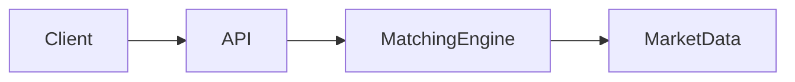

# Code to Architecture

[](https://github.com/sandeepbhardwaj/sandeepbhardwaj.github.io/actions/workflows/ci.yml)
[](https://github.com/sandeepbhardwaj/sandeepbhardwaj.github.io/actions/workflows/deploy-pages.yml)

Personal technical blog built with Jekyll and the `minimal-mistakes-jekyll` theme.

🌐 Live site: `https://sandeepbhardwaj.github.io`

## 🧭 What This Repo Contains

This repository powers a static blog focused on backend engineering, distributed systems, system design, and SaaS architecture.

The site uses:

- ⚙️ Jekyll for static site generation
- 🎨 Minimal Mistakes for the base theme and layouts
- 🚀 GitHub Actions for CI and GitHub Pages deployment
- 🌓 a custom runtime theme toggle
- 🧩 enhanced Markdown support for Mermaid diagrams and GitHub-style callouts

## 🛠️ Tech Stack

- 💎 Ruby `4.0.2`
- 🧱 Jekyll `4.4.1`
- 🎨 `minimal-mistakes-jekyll` `4.28.0`
- 🚀 GitHub Pages deployment through GitHub Actions

## ✨ Site Features

- 📰 paginated posts
- 🗂️ category archives
- 📡 RSS feed at `https://sandeepbhardwaj.github.io/feed.xml`
- 💬 Giscus-based comments
- ✉️ email subscribe link via `follow.it`
- 📈 Mermaid diagram rendering with an expanded viewer
- 📝 GitHub-style admonitions in Markdown

### 📈 Mermaid Support

Mermaid blocks are rendered client-side and include an expanded viewer with:

- ↔️ fit-width mode
- 🔍 actual-size mode
- ✋ drag-to-pan for large diagrams
- 🌐 open-in-new-tab
- ⬇️ download as SVG

Example:

````md

````

### 📝 Callouts In Posts

The site supports GitHub-style admonitions through `jekyll-gfm-admonitions`.

Example:

```md
> [!NOTE]
> Use this for context or clarification.

> [!TIP] Performance Tip
> Use a custom title when needed.

> [!WARNING]
> Use this for risky assumptions or production caveats.
```

## 💻 Local Development

1. Install Ruby `4.0.2`.
2. Install dependencies:

```bash
bundle install
```

3. Start the site locally:

```bash
bundle exec jekyll serve --host 127.0.0.1 --port 4000
```

4. Open `http://127.0.0.1:4000`.

## 🧪 Useful Commands

Install gems:

```bash
bundle install
```

Run a local server:

```bash
bundle exec jekyll serve --host 127.0.0.1 --port 4000
```

Run a normal build:

```bash
bundle exec jekyll build
```

Run the stricter CI-style build:

```bash
bundle exec jekyll build --strict_front_matter
```

## ✍️ Writing Content

Create new posts inside `_posts/` using this filename format:

```text
YYYY-MM-DD-your-title.md
```

Typical front matter fields:

- `title`
- `date`
- `categories`
- `tags`
- `excerpt`

Images and other post assets should live under `assets/images/`.

## 🗂️ Project Structure

```text
.
├── _config.yml
├── _data/
├── _includes/
├── _layouts/
├── _pages/
├── _posts/
├── _sass/custom/
├── assets/
│   ├── css/
│   ├── images/
│   └── js/
├── .github/workflows/
├── Gemfile
├── Gemfile.lock
└── README.md
```

## ⚙️ Configuration Notes

Core site settings live in `_config.yml`.

Notable areas:

- 🏷️ site metadata and SEO settings
- 👤 author profile and social links
- 🔗 footer links
- 📊 analytics configuration
- 💬 comments configuration
- 🧩 plugin list
- 📰 default post/page layout behavior

## 🚦 CI And Deployment

### ✅ CI

The `CI` workflow runs on:

- every pull request
- pushes to `main`

It:

- 📦 installs Ruby dependencies with Bundler cache
- 🧪 runs `bundle exec jekyll build --strict_front_matter`
- 📄 validates that `_site/sitemap.xml` exists
- 🔒 validates that sitemap URLs use the production HTTPS domain

### 🚀 Deployment

The `Deploy Jekyll site to Pages` workflow runs when:

- the `CI` workflow succeeds on `main`
- triggered manually with `workflow_dispatch`
- triggered by the scheduled nightly run

It builds the site and publishes `_site` to GitHub Pages.

## 🩺 Troubleshooting

If Bundler or the local Jekyll environment gets out of sync:

```bash
rm -rf .bundle vendor Gemfile.lock
bundle install
bundle exec jekyll serve --trace
```

If Bundler stops working after a Ruby upgrade:

```bash
gem install bundler
bundle -v
```

## ℹ️ Notes

- `README.md` is excluded from the generated site output.
- The source of truth for runtime site behavior is the repository code and `_config.yml`, not the generated `_site/` output.
