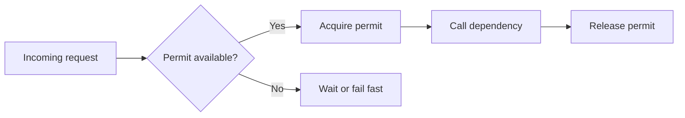

A `Semaphore` is one of the simplest ways to stop "too much parallelism" from becoming an outage.
It does not make a system faster by itself.
It makes concurrency explicit and bounded.

That is why semaphores show up in real systems around rate-limited APIs, connection-heavy services, and fragile downstream dependencies.

## Quick Decision Guide

| Need | Semaphore fit | Better alternative when needed |
| --- | --- | --- |
| limit how many callers proceed at once | strong | `Semaphore` is built for this |
| enforce requests-per-second policy | weak | rate limiter or token bucket |
| queue work and smooth bursts | weak | bounded queue or executor policy |
| protect one critical section | mixed | `Lock` or synchronized block may be clearer |
| isolate one downstream from consuming all capacity | strong | semaphore bulkhead is a common choice |

The key idea is simple:
a semaphore controls concurrency, not business priority and not overall throughput strategy.

## What Problem It Actually Solves

Semaphores solve admission control.

You decide how many threads or tasks may enter a protected area at once.
Anyone above that limit must wait, time out, or fail fast.

That is different from:

- a queue, which stores work
- a lock, which protects a critical section
- a rate limiter, which controls events over time

Mixing those ideas is where most semaphore misuse starts.

## The Mental Model

Imagine a dependency can safely handle 20 in-flight calls.
If your service lets 200 requests hit it in parallel, failures and tail latency often get worse before any retry logic even begins.

A semaphore makes that concurrency budget explicit:



The dependency still might fail.
The semaphore just prevents your own process from stampeding it.

## Basic Java Example

```java
import java.util.concurrent.Semaphore;

public final class DownstreamClient {
    private final Semaphore permits = new Semaphore(20);

    public Response fetch(Request request) throws InterruptedException {
        permits.acquire();
        try {
            return callRemoteService(request);
        } finally {
            permits.release();
        }
    }

    private Response callRemoteService(Request request) {
        return new Response();
    }
}
```

This version is correct in one important way:
the permit is released in `finally`.
That is non-negotiable.

## Why `tryAcquire` Often Fits Production Better

Blocking forever is rarely a good production default.
If a request path is latency-sensitive, a timeout usually produces a more understandable failure mode.

```java
import java.util.concurrent.Semaphore;
import java.util.concurrent.TimeUnit;

public final class PaymentGatewayClient {
    private final Semaphore permits = new Semaphore(10);

    public PaymentResult authorize(PaymentRequest request) throws InterruptedException {
        if (!permits.tryAcquire(100, TimeUnit.MILLISECONDS)) {
            throw new DependencyBusyException("payment provider concurrency budget exhausted");
        }

        try {
            return callProvider(request);
        } finally {
            permits.release();
        }
    }

    private PaymentResult callProvider(PaymentRequest request) {
        return new PaymentResult();
    }
}
```

This turns hidden queueing into an explicit policy:
either get a permit quickly or fail in a controlled way.

## Fairness: Useful, but Not Free

Java lets you create a fair semaphore:

```java
Semaphore fair = new Semaphore(10, true);
```

Fairness reduces starvation risk because waiting threads acquire permits in first-in-first-out order more often.

That can be worth it when:

- tasks are similar in cost
- starvation is unacceptable
- predictability matters more than raw throughput

It can hurt when:

- you want maximum throughput under contention
- the protected work has very uneven cost
- strict arrival order creates extra scheduling overhead

Fairness is not "more correct" by default.
It is a policy choice.

## Strong Use Cases

### Bulkhead around a dependency

A separate semaphore per downstream is a common resilience pattern:

- one semaphore for payment provider calls
- one semaphore for email delivery
- one semaphore for search API access

That prevents one slow dependency from consuming every worker thread.

### Concurrency cap around expensive local work

Semaphores can also protect memory-heavy or CPU-heavy operations where too many parallel tasks create internal collapse.

### Virtual threads still need resource limits

Virtual threads make blocking cheaper.
They do not make remote systems infinitely scalable.
Even with virtual threads, semaphores are still useful to cap access to real bottlenecks.

## Common Mistakes

### Treating semaphore as a rate limiter

A semaphore controls how many tasks run at once.
It does not guarantee "100 requests per second."
Those are different constraints.

### Releasing without successful acquisition

If the code calls `release()` when `acquire()` never succeeded, the permit count becomes wrong.
That can silently weaken the safety boundary.

### Holding permits across slow or unrelated work

Acquire only around the part that truly needs bounded concurrency.
If you hold the permit across extra parsing, logging, retries, or unrelated CPU work, the limit becomes less meaningful.

### Using one global semaphore for unrelated resources

That often creates accidental coupling.
One noisy dependency can block traffic that should have been isolated.

## Permit Leaks Are a Real Incident Class

Semaphore bugs often show up as "everything started timing out" rather than an obvious exception.

A leaked permit means some waiting tasks will never proceed even though the dependency may be healthy.

Good habits:

- release in `finally`
- keep acquisition and release close together
- avoid branching logic that can skip release
- expose metrics for permit availability and timeout count

## Observability Checklist

At minimum, measure:

- current available permits
- acquire timeout count
- average acquire wait time
- failure rate while permit-starved
- downstream latency while permits are saturated

Without those signals, teams often guess at the correct permit count instead of tuning it from evidence.

## When Not to Use a Semaphore

Do not reach for a semaphore first when the real problem is:

- work should be queued and drained gradually
- rate over time must be limited
- only one thread may mutate shared state
- the system needs backpressure at a higher architectural boundary

A semaphore is excellent for bounded in-flight concurrency.
It is mediocre when forced to act like every other control mechanism.

## Key Takeaways

- A semaphore is an admission-control tool, not a queue and not a rate limiter.
- `tryAcquire` with a timeout is often safer than waiting forever on request paths.
- Fairness is a tradeoff, not an automatic upgrade.
- The real production value comes from using semaphores as explicit concurrency budgets around fragile resources.
