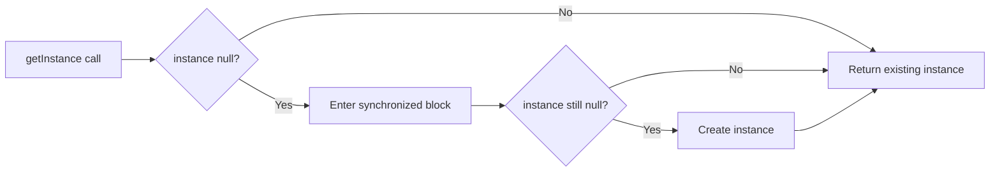

Double-checked locking provides lazy initialization with lower synchronization overhead after initialization.

## Problem description:

We want one lazily created shared instance without synchronizing every read after initialization.

What we are solving actually:

We are solving safe lazy initialization under concurrency.
Without the right memory-visibility guarantees, one thread can observe a partially constructed object.

What we are doing actually:

1. Check whether the instance already exists before locking.
2. Synchronize only during the first initialization race.
3. Mark the field `volatile` so construction becomes safely visible to other threads.



## Real-World Use Cases

- expensive configuration object
- app-level registry / metadata cache
- shared parser/serializer setup

## Java Implementation

```java
public final class Singleton {
    private static volatile Singleton instance;

    private Singleton() {}

    public static Singleton getInstance() {
        if (instance == null) {
            synchronized (Singleton.class) {
                if (instance == null) {
                    instance = new Singleton();
                }
            }
        }
        return instance;
    }
}
```

## Safer Alternative

```java
public enum AppSingleton {
    INSTANCE;
}
```

Use enum singleton when possible.

## Another Strong Alternative: Initialization-on-Demand Holder

This is lazy, thread-safe, and avoids explicit synchronization code.

```java
public final class HolderSingleton {
    private HolderSingleton() {}

    private static class Holder {
        private static final HolderSingleton INSTANCE = new HolderSingleton();
    }

    public static HolderSingleton getInstance() {
        return Holder.INSTANCE;
    }
}
```

For many cases, this is clearer than double-checked locking.

## Production API Equivalent (Dependency Injection Singleton)

In most backend applications, prefer framework-managed singletons over hand-written singleton patterns.

Spring example:

```java
import org.springframework.stereotype.Service;

@Service
public class CurrencyRateService {
    public double convert(double amount, double rate) {
        return amount * rate;
    }
}
```

`@Service` beans are singleton-scoped by default, test-friendly, and easier to evolve than static/global singleton holders.

## Common Pitfalls

1. Missing `volatile` in double-checked locking implementation.
2. Hiding expensive I/O in singleton constructor (slow startup surprises).
3. Using static singleton in code that should be dependency-injected.
4. Assuming one singleton instance across isolated classloaders.

In plugin/container environments, each classloader can have its own singleton copy.

## Testing Guidance

- avoid global mutable singleton state where possible
- if singleton keeps cache/config, expose explicit reset hooks for tests only
- prefer constructor injection and DI singletons for easier mocking

This reduces hidden coupling across test cases.

## Debug steps:

- confirm the instance field is `volatile`
- stress-test concurrent access so initialization races actually occur in tests
- prefer holder idiom or enum singleton if the double-checked variant adds unnecessary complexity
- inspect whether a DI container would solve the real problem more cleanly

## Java 8/11/17/21/25 Notes

- Java 8+: double-checked locking is safe with `volatile`.
- JDK 11 / Java 17: same guidance, widely used in enterprise LTS environments.
- Java 21+: same guidance, no behavioral change.
- Java 25: no expected API or memory-model change for this pattern.

## Key Takeaways

- `volatile` is mandatory in double-checked locking.
- Prefer enum singleton for simplicity and serialization safety.
- Use lazy singleton only when initialization cost justifies it.
- In modern services, DI-managed singleton scope is usually the best default.

---

## Practical Checkpoint

A short but valuable final check for double-checked locking singleton pattern in java is to write down the one misuse pattern most likely to appear during maintenance. That small note makes the article more useful when someone revisits it months later under pressure.
