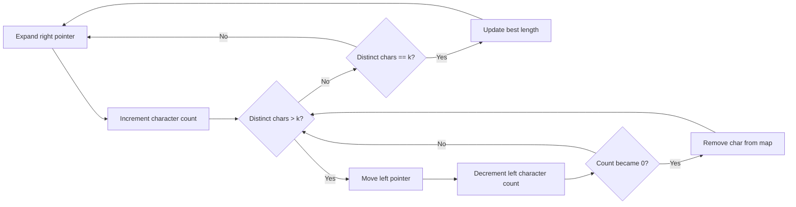

Longest Substring With Exactly K Unique Characters is a good example of turning a small-looking problem into a precise invariant. The cleaned-up Java version below keeps the sliding-window idea intact while fixing the duplicate-character bug that appears in many first attempts.

---

## Problem 1: Longest Substring With Exactly K Unique Characters

Problem description:
We are given a problem around **Longest Substring With Exactly K Unique Characters** and need a Java solution that is correct on both normal and edge-case inputs. The challenge is usually not writing a loop or recursion call; it is preserving the one invariant that makes the approach valid from start to finish.

What we are solving actually:
We are solving for correctness under the constraints that matter for this problem family. In practice, that means understanding which state must be remembered, what can be derived on the fly, and where a brute-force approach would waste work or break boundary conditions.

What we are doing actually:

1. expand the right side of the window and count how many times each character appears
2. shrink the left side only when the number of distinct characters becomes larger than `k`
3. update the best answer only when the current window has exactly `k` unique characters
4. decrement counts instead of deleting a character too early, because duplicates can still be inside the window

## Why This Problem Matters

- array problems teach when indexing alone is enough and when hashing or sorting changes the cost model
- many interview and production debugging tasks hide simple boundary bugs inside otherwise small loops
- longest substring with exactly k unique characters is a good example of trading brute force for a more intentional invariant

## Implementation Context

This post uses a cleaned-up sliding-window implementation that keeps frequency counts for every character inside the current window. That small change makes the algorithm reliable on duplicate-heavy inputs, which is exactly where many early attempts go wrong.

The core idea stays the same: expand the right side, shrink the left side only when the distinct-character count grows too large, and update the answer when the window has exactly `k` unique characters.

## Sliding Window Sketch



## Java Solution

```java
import java.util.HashMap;
import java.util.Map;

public class LongestSubstringWithExactlyKUniqueCharacters {
	public static int longestSubstringWithExactlyKUniqueCharacters(String s, int k) {
		if (s == null || s.isEmpty() || k <= 0) {
			return -1;
		}

		Map<Character, Integer> frequency = new HashMap<>();
		int left = 0;
		int bestLength = -1;

		for (int right = 0; right < s.length(); right++) {
			char rightChar = s.charAt(right);
			frequency.put(rightChar, frequency.getOrDefault(rightChar, 0) + 1);

			while (frequency.size() > k) {
				char leftChar = s.charAt(left++);
				int updatedCount = frequency.get(leftChar) - 1;
				if (updatedCount == 0) {
					frequency.remove(leftChar);
				} else {
					frequency.put(leftChar, updatedCount);
				}
			}

			if (frequency.size() == k) {
				bestLength = Math.max(bestLength, right - left + 1);
			}
		}

		return bestLength;
	}

	public static void main(String[] args) {
		String str = "aabacbebebe";
		int k = 3;
		System.out.println(longestSubstringWithExactlyKUniqueCharacters(str, k));
	}
}
```

## Why Frequency Counts Matter

The key detail is that we must know how many copies of each character still remain inside the window. A plain set loses that information, which means removing one character from the left can corrupt the state even when another copy is still inside the substring.

Using a `Map<Character, Integer>` fixes that problem cleanly. Each expansion increments a count, each shrink decrements a count, and a character leaves the window only when its count drops to zero.

## Dry Run

Dry-run `aabacbebebe` with `k = 3` and track both pointers plus the frequency map after each move. The moment you see the second `a`, it becomes clear why counts matter more than a plain set.

If you can explain the dry run without hand-waving, the code usually stops feeling memorized and starts feeling mechanical. That is the point where interview pressure drops and implementation speed improves.

## Edge Cases To Test

- empty or single-element input
- duplicates that change lookup behavior
- already sorted or reverse-ordered input

These edge cases are worth testing before you trust the solution. Many DSA bugs do not come from the main idea; they come from assuming the input shape is always convenient.

## Performance Notes

The intended optimized approach is still linear. With a frequency map, each character enters and leaves the sliding window at most once, so the time complexity stays `O(n)` and the extra space is `O(k)` to `O(min(n, alphabet))` depending on the input character set.

## Debug Steps

Debug steps:

- print `left`, `right`, and the character-frequency map after each update
- re-run with duplicate-heavy strings like `aaabbbccc`
- check whether decrementing a count to zero really means the character left the window
- verify that you update the best answer only when the distinct count is exactly `k`

## Key Takeaways

- Longest Substring With Exactly K Unique Characters becomes easier once the central invariant is stated in plain language.
- Frequency counts are what turn the sliding-window idea into a correct implementation on duplicate-heavy strings.
- If the implementation fails, debug the state transition first, not the syntax.
