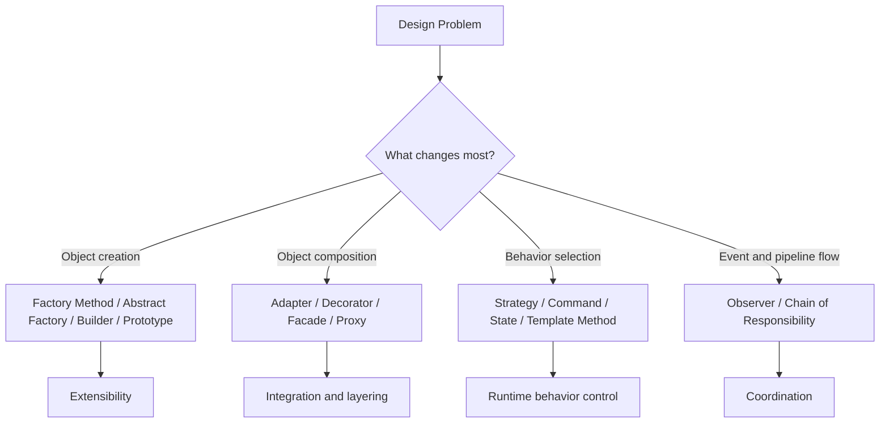

This series is written for engineers who already know Java syntax but want to improve how they structure code in real systems.
The focus is not pattern memorization. The focus is selecting the right pattern for the right pressure: changeability, readability, testability, extension points, and failure handling.

---

## What This Series Covers

Each post in the series follows the same structure:

1. a concrete problem statement
2. the naive implementation and why it becomes brittle
3. the pattern structure with UML
4. a full Java 8+ implementation walkthrough
5. extension ideas, testing notes, and trade-offs

The examples stay close to backend work:

- checkout flows
- notification systems
- payment integration
- request processing pipelines
- event-driven updates
- document generation

---

## Series Map

Use the roadmap as a guided reading sequence:

1. [Roadmap and how to study design patterns in Java]()
2. [SOLID principles as the foundation for patterns]()
3. [Singleton with configuration and shared runtime state]()
4. [Factory Method with exporter creation]()
5. [Abstract Factory with region-aware infrastructure objects]()
6. [Builder with immutable report assembly]()
7. [Prototype with reusable workflow templates]()
8. [Adapter with third-party payment providers]()
9. [Decorator with pricing and observability layers]()
10. [Facade with checkout orchestration]()
11. [Proxy with caching and access control]()
12. [Observer with order events and subscribers]()
13. [Strategy with discount calculation]()
14. [Command with queueable actions]()
15. [Template Method with file import pipelines]()
16. [State with order lifecycle management]()
17. [Chain of Responsibility with request validation]()
18. [Pattern combinations and selection heuristics]()

---

## How the Patterns Relate



This diagram is the main lens for the series: identify the axis of change first, then choose the pattern.

---

## How to Read the Series

Do not read these posts as isolated interview topics.
Read them in this order:

1. fundamentals first
2. creational patterns second
3. structural patterns third
4. behavioral patterns fourth
5. pattern combinations last

That order matters because most misuse happens when engineers jump into a named pattern before understanding the underlying design pressure.

---

## Example Domain Used Across the Series

A lot of the examples reuse a fictional commerce platform called `CommerceFlow`.
This gives the series continuity instead of a random collection of disconnected snippets.

The domain includes:

- customers placing orders
- payment providers
- shipping and invoice generation
- discount policies
- event notifications
- admin operations

Because the same domain is reused, you can compare patterns directly and see where one pattern stops helping and another begins.

---

## What “Implementation Walkthrough” Means Here

Each implementation walkthrough includes enough code to show:

- boundary interfaces
- concrete implementations
- orchestration layer
- application entry point or usage example
- the reason the pattern reduces coupling

That is enough to understand the production shape of the solution, not only the textbook class names.

```java
public final class CommerceApplication {

    public static void main(String[] args) {
        System.out.println("This series is about making this kind of application easier to extend.");
    }
}
```

The point is not the `main` method itself.
The point is that each later post can plug into a realistic application boundary.

---

## How to Use the Roadmap

The order matters because each group of posts builds on the previous one.
The SOLID article explains the design constraints that make patterns useful. The creational posts explain where object creation should live. The structural posts explain how to wrap and simplify integrations. The behavioral posts explain how to vary runtime flow without scattering conditionals across services.

If you read the posts in that order, the final composition article will feel like a synthesis of ideas you have already practiced instead of a list of abstract recommendations.

---

## Evaluation Checklist for Every Pattern

While reading the upcoming posts, ask these questions every time:

1. what pain does the pattern remove?
2. what new abstraction cost does it introduce?
3. does it improve extension without hiding control flow too much?
4. can a new engineer debug the runtime behavior?
5. would a simpler refactor solve the problem just as well?

If a pattern does not survive those questions, it should not be used.

---

## Closing Notes

The rest of the series stays practical.
Every post uses Java 8+ syntax and keeps examples close to real backend design instead of GUI-heavy textbook examples.

If you work through all 18 posts in order, you should come away with two skills:

- knowing how to implement common patterns cleanly in Java
- knowing when **not** to introduce them
