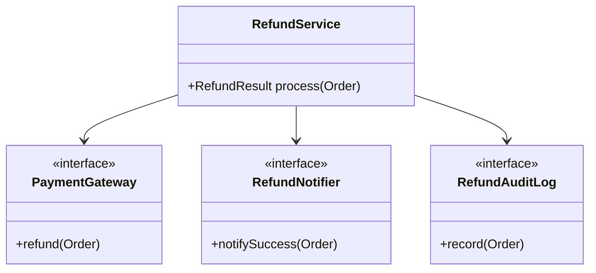

Most design patterns fail in production for a simple reason: the codebase violates basic design principles before the pattern is introduced.
If responsibilities are mixed, abstractions are leaky, and dependencies point in the wrong direction, adding a pattern usually just hides the mess behind more interfaces.

---

## The Real Goal

SOLID is not academic ceremony.
It gives you a stable surface on which patterns can actually work.

In practice:

- `S` keeps classes focused
- `O` makes extension cheaper than modification
- `L` keeps polymorphism safe
- `I` keeps interfaces narrow
- `D` keeps high-level logic independent from infrastructure

---

## A Problematic Design

Consider an order refund service:

```java
public final class RefundService {

    public String process(Order order, String paymentType) {
        if (order.getTotalAmount() <= 0) {
            throw new IllegalArgumentException("Invalid amount");
        }

        if ("STRIPE".equals(paymentType)) {
            // refund through Stripe
        } else if ("PAYPAL".equals(paymentType)) {
            // refund through PayPal
        }

        // send email
        // write audit log
        // update metrics
        return "SUCCESS";
    }
}
```

This violates multiple principles at once:

- business rules and infrastructure concerns are mixed
- extending to a new provider requires editing existing code
- testing each branch becomes expensive

---

## Better Shape Before Any Pattern



Now the service coordinates a use case instead of doing everything itself.

---

## Implementation Walkthrough

```java
public interface PaymentGateway {
    RefundResult refund(Order order);
}

public interface RefundNotifier {
    void notifySuccess(Order order);
}

public interface RefundAuditLog {
    void record(Order order, RefundResult result);
}

public final class RefundService {
    private final PaymentGateway paymentGateway;
    private final RefundNotifier notifier;
    private final RefundAuditLog auditLog;

    public RefundService(PaymentGateway paymentGateway,
                         RefundNotifier notifier,
                         RefundAuditLog auditLog) {
        this.paymentGateway = paymentGateway;
        this.notifier = notifier;
        this.auditLog = auditLog;
    }

    public RefundResult process(Order order) {
        validate(order);
        RefundResult result = paymentGateway.refund(order);
        auditLog.record(order, result);
        if (result.isSuccess()) {
            notifier.notifySuccess(order);
        }
        return result;
    }

    private void validate(Order order) {
        if (order == null || order.getTotalAmount() <= 0) {
            throw new IllegalArgumentException("Invalid order");
        }
    }
}
```

Concrete infrastructure implementations stay outside the use-case class:

```java
public final class StripePaymentGateway implements PaymentGateway {
    @Override
    public RefundResult refund(Order order) {
        return RefundResult.success("stripe-" + order.getId());
    }
}

public final class EmailRefundNotifier implements RefundNotifier {
    @Override
    public void notifySuccess(Order order) {
        System.out.println("Email sent for order " + order.getId());
    }
}
```

Application wiring becomes explicit:

```java
RefundService refundService = new RefundService(
        new StripePaymentGateway(),
        new EmailRefundNotifier(),
        (order, result) -> System.out.println("Audit " + order.getId() + " -> " + result.getStatus())
);
```

The key improvement here is dependency direction.
`RefundService` now depends on behavior contracts that describe the use case instead of on SDK calls and notification plumbing. That change makes the orchestration code easier to test, but more importantly it makes the service easier to extend without reopening the whole class every time a provider or notification path changes.

---

## Where the Principles Help

### Single Responsibility Principle

`RefundService` coordinates refund flow.
It does not embed payment API details, email formatting, or audit persistence.

### Open/Closed Principle

New providers can be added by implementing `PaymentGateway`.
The orchestration logic remains stable.

### Liskov Substitution Principle

Any payment gateway must preserve the expected contract:

- it accepts a valid `Order`
- it returns a `RefundResult`
- it does not require callers to special-case specific implementations

### Interface Segregation Principle

We use focused interfaces instead of a giant `CommercePlatformService` with unrelated methods.

### Dependency Inversion Principle

The refund workflow depends on abstractions, not on a concrete SDK.

---

## Why This Matters for Patterns

The later Strategy, Adapter, Observer, and Facade posts all depend on this baseline structure.
Without SOLID:

- Strategy becomes a disguised `if-else`
- Adapter becomes a leaky wrapper
- Observer becomes an event mess
- Facade becomes a god object

Another way to say this is that SOLID creates the conditions in which patterns can stay honest.
Once responsibilities are separated, a pattern clarifies structure. Before that, it mostly hides coupling behind extra types.

---

## Testing the Design

```java
PaymentGateway gateway = order -> RefundResult.success("ok");
RefundNotifier notifier = order -> { };
RefundAuditLog auditLog = (order, result) -> { };

RefundService service = new RefundService(gateway, notifier, auditLog);
RefundResult result = service.process(new Order("ORD-1", 500));
```

The service is trivial to test because dependencies are narrow and explicit.

That matters because patterns usually add abstraction. The abstraction is justified only if the result becomes easier to isolate, verify, and change.

---

## Key Takeaways

Patterns are multipliers.
If the underlying design is poor, they multiply confusion.
If the underlying design is disciplined, they multiply extensibility.

That is why SOLID comes first in this series.
