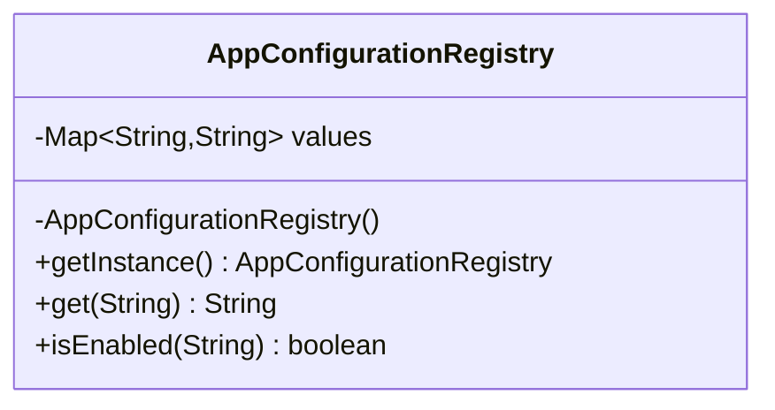

Singleton is the most overused pattern in Java.
That does not make it useless. It means it must be applied carefully and only when a single shared instance is truly part of the problem definition.

---

## Problem 1: Shared Configuration Registry Without Hidden Mutable State

Problem description:
Our application loads environment-specific feature flags and service endpoints once during startup.
Many parts of the application need read-only access to that configuration.

What we are solving actually:
We are solving controlled shared access, not “easy global access.”
If configuration is loaded once, remains immutable, and is genuinely process-wide, a singleton can be a reasonable boundary.
If the object starts holding mutable runtime state, the same pattern quickly turns into hidden global coupling.

What we are doing actually:

1. Create one immutable configuration holder.
2. Initialize it lazily and safely.
3. Expose read-only accessors only.
4. Keep mutation and runtime refresh logic out of the singleton itself.

---

## When Singleton Is Legitimate

Good use cases:

- process-wide immutable configuration
- a coordinated registry with controlled lifecycle
- lightweight stateless services where multiple instances add no value

Bad use cases:

- hiding global mutable state
- replacing dependency injection
- sharing state to avoid proper object design

---

## Example Problem

Our application loads environment-specific feature flags and service endpoints once during startup.
Every part of the application needs read-only access to that configuration.

---

## UML



---

## Implementation Walkthrough

```java
import java.util.Collections;
import java.util.HashMap;
import java.util.Map;

public final class AppConfigurationRegistry {
    private final Map<String, String> values;

    private AppConfigurationRegistry() {
        Map<String, String> loaded = new HashMap<>();
        loaded.put("payment.provider", "stripe");
        loaded.put("feature.dynamicPricing", "true");
        loaded.put("checkout.timeout.ms", "2500");
        this.values = Collections.unmodifiableMap(loaded);
    }

    private static final class Holder {
        private static final AppConfigurationRegistry INSTANCE = new AppConfigurationRegistry(); // Lazy, classloader-safe initialization.
    }

    public static AppConfigurationRegistry getInstance() {
        return Holder.INSTANCE;
    }

    public String get(String key) {
        return values.get(key);
    }

    public boolean isEnabled(String key) {
        return Boolean.parseBoolean(values.getOrDefault(key, "false"));
    }
}
```

Usage:

```java
public final class CheckoutService {
    public void printConfiguration() {
        AppConfigurationRegistry config = AppConfigurationRegistry.getInstance();
        System.out.println(config.get("payment.provider"));
        System.out.println(config.isEnabled("feature.dynamicPricing"));
    }
}
```

This example keeps the singleton intentionally boring. That is a good property.
It exposes read-only configuration and avoids becoming a hidden dependency bucket for unrelated concerns such as request-scoped data, counters, or mutable caches.

---

## Why the Holder Idiom Works

It gives:

- lazy initialization
- thread-safe instance creation via class loading semantics
- no explicit synchronization cost on reads

That is a better default than manually synchronized `getInstance()` methods in most Java codebases.

---

## What to Avoid

Do not evolve this into a mutable dumping ground:

```java
public void put(String key, String value) {
    // This is exactly how a clean singleton turns into hidden global state.
}
```

If runtime updates are needed, introduce a well-defined refresh mechanism with explicit synchronization and ownership.

---

## Testing Considerations

Singletons complicate test isolation.
This example reduces the problem by keeping the singleton immutable.

If tests need alternative configuration, a better design is:

- keep the singleton only at application bootstrap
- pass actual values into services via constructors

That way the singleton is a startup detail, not a deep runtime dependency.

That distinction is what usually separates acceptable singleton usage from the kind that makes a codebase harder to test and reason about.

---

## Debug Steps

Debug steps:

- confirm the singleton is immutable after construction
- verify tests do not depend on hidden state left by previous test cases
- inspect whether `getInstance()` is being used as a shortcut instead of proper dependency wiring
- check whether different classloaders or test runners create multiple logical singleton instances

---

## Practical Rule

If you cannot explain why exactly one instance must exist, do not use Singleton.
If the only reason is “easy access from anywhere,” that is not a valid reason.
