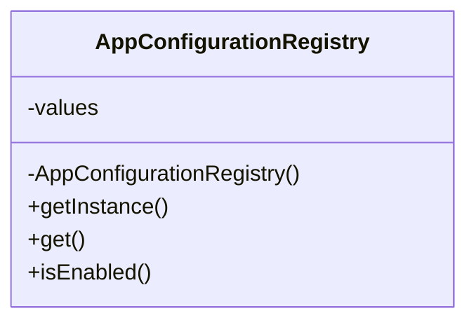

Singleton is the most overused pattern in Java for one reason:
it solves a real problem, but it also offers a very tempting shortcut to global state.

That means the right question is not "is singleton bad?"
It is "is one shared instance actually part of the domain, or are we using it to avoid better dependency boundaries?"

Configuration registry is one of the few examples where Singleton can still make sense, but only under tight constraints.

## Quick Summary

| Question | Good answer for Singleton | Warning sign |
| --- | --- | --- |
| Does exactly one process-wide instance make sense? | yes | not really, but convenient |
| Is the state immutable after startup? | yes | no, callers keep changing it |
| Would dependency injection work just as well? | sometimes, and often better | ignored because singleton is easier |
| Is test isolation still easy? | yes, if singleton stays small and immutable | no, tests leak state through global access |

The safe rule is:
singleton is acceptable for process-wide immutable state, and dangerous for mutable runtime behavior.

## When Singleton Is Legitimate

Singleton can be reasonable when all of these are true:

1. the instance is genuinely process-wide
2. multiple instances would not add value
3. the state is immutable or tightly controlled
4. lifecycle is simple and explicit

Good examples:

- immutable startup configuration
- carefully owned registry metadata
- a tiny bootstrap-time adapter around one shared resource

Bad examples:

- request-scoped data disguised as a singleton
- mutable caches with unclear ownership
- counters, toggles, or feature state modified from everywhere
- "easy access from anywhere"

## A Configuration Registry Is a Narrowly Valid Case

Configuration is a better singleton candidate because:

- it is loaded once
- it is usually shared across the process
- most callers only need read access
- immutability is often desirable anyway

That still does not mean every configuration object must be a singleton.
Constructor injection is often cleaner.
But if you truly need one shared immutable registry, this is one of the safer places to use the pattern.

## Structure at a Glance



The important part is not the pattern label.
It is that callers get read-only access to stable configuration, not to a global mutation hub.

## A Better Java Implementation

```java
import java.util.Collections;
import java.util.HashMap;
import java.util.Map;

public final class AppConfigurationRegistry {
    private final Map<String, String> values;

    private AppConfigurationRegistry() {
        Map<String, String> loaded = new HashMap<>();
        loaded.put("payment.provider", "stripe");
        loaded.put("feature.dynamicPricing", "true");
        loaded.put("checkout.timeout.ms", "2500");
        this.values = Collections.unmodifiableMap(loaded);
    }

    private static final class Holder {
        private static final AppConfigurationRegistry INSTANCE = new AppConfigurationRegistry();
    }

    public static AppConfigurationRegistry getInstance() {
        return Holder.INSTANCE;
    }

    public String get(String key) {
        return values.get(key);
    }

    public boolean isEnabled(String key) {
        return Boolean.parseBoolean(values.getOrDefault(key, "false"));
    }
}
```

This is a good example because it is intentionally boring.
It loads data once, wraps it immutably, and exposes read-only behavior.

## Why the Holder Idiom Is the Right Default Here

The initialization-on-demand holder idiom gives you:

- lazy initialization
- thread-safe construction through class loading
- no synchronization overhead on reads

That is usually better than:

- synchronized `getInstance()`
- ad hoc double-checked locking
- custom initialization flags

If the only thing you need is one lazily initialized immutable instance, the holder idiom is the least noisy solution.

## Where Singleton Starts Becoming Dangerous

### Mutable global state

Once the singleton starts exposing mutation methods, it stops being a clean registry and becomes hidden shared state.

### Implicit dependencies

If services call `getInstance()` deep inside business code, the dependency is now global and harder to substitute or test.

### Multiple logical runtimes

Classloader boundaries, plugin systems, or test containers can create more than one "singleton" anyway.
That makes casual assumptions fragile.

### Feature creep

A configuration singleton often starts clean, then accumulates:

- refresh logic
- metrics
- caches
- environment branching

That is when the boundary should usually be split.

## Better Alternatives When the Design Grows

Prefer constructor injection when:

- the object is really just a dependency
- tests need easy substitution
- the lifecycle is already managed by an application framework

Prefer explicit registry ownership when:

- refresh or reload behavior exists
- different subsystems need different configuration views
- plugin or tenant boundaries matter

Singleton is not wrong just because dependency injection exists.
It is wrong when it hides a richer lifecycle than the pattern can safely carry.

## Testing Strategy

If you keep Singleton, keep it easy to test by making the instance:

- immutable
- small
- read-only

Also test:

- initialization behavior
- values are not externally mutable
- callers do not rely on hidden runtime mutation

The moment tests need "reset singleton state" hooks, the design is usually drifting in the wrong direction.

## Practical Rule

Use Singleton only when exactly one instance is a real design fact, not just a convenience.

For configuration registries, that can be true.
For most other runtime behavior, constructor injection or explicit ownership is usually the better answer.

## Key Takeaways

- Singleton is safest when the shared instance is small, immutable, and process-wide by design.
- Configuration registry is one of the more legitimate use cases, but even there the boundary should stay narrow.
- The holder idiom is a cleaner default than custom synchronization.
- If the singleton becomes mutable or hard to test, it is probably solving the wrong problem.
