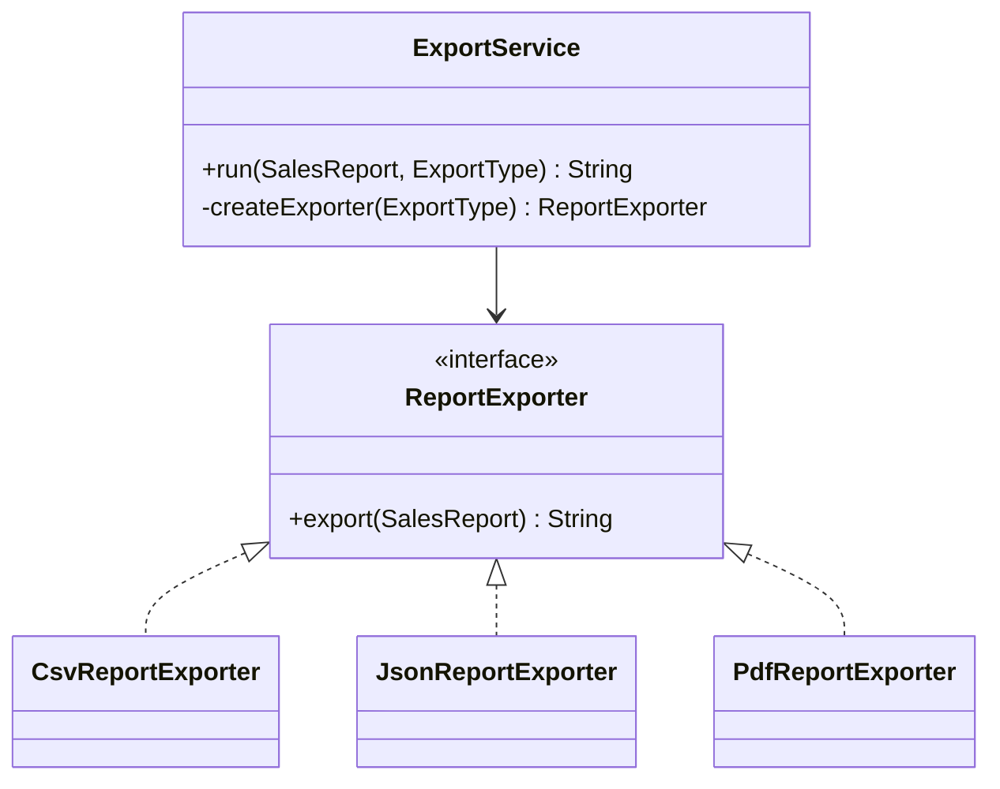

Factory Method solves a specific problem: object creation varies, but the surrounding workflow stays stable.
That is common in backend systems that support multiple output formats or providers behind the same use-case flow.

---

## Problem

We want to export a sales report as `CSV`, `JSON`, or `PDF`.
Validation, orchestration, and audit logging should remain unchanged.

The pressure here is not “how do I instantiate an object?”
The pressure is “how do I keep one stable export workflow while allowing one creation choice to vary?”

---

## UML



---

## Implementation Walkthrough

```java
public enum ExportType {
    CSV, JSON, PDF
}

public interface ReportExporter {
    String export(SalesReport report);
}

public final class CsvReportExporter implements ReportExporter {
    @Override
    public String export(SalesReport report) {
        return "date,total\n" + report.getDate() + "," + report.getTotalRevenue();
    }
}

public final class JsonReportExporter implements ReportExporter {
    @Override
    public String export(SalesReport report) {
        return "{\"date\":\"" + report.getDate() + "\",\"total\":" + report.getTotalRevenue() + "}";
    }
}

public final class PdfReportExporter implements ReportExporter {
    @Override
    public String export(SalesReport report) {
        return "PDF-BINARY(" + report.getDate() + "," + report.getTotalRevenue() + ")";
    }
}

public class ExportService {
    public String run(SalesReport report, ExportType type) {
        validate(report);
        ReportExporter exporter = createExporter(type);
        String payload = exporter.export(report);
        audit(type, report);
        return payload;
    }

    protected ReportExporter createExporter(ExportType type) {
        switch (type) {
            case CSV:
                return new CsvReportExporter();
            case JSON:
                return new JsonReportExporter();
            case PDF:
                return new PdfReportExporter();
            default:
                throw new IllegalArgumentException("Unsupported type: " + type);
        }
    }

    private void validate(SalesReport report) {
        if (report == null) {
            throw new IllegalArgumentException("Report is required");
        }
    }

    private void audit(ExportType type, SalesReport report) {
        System.out.println("Exported " + type + " for " + report.getDate());
    }
}
```

Usage:

```java
ExportService service = new ExportService();
String result = service.run(new SalesReport("2025-12-04", 125000), ExportType.JSON);
```

The example keeps exporter creation inside the service because that is the part that varies while validation and audit behavior stay fixed.
If a later requirement adds `XML`, the change is localized to the creation decision instead of being repeated in every caller that needs export support.

---

## Why This Is Better Than Inline Conditionals

The creation logic has one responsibility: choose an exporter.
The workflow logic has another responsibility: validate, export, audit.

If later we add `XML`, we touch creation logic only.
That is the exact pressure Factory Method is meant to absorb.

This is the real payoff: not fewer lines in one class, but fewer decision points across the codebase.

---

## Where It Starts to Break Down

If the family of created objects expands beyond one type, Factory Method may become too narrow.
For example, if each region needs:

- an exporter
- a validator
- a formatter

then Abstract Factory becomes a better fit.

---

## Key Takeaway

Use Factory Method when the workflow is fixed but the product object changes.
Do not use it if a simple constructor already communicates the intent clearly.
