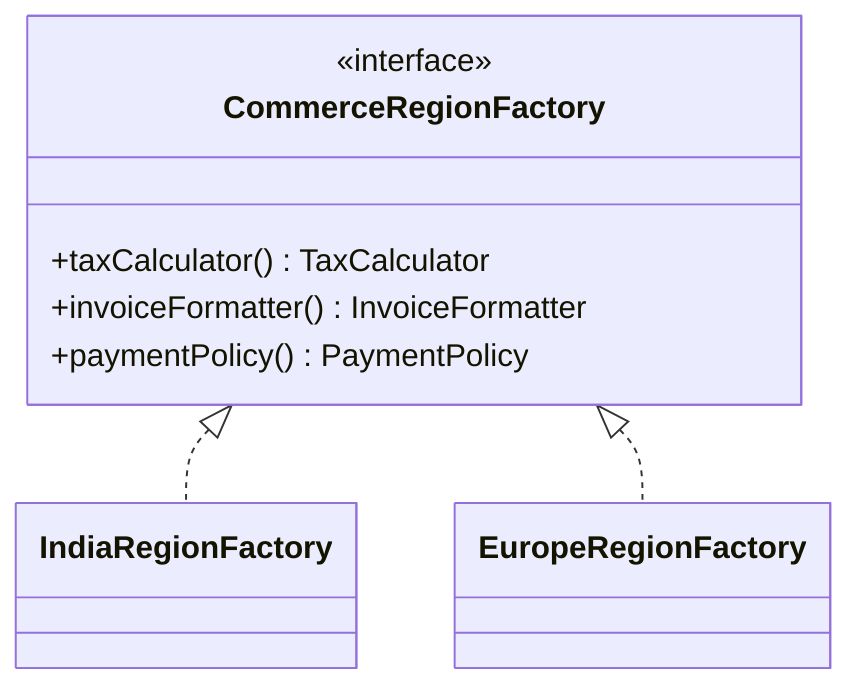

Abstract Factory is useful when you do not create just one object.
You create a **compatible family** of objects that must vary together.

---

## Example Problem

An e-commerce platform supports different regions.
Each region needs its own:

- tax calculator
- invoice formatter
- payment configuration

These parts should be selected together so the application never mixes incompatible regional rules.

---

## UML



---

## Implementation Walkthrough

```java
public interface TaxCalculator {
    double calculate(double subtotal);
}

public interface InvoiceFormatter {
    String format(String orderId, double total);
}

public interface PaymentPolicy {
    String preferredProvider();
}

public interface CommerceRegionFactory {
    TaxCalculator taxCalculator();
    InvoiceFormatter invoiceFormatter();
    PaymentPolicy paymentPolicy();
}

public final class IndiaRegionFactory implements CommerceRegionFactory {
    public TaxCalculator taxCalculator() {
        return subtotal -> subtotal * 0.18;
    }

    public InvoiceFormatter invoiceFormatter() {
        return (orderId, total) -> "GST Invoice :: " + orderId + " :: INR " + total;
    }

    public PaymentPolicy paymentPolicy() {
        return () -> "RAZORPAY";
    }
}

public final class EuropeRegionFactory implements CommerceRegionFactory {
    public TaxCalculator taxCalculator() {
        return subtotal -> subtotal * 0.20;
    }

    public InvoiceFormatter invoiceFormatter() {
        return (orderId, total) -> "VAT Invoice :: " + orderId + " :: EUR " + total;
    }

    public PaymentPolicy paymentPolicy() {
        return () -> "STRIPE";
    }
}

public final class CheckoutRegionService {
    private final CommerceRegionFactory factory;

    public CheckoutRegionService(CommerceRegionFactory factory) {
        this.factory = factory;
    }

    public String finalizeOrder(String orderId, double subtotal) {
        double total = subtotal + factory.taxCalculator().calculate(subtotal);
        String invoice = factory.invoiceFormatter().format(orderId, total);
        return invoice + " | provider=" + factory.paymentPolicy().preferredProvider();
    }
}
```

Usage:

```java
CheckoutRegionService india = new CheckoutRegionService(new IndiaRegionFactory());
CheckoutRegionService europe = new CheckoutRegionService(new EuropeRegionFactory());
```

The important part is that the region is selected once, and every downstream collaborator comes from that same selection.
That prevents subtle mismatches, such as one region’s tax logic being combined with another region’s invoice format or preferred payment route.

---

## Why Abstract Factory Fits

The key is compatibility.
If we create the tax calculator from India rules and the invoice formatter from Europe rules, we get invalid behavior.

Abstract Factory prevents that mismatch by selecting a family of objects through one decision point.

That idea scales well when the family grows. If tomorrow a region also needs its own address validator and fraud rule set, those collaborators belong in the same family decision rather than in separate unrelated branches.

---

## Common Mistake

Do not create an Abstract Factory just because you have more than one class.
Use it only when those classes form a coherent set that must vary together.

That constraint is what justifies the abstraction.
