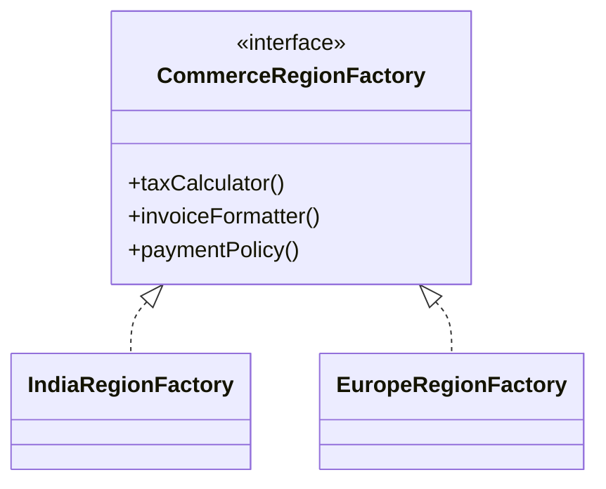

Abstract Factory is useful when one business choice should determine multiple collaborators together.
It is not mainly about "hiding `new`."
It is about preventing invalid combinations of objects that belong to different families.

---

## Problem 1: Region-Aware Checkout Services

Problem description:
An e-commerce platform serves multiple regions.
Each region needs its own:

- tax calculator
- invoice formatter
- payment configuration

These pieces must be selected together so the application never mixes incompatible tax, invoice, and payment rules.

What we are solving actually:
We are solving a consistency problem.
If region selection happens in three unrelated places, one request can accidentally combine India tax rules with Europe invoice formatting or a payment provider that is not valid for that market.
That kind of bug is easy to miss in code review and painful to detect in production.

What we are doing actually:

1. Define interfaces for the products that vary by region.
2. Define one factory interface that creates a compatible family of those products.
3. Provide a concrete factory per region.
4. Inject that factory once into the checkout flow.
5. Let downstream code ask the factory for the right collaborators instead of branching repeatedly.

---

## UML



---

## Implementation Walkthrough

```java
public interface TaxCalculator {
    double calculate(double subtotal);
}

public interface InvoiceFormatter {
    String format(String orderId, double total);
}

public interface PaymentPolicy {
    String preferredProvider();
}

public interface CommerceRegionFactory {
    TaxCalculator taxCalculator();
    InvoiceFormatter invoiceFormatter();
    PaymentPolicy paymentPolicy();
}

public final class IndiaRegionFactory implements CommerceRegionFactory {
    @Override
    public TaxCalculator taxCalculator() {
        return subtotal -> subtotal * 0.18; // GST style example.
    }

    @Override
    public InvoiceFormatter invoiceFormatter() {
        return (orderId, total) -> "GST Invoice :: " + orderId + " :: INR " + total;
    }

    @Override
    public PaymentPolicy paymentPolicy() {
        return () -> "RAZORPAY"; // Region-preferred provider.
    }
}

public final class EuropeRegionFactory implements CommerceRegionFactory {
    @Override
    public TaxCalculator taxCalculator() {
        return subtotal -> subtotal * 0.20; // VAT style example.
    }

    @Override
    public InvoiceFormatter invoiceFormatter() {
        return (orderId, total) -> "VAT Invoice :: " + orderId + " :: EUR " + total;
    }

    @Override
    public PaymentPolicy paymentPolicy() {
        return () -> "STRIPE";
    }
}

public final class CheckoutRegionService {
    private final CommerceRegionFactory factory;

    public CheckoutRegionService(CommerceRegionFactory factory) {
        this.factory = factory; // Region is selected once for the whole request flow.
    }

    public String finalizeOrder(String orderId, double subtotal) {
        TaxCalculator taxCalculator = factory.taxCalculator();
        InvoiceFormatter invoiceFormatter = factory.invoiceFormatter();
        PaymentPolicy paymentPolicy = factory.paymentPolicy();

        double total = subtotal + taxCalculator.calculate(subtotal);
        String invoice = invoiceFormatter.format(orderId, total);

        return invoice + " | provider=" + paymentPolicy.preferredProvider();
    }
}
```

Usage:

```java
CheckoutRegionService india = new CheckoutRegionService(new IndiaRegionFactory());
CheckoutRegionService europe = new CheckoutRegionService(new EuropeRegionFactory());
```

The key design benefit is that region is selected once, and everything else follows from that choice.
The checkout service does not need `if (region == ...)` branches scattered across tax, invoice, and provider selection.

---

## Why Abstract Factory Fits

The pattern fits because the products form a family.
Tax rules, invoice format, and payment policy are not independent variations.
They must stay compatible.

That is the exact moment where Abstract Factory adds value:

- one decision point
- multiple related products
- compatibility guaranteed by construction

---

## What the Flow Looks Like in Practice

1. Resolve the correct `CommerceRegionFactory` for the request.
2. Build all region-specific collaborators from that factory.
3. Execute checkout using only those collaborators.

This keeps region branching near the composition boundary instead of leaking all over the business flow.

In a Spring application, that selection often happens in a resolver, configuration class, or request-scoped orchestrator.
The rest of the application then uses normal interfaces without caring which region was chosen.

---

## Trade-Offs

Abstract Factory improves consistency, but it also adds more types.

That cost is worth paying when:

- the object family is real and stable
- incompatible combinations would be dangerous
- new family members are likely to be added later

It is not worth paying when only one object varies and the rest of the system does not care.
In that case, a simple factory or plain constructor injection is usually enough.

---

## Common Mistakes

1. Using Abstract Factory when products do not actually form a family
2. Putting unrelated responsibilities into the same factory just because they are "regional"
3. Branching again inside consumers after already selecting a concrete factory
4. Returning partially configured objects that still require region-specific `if` statements later

---

## Debug Steps

Debug steps:

- log the concrete factory chosen for each request
- add tests that assert all collaborators come from the same region family
- test one region end-to-end instead of only unit testing each product in isolation
- verify that adding a new region does not require edits inside `CheckoutRegionService`

---

## When Not to Use It

Do not create an Abstract Factory just because you have more than one class to instantiate.
Use it when the classes vary together for a real business reason.

If tomorrow your checkout only needs region-aware tax calculation and everything else is shared, then the abstraction should likely shrink too.

---

## Key Takeaways

- Abstract Factory is about keeping related object creation consistent
- it works best when one business choice determines a family of collaborators
- the real payoff is preventing incompatible combinations, not just reducing `new` calls
