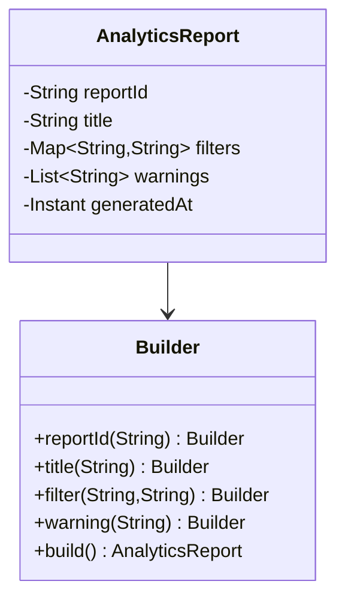

Builder is valuable when object construction is complex, optional fields are common, and you want the result to be immutable and readable.
It is not useful for every three-field DTO.

---

## Problem 1: Assemble an Immutable Report with Optional Parts

Problem description:
We need to construct an analytics report response with:

- mandatory report identity
- optional filters
- optional metadata
- optional warnings
- immutable final representation

What we are solving actually:
We are solving readability and invariant enforcement at construction time.
Without a builder, optional parts either create constructor bloat or force the object into partially initialized states that the rest of the system has to defend against.

What we are doing actually:

1. Keep required fields explicit at builder creation time.
2. Add optional fields fluently.
3. Validate invariants in one `build()` method.
4. Return an immutable object so downstream code never sees half-built state.

---

## UML



---

## Implementation Walkthrough

```java
import java.time.Instant;
import java.util.ArrayList;
import java.util.Collections;
import java.util.LinkedHashMap;
import java.util.List;
import java.util.Map;

public final class AnalyticsReport {
    private final String reportId;
    private final String title;
    private final Map<String, String> filters;
    private final List<String> warnings;
    private final Instant generatedAt;

    private AnalyticsReport(Builder builder) {
        this.reportId = builder.reportId;
        this.title = builder.title;
        this.filters = Collections.unmodifiableMap(new LinkedHashMap<>(builder.filters));
        this.warnings = Collections.unmodifiableList(new ArrayList<>(builder.warnings));
        this.generatedAt = builder.generatedAt;
    }

    public static Builder builder(String reportId, String title) {
        return new Builder(reportId, title);
    }

    public static final class Builder {
        private final String reportId;
        private final String title;
        private final Map<String, String> filters = new LinkedHashMap<>();
        private final List<String> warnings = new ArrayList<>();
        private Instant generatedAt = Instant.now();

        private Builder(String reportId, String title) {
            this.reportId = reportId;
            this.title = title;
        }

        public Builder filter(String key, String value) {
            filters.put(key, value); // Optional fields are accumulated fluently before final validation.
            return this;
        }

        public Builder warning(String message) {
            warnings.add(message);
            return this;
        }

        public Builder generatedAt(Instant generatedAt) {
            this.generatedAt = generatedAt;
            return this;
        }

        public AnalyticsReport build() {
            if (reportId == null || reportId.isEmpty()) {
                throw new IllegalStateException("reportId is required");
            }
            if (title == null || title.isEmpty()) {
                throw new IllegalStateException("title is required");
            }
            return new AnalyticsReport(this);
        }
    }
}
```

Usage:

```java
AnalyticsReport report = AnalyticsReport.builder("REP-42", "Revenue by Region")
        .filter("region", "IN")
        .filter("channel", "APP")
        .warning("Missing data for one warehouse")
        .build();
```

The fluent calls make the object shape visible at the call site.
That readability is useful, but the bigger win is that all invariant checks stay close to object creation. The rest of the application can work with a fully valid immutable report instead of partially assembled state.

---

## Why Builder Helps

Without Builder, constructor signatures become hard to read:

```java
new AnalyticsReport("REP-42", "Revenue by Region", filters, warnings, Instant.now());
```

The problem gets worse as optional fields grow.
Builder makes intent readable at the call site and centralizes validation in one place.

That second part is what often gets missed. A builder without validation is mostly syntax. A builder with validation becomes a reliable construction boundary.

---

## Debug Steps

Debug steps:

- test missing required fields to confirm `build()` fails fast
- verify the built object cannot be mutated through returned collections
- inspect whether the builder is solving real optional complexity or just adding ceremony
- check whether defaults like `generatedAt` are explicit enough for tests and reproducibility

---

## Practical Rule

Use Builder when:

- construction has many optional parts
- the final object should be immutable
- you want readable named steps

Do not use Builder for every trivial entity just because it looks fluent.
