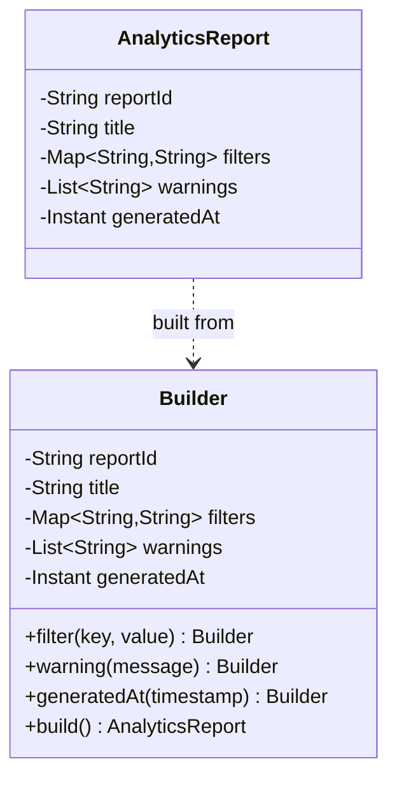

Builder is most useful when object creation has real shape:
required data, optional fields, defaults, validation, and a strong reason to keep the final object immutable.

It is much less useful when teams add it to every class just because fluent APIs look modern.

## Quick Decision Guide

| Situation | Builder fit | Better alternative when simpler |
| --- | --- | --- |
| many optional fields with readable named steps | strong | builder shines here |
| immutable object with construction-time validation | strong | builder or factory can work |
| 2-3 obvious required arguments | weak | constructor or static factory is usually enough |
| multiple mutually exclusive configuration modes | mixed | builder helps only if validation is clear |
| object graph assembly spread across layers | strong | builder can centralize construction rules |

The best builders do two jobs:

- make the call site readable
- enforce invariants before the object exists

If they only do the first job, they are often just ceremony.

## The Problem Builder Actually Solves

Suppose we need to assemble an analytics report with:

- required report identity
- required title
- optional filters
- optional warnings
- generated timestamp
- immutable final representation

The challenge is not "how do we avoid typing constructors."
The challenge is "how do we keep partially valid objects from escaping into the rest of the system."

That is where builder becomes useful:
it creates a clear construction boundary.

## Why Constructor-Only Design Gets Awkward

Without a builder, the call site often looks like this:

```java
new AnalyticsReport("REP-42", "Revenue by Region", filters, warnings, Instant.now());
```

That is fine while the object is small.
It gets harder to read once optional fields multiply or validation becomes non-trivial.

Problems appear quickly:

- argument ordering is easy to mix up
- optional values create constructor overload growth
- validation logic gets duplicated or scattered
- callers can drift into half-assembled state before the final object is ready

## A Practical Builder Example

```java
import java.time.Instant;
import java.util.ArrayList;
import java.util.Collections;
import java.util.LinkedHashMap;
import java.util.List;
import java.util.Map;

public final class AnalyticsReport {
    private final String reportId;
    private final String title;
    private final Map<String, String> filters;
    private final List<String> warnings;
    private final Instant generatedAt;

    private AnalyticsReport(Builder builder) {
        this.reportId = builder.reportId;
        this.title = builder.title;
        this.filters = Collections.unmodifiableMap(new LinkedHashMap<>(builder.filters));
        this.warnings = Collections.unmodifiableList(new ArrayList<>(builder.warnings));
        this.generatedAt = builder.generatedAt;
    }

    public static Builder builder(String reportId, String title) {
        return new Builder(reportId, title);
    }

    public static final class Builder {
        private final String reportId;
        private final String title;
        private final Map<String, String> filters = new LinkedHashMap<>();
        private final List<String> warnings = new ArrayList<>();
        private Instant generatedAt = Instant.now();

        private Builder(String reportId, String title) {
            this.reportId = reportId;
            this.title = title;
        }

        public Builder filter(String key, String value) {
            filters.put(key, value);
            return this;
        }

        public Builder warning(String message) {
            warnings.add(message);
            return this;
        }

        public Builder generatedAt(Instant generatedAt) {
            this.generatedAt = generatedAt;
            return this;
        }

        public AnalyticsReport build() {
            if (reportId == null || reportId.isBlank()) {
                throw new IllegalStateException("reportId is required");
            }
            if (title == null || title.isBlank()) {
                throw new IllegalStateException("title is required");
            }
            return new AnalyticsReport(this);
        }
    }
}
```

Usage:

```java
AnalyticsReport report = AnalyticsReport.builder("REP-42", "Revenue by Region")
        .filter("region", "IN")
        .filter("channel", "APP")
        .warning("Missing data for one warehouse")
        .build();
```

This is one of the Java patterns where a small UML class diagram genuinely helps:
it makes the construction boundary and the immutable result visible at a glance.



The call site reads like assembly steps instead of a dense argument list.

## The Real Win: Validation at the Boundary

A builder without validation is mostly syntax.
A builder with validation becomes a design boundary.

That matters because the rest of the application can assume:

- required fields exist
- defaults were applied consistently
- immutable collections are already wrapped
- invalid combinations were rejected before publication

This is why builder works well for immutable domain responses, reports, commands, and configuration objects.

## Immutability Matters Here

Builder and immutability pair well because they solve opposite halves of the same problem:

- builder helps create a valid object
- immutability helps keep it valid afterward

That is why defensive copies matter in the example:

```java
this.filters = Collections.unmodifiableMap(new LinkedHashMap<>(builder.filters));
this.warnings = Collections.unmodifiableList(new ArrayList<>(builder.warnings));
```

If we reused mutable collections directly, callers could mutate the final object through aliases and break the whole point of the pattern.

## Common Mistakes

### Using builder for trivial objects

If a class has two required fields and no real construction logic, a constructor or static factory is usually cleaner.

### Skipping validation in `build()`

Then the builder mostly becomes fluent syntax instead of an invariant gate.

### Exposing mutable internals

If the built object returns live mutable collections, the design is only pretending to be immutable.

### Letting the builder become a second domain model

Builders should assemble the object, not absorb unrelated business workflows and branching logic.

## When Builder Is a Strong Fit

Use it when:

- optional fields are common
- readability at the call site matters
- defaults must be applied consistently
- the final object should be immutable
- construction rules are important enough to centralize

Examples:

- report definitions
- API response assemblers
- configuration objects
- command objects with optional metadata

## When Builder Is the Wrong Tool

Do not use it automatically for:

- tiny DTOs
- simple entities with obvious constructors
- objects where a named static factory already communicates intent
- classes whose complexity comes from behavior, not construction

Sometimes a factory method like `Report.monthlyRevenue(id, title)` says more than a generic builder ever will.

## A Practical Rule

Ask this before adding builder:

"Am I solving real construction complexity, or am I just trying to make object creation look fancy?"

If the answer is only style, skip it.
If the answer is invariants, readability, defaults, and immutability, builder is usually a good fit.

## Key Takeaways

- Builder is strongest when object construction has genuine complexity.
- The biggest win is invariant enforcement at `build()` time, not just fluent syntax.
- Builder pairs naturally with immutable objects and defensive copies.
- For simple classes, constructors or static factories are often clearer and cheaper.
