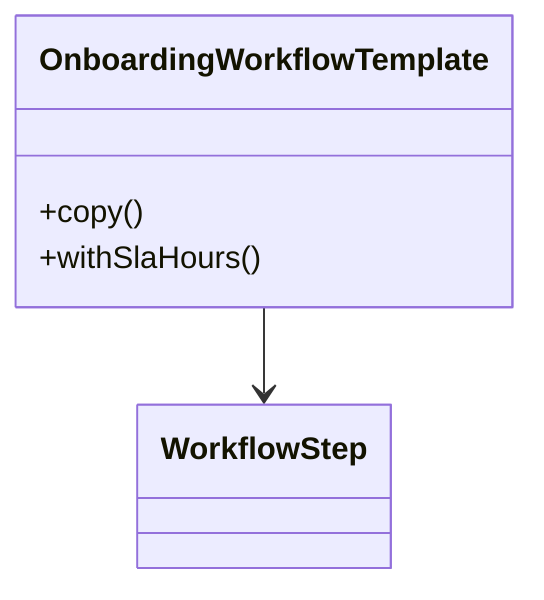

Prototype is useful when the natural domain operation is "start from a known template and clone it."
It helps when object creation is not just about setting fields, but about reusing a meaningful baseline safely.

---

## Problem 1: Workflow Template Cloning

Problem description:
We maintain onboarding workflows for different customer segments.
Each workflow starts from a shared template but may customize:

- SLA
- approval list
- notification channels

What we are solving actually:
We are solving for safe reuse of a baseline configuration.
Operations teams want to start from a standard workflow and create a slightly modified variant without rebuilding every object manually.
The risk is that careless copying can make different workflow instances accidentally share mutable nested data.

What we are doing actually:

1. Model a workflow template that knows how to copy itself.
2. Ensure nested mutable parts are cloned deliberately.
3. Start new workflow variants by cloning the baseline.
4. Apply small targeted changes to the clone instead of rebuilding from scratch.

---

## UML



---

## Implementation Walkthrough

```java
import java.util.ArrayList;
import java.util.List;

public final class WorkflowStep {
    private final String name;

    public WorkflowStep(String name) {
        this.name = name;
    }

    public WorkflowStep copy() {
        return new WorkflowStep(name); // Step is copied so clones do not share mutable step objects later.
    }
}

public final class OnboardingWorkflowTemplate {
    private final String templateName;
    private final List<WorkflowStep> steps;
    private final int slaHours;

    public OnboardingWorkflowTemplate(String templateName, List<WorkflowStep> steps, int slaHours) {
        this.templateName = templateName;
        this.steps = steps;
        this.slaHours = slaHours;
    }

    public OnboardingWorkflowTemplate copy() {
        List<WorkflowStep> clonedSteps = new ArrayList<>();
        for (WorkflowStep step : steps) {
            clonedSteps.add(step.copy()); // Deep-copy nested step objects.
        }
        return new OnboardingWorkflowTemplate(templateName, clonedSteps, slaHours);
    }

    public OnboardingWorkflowTemplate withSlaHours(int newSlaHours) {
        return new OnboardingWorkflowTemplate(templateName, new ArrayList<>(steps), newSlaHours);
    }
}
```

Usage:

```java
OnboardingWorkflowTemplate defaultTemplate = new OnboardingWorkflowTemplate(
        "default-startup",
        java.util.Arrays.asList(
                new WorkflowStep("kyc"),
                new WorkflowStep("risk-review"),
                new WorkflowStep("account-activation")
        ),
        48
);

OnboardingWorkflowTemplate enterprise = defaultTemplate.copy().withSlaHours(24);
```

This fits the domain because teams really do think in terms of "take the default workflow and derive a stricter enterprise version."
That is a stronger signal for Prototype than "I happen to have a lot of constructor arguments."

---

## Deep Copy vs Shallow Copy

This is the central issue in Prototype.
If you copy only the top-level object but leave nested mutable objects shared, one clone can accidentally corrupt another.

That is why `WorkflowStep.copy()` exists.
Prototype without clear copy semantics is a bug factory.

In practice, document all of these clearly:

- which fields are deeply copied
- which identifiers are regenerated
- which metadata is preserved
- whether nested collections are shared or recreated

That documentation matters as much as the code, because copy semantics are part of the domain contract.

---

## Clone Flow

```mermaid
flowchart LR
    A[Baseline Template] --> B[copy()]
    B --> C[Cloned Workflow]
    C --> D[Adjust SLA]
    C --> E[Adjust Approval List]
    C --> F[Adjust Notification Channels]
```

This flow is useful because it shows where variation belongs.
Variation should happen after cloning the baseline, not by mutating the shared template directly.

---

## When Prototype Fits Better Than Builder

Builder is great when you are assembling something from parts.
Prototype is better when a copy of an existing object is the starting point.

Use Prototype when:

- templates are common
- clone semantics match the business language
- object graphs are moderately rich
- rebuilding from scratch would duplicate setup logic

Use Builder when:

- creation is step-by-step composition
- no meaningful baseline object exists
- you want explicit control over each assembled piece

---

## Common Mistakes

1. Implementing only a shallow copy for nested mutable objects
2. Forgetting to reset fields like ids, timestamps, or execution state in the clone
3. Using Prototype when the real need is a builder or factory
4. Hiding copy behavior so deeply that readers cannot tell what is shared versus cloned

---

## Debug Steps

Debug steps:

- clone a template and mutate the clone to verify the original does not change
- test nested collections and nested objects, not just top-level fields
- document which fields are intentionally shared, if any
- verify that identifiers or runtime state are not duplicated accidentally

---

## Key Takeaways

- Prototype is about safe reuse of a meaningful baseline object
- deep versus shallow copy is the most important design decision
- use it when cloning is a natural domain action, not just because constructors feel long
