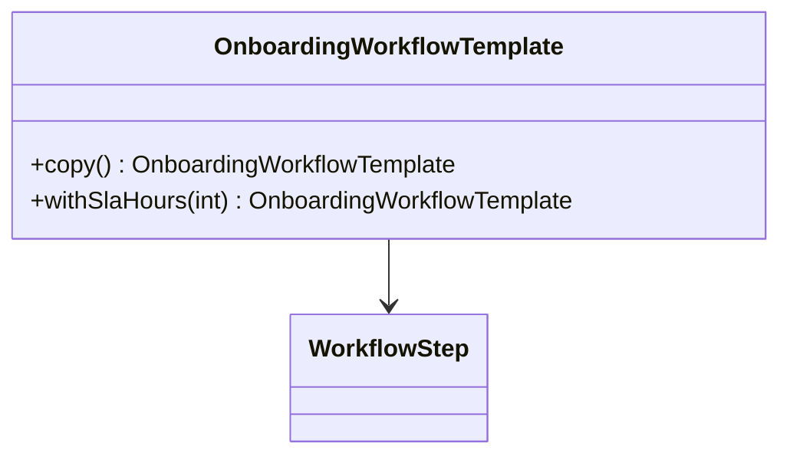

Prototype is useful when creating a new object from scratch is expensive or when a predefined template should be copied and slightly adjusted.
It is common in workflow systems, document templates, and rule configurations.

---

## Example Problem

We maintain onboarding workflows for different customer segments.
Each workflow starts from a template but may customize:

- SLA
- approval list
- notification channels

---

## UML



---

## Implementation Walkthrough

```java
import java.util.ArrayList;
import java.util.List;

public final class WorkflowStep {
    private final String name;

    public WorkflowStep(String name) {
        this.name = name;
    }

    public WorkflowStep copy() {
        return new WorkflowStep(name);
    }
}

public final class OnboardingWorkflowTemplate {
    private final String templateName;
    private final List<WorkflowStep> steps;
    private final int slaHours;

    public OnboardingWorkflowTemplate(String templateName, List<WorkflowStep> steps, int slaHours) {
        this.templateName = templateName;
        this.steps = steps;
        this.slaHours = slaHours;
    }

    public OnboardingWorkflowTemplate copy() {
        List<WorkflowStep> clonedSteps = new ArrayList<>();
        for (WorkflowStep step : steps) {
            clonedSteps.add(step.copy());
        }
        return new OnboardingWorkflowTemplate(templateName, clonedSteps, slaHours);
    }

    public OnboardingWorkflowTemplate withSlaHours(int newSlaHours) {
        return new OnboardingWorkflowTemplate(templateName, new ArrayList<>(steps), newSlaHours);
    }
}
```

Usage:

```java
OnboardingWorkflowTemplate defaultTemplate = new OnboardingWorkflowTemplate(
        "default-startup",
        java.util.Arrays.asList(
                new WorkflowStep("kyc"),
                new WorkflowStep("risk-review"),
                new WorkflowStep("account-activation")
        ),
        48
);

OnboardingWorkflowTemplate enterprise = defaultTemplate.copy().withSlaHours(24);
```

This example works because cloning matches the domain language. Operations teams often do think in terms of “take the baseline workflow and create a stricter enterprise variant.”
That makes Prototype more natural here than forcing every variant through a long constructor or a separate builder flow.

---

## Deep Copy vs Shallow Copy

This is the central issue in Prototype.
If you copy only the top-level object but retain shared mutable nested objects, one clone can accidentally corrupt another.

That is why `WorkflowStep.copy()` exists.
Prototype without clear copy semantics is a bug factory.

In practice, that means you should document exactly which parts are cloned deeply, which identifiers are reset, and whether nested mutable objects are shared or recreated.

---

## When to Prefer Prototype

Use it when:

- templates are common
- object graphs are moderately rich
- cloning is semantically meaningful

Prefer Builder or Factory when a copy is not the natural mental model.
