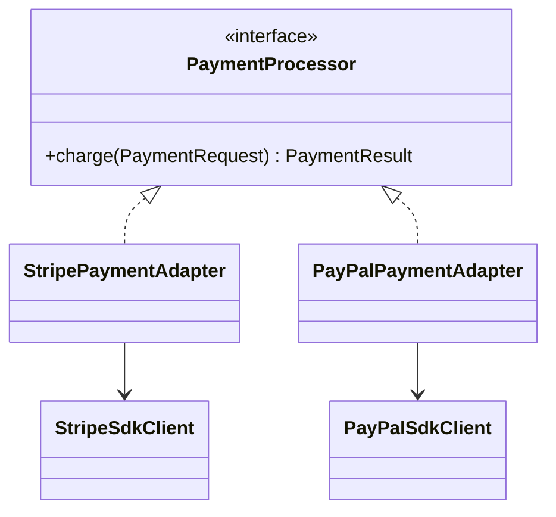

Adapter lets your application speak in its own language while wrapping external APIs that were never designed for your internal model.
This is one of the most practical patterns in backend engineering.

---

## Problem

Our checkout code wants this contract:

```java
public interface PaymentProcessor {
    PaymentResult charge(PaymentRequest request);
}
```

But the providers expose incompatible APIs.

---

## UML



---

## Implementation Walkthrough

```java
public final class PaymentRequest {
    private final String orderId;
    private final long amountInCents;

    public PaymentRequest(String orderId, long amountInCents) {
        this.orderId = orderId;
        this.amountInCents = amountInCents;
    }

    public String getOrderId() { return orderId; }
    public long getAmountInCents() { return amountInCents; }
}

public final class PaymentResult {
    private final boolean success;
    private final String providerReference;

    private PaymentResult(boolean success, String providerReference) {
        this.success = success;
        this.providerReference = providerReference;
    }

    public static PaymentResult success(String ref) {
        return new PaymentResult(true, ref);
    }
}

public interface PaymentProcessor {
    PaymentResult charge(PaymentRequest request);
}

public final class StripeSdkClient {
    public String createCharge(long cents, String externalId) {
        return "stripe-" + externalId + "-" + cents;
    }
}

public final class StripePaymentAdapter implements PaymentProcessor {
    private final StripeSdkClient stripeSdkClient;

    public StripePaymentAdapter(StripeSdkClient stripeSdkClient) {
        this.stripeSdkClient = stripeSdkClient;
    }

    @Override
    public PaymentResult charge(PaymentRequest request) {
        String ref = stripeSdkClient.createCharge(request.getAmountInCents(), request.getOrderId());
        return PaymentResult.success(ref);
    }
}
```

Application code remains stable:

```java
public final class CheckoutService {
    private final PaymentProcessor paymentProcessor;

    public CheckoutService(PaymentProcessor paymentProcessor) {
        this.paymentProcessor = paymentProcessor;
    }

    public PaymentResult checkout(String orderId, long amount) {
        return paymentProcessor.charge(new PaymentRequest(orderId, amount));
    }
}
```

The design benefit is not just easier provider swapping.
It is that the checkout flow can now speak in business terms such as `PaymentRequest` and `PaymentResult` instead of leaking vendor-specific request models into core application code.

---

## Why Adapter Matters

Without Adapter, third-party SDK details spread across the codebase:

- request shape
- exception mapping
- provider-specific terminology
- response parsing

With Adapter, those concerns stay at the integration boundary.

That boundary is one of the most valuable habits in backend architecture because it prevents third-party SDK choices from dictating the shape of your internal model.

---

## Practical Advice

An adapter should translate, not invent business logic.
If retry policy, idempotency, or fallback logic is added there, document it explicitly because the adapter is now becoming part integration layer and part policy layer.
