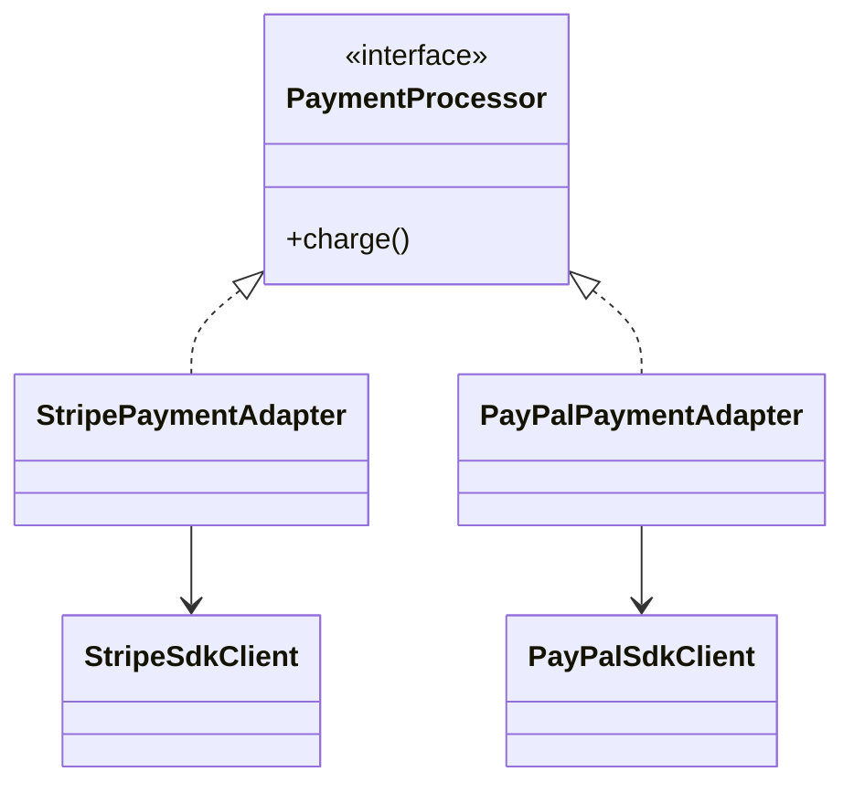
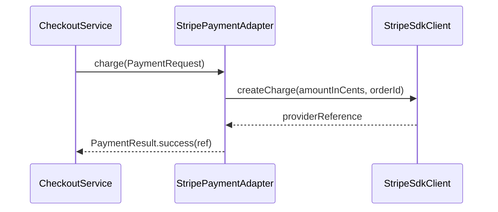

Adapter lets your application speak in its own language while wrapping external APIs that were never designed for your internal model.
This is one of the most practical patterns in backend engineering.

---

## Problem 1: Payment Gateway Integration with Stable Internal Contracts

Problem description:
Our checkout code wants this contract:

```java
public interface PaymentProcessor {
    PaymentResult charge(PaymentRequest request);
}
```

But the providers expose incompatible APIs.

What we are solving actually:
We are solving a boundary problem.
The checkout domain should talk in business terms such as `PaymentRequest` and `PaymentResult`, while external providers speak in SDK-specific terms, error models, and request shapes.
Without an adapter, those provider details leak into the core application and make future provider changes expensive.

What we are doing actually:

1. Define a stable internal contract for payment processing.
2. Keep checkout code dependent only on that contract.
3. Wrap each provider SDK in an adapter that translates both requests and responses.
4. Contain provider-specific terminology, exception mapping, and response parsing at the integration edge.

---

## UML



---

## Implementation Walkthrough

```java
public final class PaymentRequest {
    private final String orderId;
    private final long amountInCents;

    public PaymentRequest(String orderId, long amountInCents) {
        this.orderId = orderId;
        this.amountInCents = amountInCents;
    }

    public String getOrderId() { return orderId; }
    public long getAmountInCents() { return amountInCents; }
}

public final class PaymentResult {
    private final boolean success;
    private final String providerReference;

    private PaymentResult(boolean success, String providerReference) {
        this.success = success;
        this.providerReference = providerReference;
    }

    public static PaymentResult success(String ref) {
        return new PaymentResult(true, ref);
    }
}

public interface PaymentProcessor {
    PaymentResult charge(PaymentRequest request);
}

public final class StripeSdkClient {
    public String createCharge(long cents, String externalId) {
        return "stripe-" + externalId + "-" + cents;
    }
}

public final class StripePaymentAdapter implements PaymentProcessor {
    private final StripeSdkClient stripeSdkClient;

    public StripePaymentAdapter(StripeSdkClient stripeSdkClient) {
        this.stripeSdkClient = stripeSdkClient;
    }

    @Override
    public PaymentResult charge(PaymentRequest request) {
        String ref = stripeSdkClient.createCharge(
                request.getAmountInCents(),
                request.getOrderId()
        ); // Translate internal request shape to provider-specific method call.
        return PaymentResult.success(ref);
    }
}
```

Application code remains stable:

```java
public final class CheckoutService {
    private final PaymentProcessor paymentProcessor;

    public CheckoutService(PaymentProcessor paymentProcessor) {
        this.paymentProcessor = paymentProcessor;
    }

    public PaymentResult checkout(String orderId, long amount) {
        return paymentProcessor.charge(new PaymentRequest(orderId, amount));
    }
}
```

The design benefit is not just easier provider swapping.
It is that the checkout flow can now speak in business terms such as `PaymentRequest` and `PaymentResult` instead of leaking vendor-specific request models into core application code.

---

## Why Adapter Matters

Without Adapter, third-party SDK details spread across the codebase:

- request shape
- exception mapping
- provider-specific terminology
- response parsing

With Adapter, those concerns stay at the integration boundary.

That boundary is one of the most valuable habits in backend architecture because it prevents third-party SDK choices from dictating the shape of your internal model.

---

## Translation Flow



This diagram captures the real value of the pattern.
Checkout never learns the SDK method names or parameter conventions.
It only sees the internal contract.

---

## Adapter vs Facade

These patterns are sometimes confused.

- Adapter changes one interface into another interface your code wants
- Facade simplifies a subsystem behind a higher-level API

In this example, the key problem is interface mismatch, so Adapter is the better fit.
If the goal were only to simplify a complex internal payment subsystem, Facade would be the closer match.

---

## Practical Production Concerns

Real adapters usually do more than field mapping.
They often centralize:

- provider exception translation
- timeout and retry behavior
- idempotency key handling
- provider-specific status normalization

Those are good responsibilities for an adapter as long as they remain translation-oriented.
If the adapter starts deciding discount policy or checkout workflow, the boundary has become muddled.

---

## Common Mistakes

1. Letting provider DTOs leak past the adapter into core business code
2. Mixing provider selection logic into the adapter itself
3. Hiding important policy like retries or idempotency without documenting it
4. Treating the adapter as a place for unrelated business decisions

---

## Debug Steps

Debug steps:

- log both the internal request and normalized provider reference at the adapter boundary
- add tests that verify checkout code never depends on provider SDK types
- simulate provider errors and confirm they are translated consistently
- verify swapping one adapter for another does not change checkout service code

---

## Key Takeaways

- Adapter protects the internal model from third-party interface mismatch
- the real win is boundary control, not just provider swapping
- use it to translate external contracts into business-friendly internal contracts

---

## Practical Advice

An adapter should translate, not invent business logic.
If retry policy, idempotency, or fallback logic is added there, document it explicitly because the adapter is now becoming part integration layer and part policy layer.
