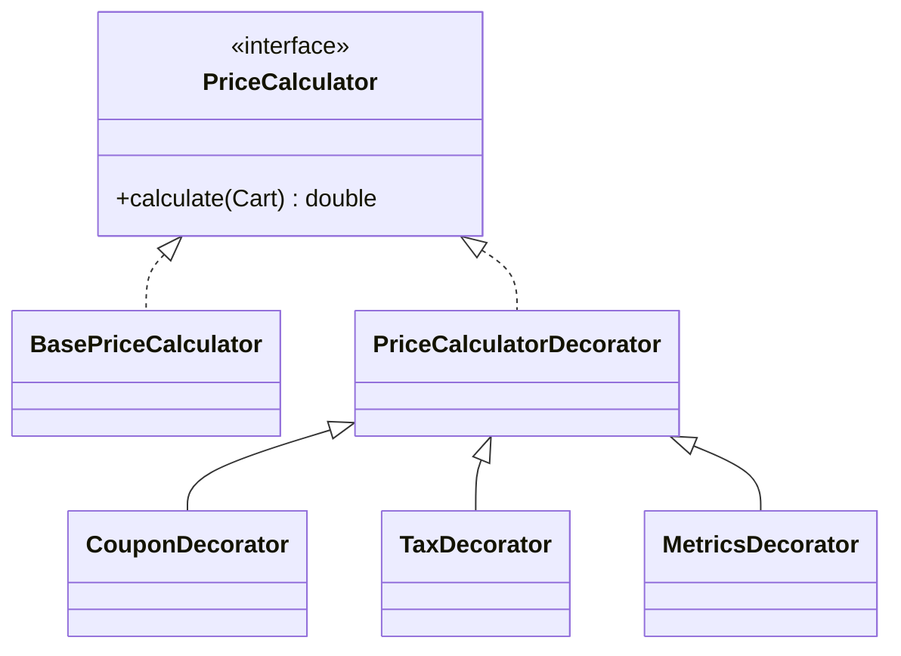

Decorator is ideal when behavior should be layered dynamically without creating an inheritance tree for every combination.
In backend systems, this often appears in pricing, validation, caching, authorization, and logging.

---

## Example Problem

We start with base price calculation.
Then we want optional layers:

- coupon discount
- tax
- metrics logging

These combinations should be composable.

---

## UML



---

## Implementation Walkthrough

```java
public interface PriceCalculator {
    double calculate(Cart cart);
}

public final class BasePriceCalculator implements PriceCalculator {
    @Override
    public double calculate(Cart cart) {
        return cart.getItems().stream().mapToDouble(Item::getPrice).sum();
    }
}

public abstract class PriceCalculatorDecorator implements PriceCalculator {
    protected final PriceCalculator delegate;

    protected PriceCalculatorDecorator(PriceCalculator delegate) {
        this.delegate = delegate;
    }
}

public final class CouponDecorator extends PriceCalculatorDecorator {
    public CouponDecorator(PriceCalculator delegate) {
        super(delegate);
    }

    @Override
    public double calculate(Cart cart) {
        return delegate.calculate(cart) * 0.90;
    }
}

public final class TaxDecorator extends PriceCalculatorDecorator {
    public TaxDecorator(PriceCalculator delegate) {
        super(delegate);
    }

    @Override
    public double calculate(Cart cart) {
        return delegate.calculate(cart) * 1.18;
    }
}

public final class MetricsDecorator extends PriceCalculatorDecorator {
    public MetricsDecorator(PriceCalculator delegate) {
        super(delegate);
    }

    @Override
    public double calculate(Cart cart) {
        long start = System.nanoTime();
        double result = delegate.calculate(cart);
        long duration = System.nanoTime() - start;
        System.out.println("pricing.duration.nanos=" + duration);
        return result;
    }
}
```

Usage:

```java
PriceCalculator calculator = new MetricsDecorator(
        new TaxDecorator(
                new CouponDecorator(
                        new BasePriceCalculator()
                )
        )
);
```

This composition is not arbitrary.
The ordering expresses business meaning. A coupon applied before tax can yield a different monetary result than a coupon applied after tax, so the assembly code is part of the business design, not just a technical wrapper stack.

---

## Why Not Inheritance

Without Decorator, you quickly create classes such as:

- `DiscountedPriceCalculator`
- `DiscountedTaxedPriceCalculator`
- `DiscountedTaxedMetricsPriceCalculator`

That scales badly.
Decorator avoids combinatorial class explosion by composing behavior.

That is the main reason to prefer it over inheritance here. You are composing orthogonal concerns instead of minting a new subclass for every combination of discount, tax, and instrumentation behavior.

---

## Practical Warning

Too many decorators can hide control flow.
If debugging the stack becomes difficult, create a higher-level composition factory so behavior assembly stays readable.
