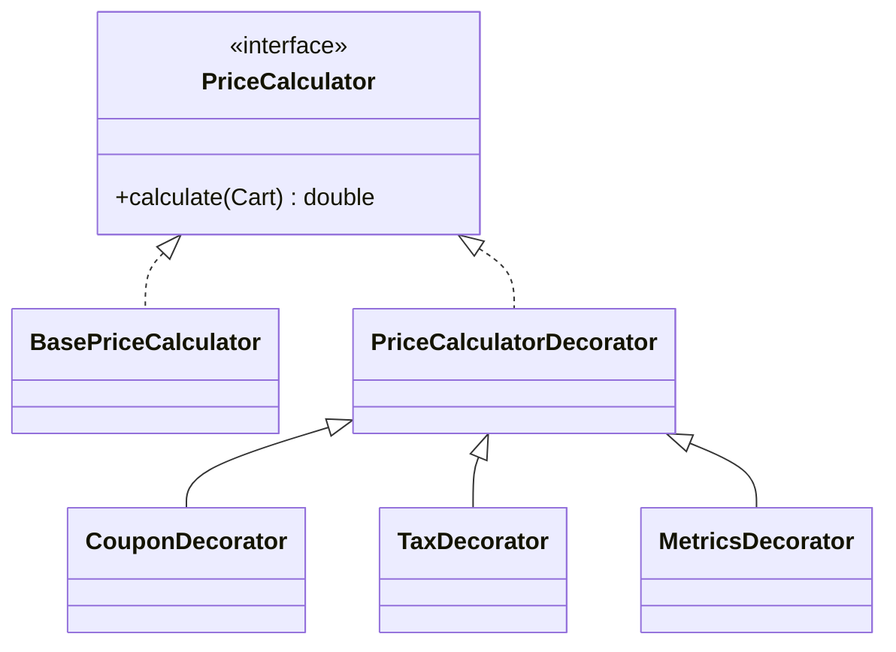

Decorator becomes useful when the base behavior is stable, but the way you wrap it keeps changing.
That usually happens in systems where pricing, logging, validation, or policy layers need to stack without creating a new class for every combination.

---

## Where The Pain Starts

Imagine pricing logic that begins simply and then attracts extra responsibilities:

- coupon discount
- tax
- metrics logging

At first, people often just add more conditionals into one calculator.
Then the order starts to matter.
Then observability shows up.
Then someone wants one flow with coupon plus tax, another with tax only, and another with metrics around everything.

That is where a plain inheritance hierarchy starts getting silly.

---

## Why Decorator Fits This Better Than Subclasses

The real problem is not “how do I add code around a method.”
It is “how do I keep optional behavior composable without turning the model into a subclass matrix.”

Without Decorator, you quickly drift toward names like:

- `DiscountedPriceCalculator`
- `DiscountedTaxedPriceCalculator`
- `DiscountedTaxedMetricsPriceCalculator`

That is not domain modeling.
That is class explosion.

Decorator gives you a better shape:

- one stable contract
- one core implementation
- optional wrappers with explicit ordering

---

## Structure



---

## A Minimal Implementation

```java
public interface PriceCalculator {
    double calculate(Cart cart);
}

public final class BasePriceCalculator implements PriceCalculator {
    @Override
    public double calculate(Cart cart) {
        return cart.getItems().stream().mapToDouble(Item::getPrice).sum();
    }
}

public abstract class PriceCalculatorDecorator implements PriceCalculator {
    protected final PriceCalculator delegate;

    protected PriceCalculatorDecorator(PriceCalculator delegate) {
        this.delegate = delegate;
    }
}

public final class CouponDecorator extends PriceCalculatorDecorator {
    public CouponDecorator(PriceCalculator delegate) {
        super(delegate);
    }

    @Override
    public double calculate(Cart cart) {
        return delegate.calculate(cart) * 0.90;
    }
}

public final class TaxDecorator extends PriceCalculatorDecorator {
    public TaxDecorator(PriceCalculator delegate) {
        super(delegate);
    }

    @Override
    public double calculate(Cart cart) {
        return delegate.calculate(cart) * 1.18;
    }
}

public final class MetricsDecorator extends PriceCalculatorDecorator {
    public MetricsDecorator(PriceCalculator delegate) {
        super(delegate);
    }

    @Override
    public double calculate(Cart cart) {
        long start = System.nanoTime();
        double result = delegate.calculate(cart);
        long duration = System.nanoTime() - start;
        System.out.println("pricing.duration.nanos=" + duration);
        return result;
    }
}
```

Usage:

```java
PriceCalculator calculator = new MetricsDecorator(
        new TaxDecorator(
                new CouponDecorator(
                        new BasePriceCalculator()
                )
        )
);
```

The important thing here is not that decorators can stack.
Everyone already knows that part.

The important thing is that ordering carries business meaning.
A coupon applied before tax can produce a different outcome than a coupon applied after tax.
So the assembly code is not just plumbing.
It is part of the pricing policy.

---

## What Makes Decorator Dangerous

Decorator looks elegant in diagrams and messy in production if you overuse it.

Typical failure modes:

- the wrapping order is implicit and nobody knows which layer runs first
- too many small decorators make debugging painful
- domain behavior and technical behavior get mixed without boundaries

My bias is to use Decorator when the layers are genuinely orthogonal and when order can be made explicit in one place.
If both of those are not true, simpler composition is usually better.

---

## When I Would Still Choose Something Else

If the behavior is fixed and not optional, a regular service class is usually enough.
If the object graph is getting hard to read, a composition factory or policy object is often a better boundary than ten decorators chained together.

Decorator is strongest when variability is real, the contract is stable, and the layering itself expresses useful intent.
