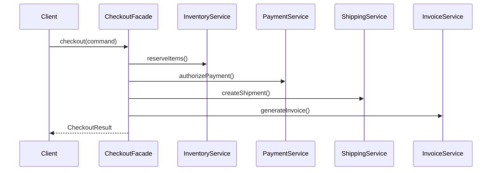

Facade provides a simpler interface over a subsystem that is noisy, fragmented, or too detailed for most callers.
That makes it a natural fit for application services and orchestration boundaries.

---

## Example Problem

Checkout requires multiple subsystems:

- inventory reservation
- payment authorization
- shipping initiation
- invoice generation

Most callers should not coordinate these pieces manually.

---

## UML



---

## Implementation Walkthrough

```java
public final class CheckoutFacade {
    private final InventoryService inventoryService;
    private final PaymentService paymentService;
    private final ShippingService shippingService;
    private final InvoiceService invoiceService;

    public CheckoutFacade(InventoryService inventoryService,
                          PaymentService paymentService,
                          ShippingService shippingService,
                          InvoiceService invoiceService) {
        this.inventoryService = inventoryService;
        this.paymentService = paymentService;
        this.shippingService = shippingService;
        this.invoiceService = invoiceService;
    }

    public CheckoutResult checkout(CheckoutCommand command) {
        inventoryService.reserve(command.getItems());
        String paymentRef = paymentService.authorize(command.getOrderId(), command.getAmount());
        String shipmentId = shippingService.createShipment(command.getOrderId(), command.getAddress());
        String invoiceId = invoiceService.generate(command.getOrderId(), command.getAmount());
        return new CheckoutResult(command.getOrderId(), paymentRef, shipmentId, invoiceId);
    }
}
```

Usage stays simple:

```java
CheckoutResult result = checkoutFacade.checkout(command);
```

The facade is useful because the client now interacts with checkout as one application-level action instead of four subsystem calls.
That reduces duplication in callers and gives you one place to define sequencing, failure semantics, and request-level observability.

---

## Why Facade Helps

It reduces coupling at the caller side.
Clients interact with one high-level use case instead of four lower-level services.

It also creates a natural place for:

- orchestration rules
- transaction boundaries
- compensating actions
- request-level logging

In real systems, this is also the right layer to make compensation rules explicit. If payment succeeds but shipment creation fails, the facade is the natural place to define whether the system should roll back, retry, or mark the workflow for asynchronous recovery.

---

## Common Mistake

Facade should simplify access, not become the home for every business rule in the system.
If the class keeps growing, split by use case instead of creating one mega-facade.
