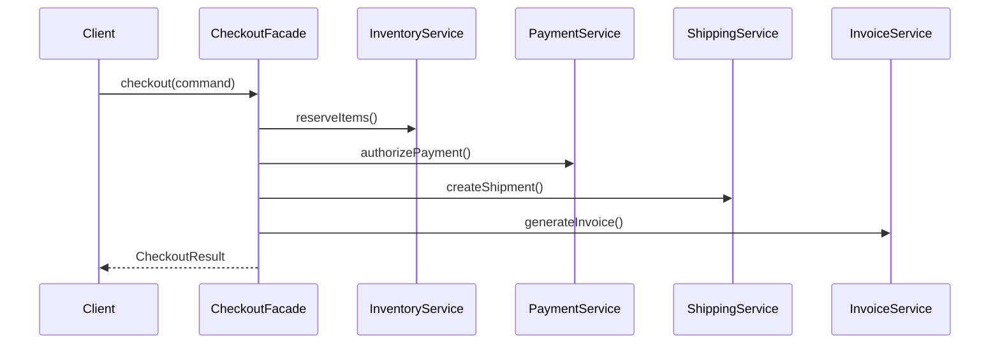

Facade is useful when the caller should think in terms of one business action, but the system underneath still needs several subsystem calls to make that happen.
That is why it shows up so often in application services and orchestration layers.

---

## Problem 1: One Checkout Use Case, Many Subsystems

Problem description:
Checkout requires multiple subsystems:

- inventory reservation
- payment authorization
- shipping initiation
- invoice generation

Most callers should not coordinate these pieces manually.

What we are solving actually:
We are solving for use-case orchestration at one clear boundary.
If every caller coordinates inventory, payment, shipping, and invoice generation independently, the application ends up with duplicated sequencing and inconsistent failure behavior.

What we are doing actually:

1. Expose one `checkout` entry point to callers.
2. Keep subsystem sequencing inside the facade.
3. Centralize orchestration policy, logging, and compensation decisions around that boundary.

---

## Why This Should Not Leak To Callers

If every caller has to remember the checkout sequence, you get duplication immediately:

- reserve inventory
- authorize payment
- create shipment
- generate invoice

Worse, you get inconsistent failure handling.
One caller retries payment.
Another forgets to create the invoice.
A third logs only half the workflow.

That is the real value of Facade.
It turns a multi-step subsystem interaction into one application-level boundary.

---

## Structure



---

## A Minimal Implementation

```java
public final class CheckoutFacade {
    private final InventoryService inventoryService;
    private final PaymentService paymentService;
    private final ShippingService shippingService;
    private final InvoiceService invoiceService;

    public CheckoutFacade(InventoryService inventoryService,
                          PaymentService paymentService,
                          ShippingService shippingService,
                          InvoiceService invoiceService) {
        this.inventoryService = inventoryService;
        this.paymentService = paymentService;
        this.shippingService = shippingService;
        this.invoiceService = invoiceService;
    }

    public CheckoutResult checkout(CheckoutCommand command) {
        inventoryService.reserve(command.getItems()); // First secure inventory for the order.
        String paymentRef = paymentService.authorize(command.getOrderId(), command.getAmount());
        String shipmentId = shippingService.createShipment(command.getOrderId(), command.getAddress());
        String invoiceId = invoiceService.generate(command.getOrderId(), command.getAmount());
        return new CheckoutResult(command.getOrderId(), paymentRef, shipmentId, invoiceId);
    }
}
```

Usage stays simple:

```java
CheckoutResult result = checkoutFacade.checkout(command);
```

The important shift is this:

- clients talk in terms of `checkout`
- the facade owns sequencing
- subsystem coordination is no longer copied around the codebase

That gives you one place to express failure semantics, observability, and orchestration policy.

---

## Where Facade Earns Its Keep

In real systems, this is the natural place for:

- orchestration rules
- transaction boundaries
- compensating actions
- request-level logging

It is also where compensation policy becomes explicit.
If payment succeeds but shipment creation fails, the facade is the layer that should decide whether to roll back, retry, or mark the workflow for asynchronous recovery.

---

## How Facades Rot

The usual mistake is treating Facade as a safe place to dump every rule.

That creates a mega-facade that knows too much:

- validation
- pricing
- orchestration
- fallback policy
- reporting side effects

At that point the class is no longer simplifying the subsystem.
It is becoming a second subsystem.

My rule is simple: split facades by use case boundary, not by the fact that several services exist underneath.

---

## Debug Steps

Debug steps:

- trace one checkout request end-to-end and confirm sequencing is owned only by the facade
- test partial-failure paths, not just the happy path
- inspect whether validation, pricing, or reporting logic is leaking into the facade unnecessarily
- split the facade when one use-case boundary grows into a catch-all orchestration class
