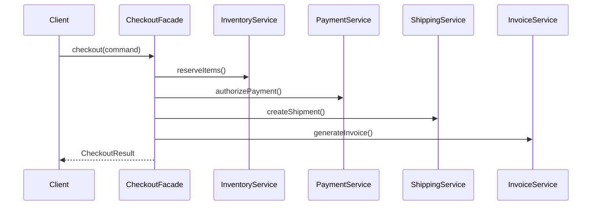

Facade is useful when the caller should think in terms of one business action, while the system underneath still needs several subsystem interactions to make that action real.

That is why it appears so often in application services, orchestration layers, and domain-level use cases.
The caller wants "checkout."
The system still needs inventory, payment, shipping, and invoicing.

## Quick Summary

| Good fit for Facade | Poor fit for Facade |
| --- | --- |
| one business use case over multiple subsystems | a dumping ground for every cross-cutting rule |
| hiding sequencing details from callers | replacing all domain modeling with one giant coordinator |
| centralizing failure and logging policy | mixing unrelated use cases into one mega-class |
| creating a stable application boundary | burying deep business rules that should live elsewhere |

The point of Facade is simplification at the boundary, not accumulation of every responsibility in the system.

## The Real Problem

Checkout often needs several subsystems:

- inventory reservation
- payment authorization
- shipment creation
- invoice generation

If every caller coordinates those pieces manually, the codebase starts drifting almost immediately:

- one caller does payment before inventory
- another forgets compensation
- a third logs only half the workflow
- a fourth applies a slightly different retry policy

That inconsistency is the real problem Facade solves.

## What a Facade Should Own

A good facade owns the application-level sequence for one use case.

That usually includes:

- orchestration order
- request-scoped logging
- translation from subsystem outputs to one caller-facing result
- explicit failure behavior at the use-case boundary

It should not automatically own:

- all domain validation in the system
- every pricing rule
- reporting pipelines
- every policy decision from unrelated flows

The boundary is the use case, not "anything that happens to touch these services."

## Checkout Example



The client should not care about subsystem choreography.
It should care whether checkout succeeded and what the resulting business outcome is.

## A Minimal Java Implementation

```java
public final class CheckoutFacade {
    private final InventoryService inventoryService;
    private final PaymentService paymentService;
    private final ShippingService shippingService;
    private final InvoiceService invoiceService;

    public CheckoutFacade(InventoryService inventoryService,
                          PaymentService paymentService,
                          ShippingService shippingService,
                          InvoiceService invoiceService) {
        this.inventoryService = inventoryService;
        this.paymentService = paymentService;
        this.shippingService = shippingService;
        this.invoiceService = invoiceService;
    }

    public CheckoutResult checkout(CheckoutCommand command) {
        inventoryService.reserve(command.getItems());

        String paymentRef =
                paymentService.authorize(command.getOrderId(), command.getAmount());

        String shipmentId =
                shippingService.createShipment(command.getOrderId(), command.getAddress());

        String invoiceId =
                invoiceService.generate(command.getOrderId(), command.getAmount());

        return new CheckoutResult(
                command.getOrderId(),
                paymentRef,
                shipmentId,
                invoiceId
        );
    }
}
```

This keeps the client API simple:

```java
CheckoutResult result = checkoutFacade.checkout(command);
```

That simplicity is the benefit.
The complexity still exists, but it now lives in the right place.

## Why This Boundary Is Valuable

The facade gives you one place to define the operational truth of checkout:

- what must happen first
- what may fail
- what gets retried
- what gets compensated
- what gets logged

Without that boundary, those decisions leak into multiple callers and stop being consistent.

In practice, the value is not "fewer method calls."
The value is one stable application contract for a multi-step workflow.

## Failure Semantics Matter More Than the Happy Path

The happy path is easy:

1. reserve inventory
2. charge payment
3. create shipment
4. generate invoice

The real design question is what happens when step 3 fails after step 2 succeeded.

This is where facades earn their keep.
They are a natural place to centralize policies such as:

- release inventory if payment fails
- refund or void payment if shipping creation fails
- mark the order for asynchronous recovery instead of forcing full rollback
- emit one consistent audit trail for the checkout attempt

If every caller invents its own answer, the system becomes operationally incoherent.

## What Should Not Live Inside the Facade

Facade is easy to misuse because "central place" feels safe.
Over time, teams start pushing in unrelated responsibilities:

- validation rules that belong to domain objects
- pricing logic that belongs to pricing policy
- reporting fan-out
- experiment branching
- data cleanup

That is how a clean facade turns into a god class.

My rule is simple:
the facade should express the use-case flow, not become the entire application.

## Facade vs Adapter vs Application Service

These patterns overlap in real code, but they solve different problems.

### Facade

Simplifies a subsystem or workflow behind one boundary.

### Adapter

Translates one interface into another.
It is about compatibility, not orchestration.

### Application Service

Often ends up hosting the facade-like behavior in modern codebases.
In many Spring systems, a class named `CheckoutService` may effectively be the facade.

That is fine.
The important thing is the responsibility, not the class name.

## Testing a Facade Properly

A facade should not only be tested for the success path.
The most valuable tests usually verify:

- subsystem calls happen in the right order
- failures stop the flow at the correct boundary
- compensating actions run when policy requires them
- callers do not need to know internal sequencing details

If the tests only check that four methods were called, you are testing syntax instead of design.

## Common Failure Patterns

### The Mega-Facade

One class starts handling checkout, refunds, loyalty points, fraud review, analytics, fulfillment exceptions, and reporting.

That is no longer simplification.
That is architectural debt wearing a pattern name.

### Leaking Subsystems Back to Callers

If callers still need to know when to invoke inventory or payment directly, the facade is not really the boundary.

### Hiding Too Much Policy

A facade should make orchestration simple for callers, but it should not make important business rules impossible to see or test.

### Treating the Facade as a Transaction Magic Box

Distributed workflows rarely become atomic just because one class coordinates them.
Compensation and failure semantics still need explicit design.

## A Better Rule for Real Projects

Create a facade when all of these are true:

1. callers should think in terms of one business action
2. multiple subsystem interactions are required
3. sequencing and failure policy should be consistent across callers
4. hiding the internal choreography improves the API

If those are not true, a facade may only be adding another layer.

## Final Takeaway

Facade is most valuable when it gives the rest of the system one clean sentence:
"to perform checkout, call this boundary."

That sounds simple, but it is powerful.
It means sequencing, failure handling, and workflow visibility are now owned in one place instead of being duplicated across the codebase.
