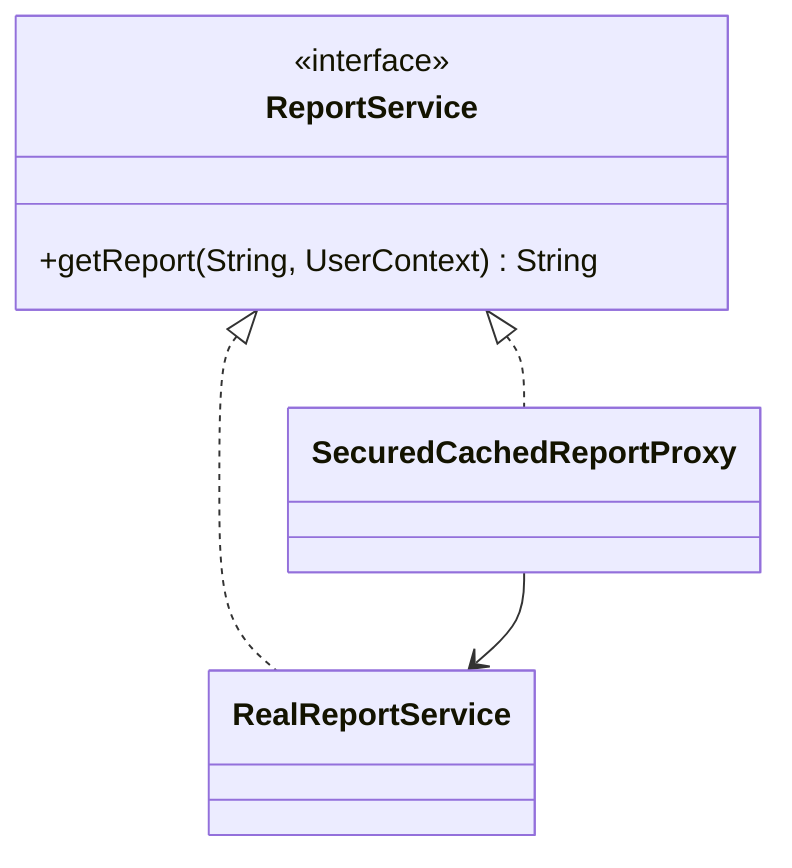

Teams often discover Proxy accidentally.
They add authorization, then caching, then maybe rate limiting, and suddenly one object is standing between callers and the real service.

---

## What Actually Hurts

Suppose a reporting service is expensive to call.
Only admins may access it, and repeated requests for the same report should not regenerate the payload every time.

The naive implementation usually mixes those concerns directly into the service:

- security checks
- cache lookup logic
- expensive report generation

That works for a while, but the service stops being about reports.
It becomes a policy bucket.

---

## Why Proxy Is The Right Shape

This is not just “extra behavior around a method.”

The core design problem is controlled access to a real object:

- some callers should be rejected
- some requests should be served from cache
- the expensive implementation should stay unaware of those control policies

That is Proxy territory.

If you push this into helper methods, the caller starts coordinating policy manually.
If you treat it like a Decorator, you risk framing the problem as feature composition when it is really gatekeeping and shielding.

---

## Structure



---

## A Minimal Implementation

```java
import java.util.HashMap;
import java.util.Map;

public interface ReportService {
    String getReport(String reportId, UserContext userContext);
}

public final class RealReportService implements ReportService {
    @Override
    public String getReport(String reportId, UserContext userContext) {
        return "Expensive report payload for " + reportId;
    }
}

public final class SecuredCachedReportProxy implements ReportService {
    private final ReportService delegate;
    private final Map<String, String> cache = new HashMap<>();

    public SecuredCachedReportProxy(ReportService delegate) {
        this.delegate = delegate;
    }

    @Override
    public String getReport(String reportId, UserContext userContext) {
        if (!userContext.isAdmin()) {
            throw new SecurityException("Admin role required");
        }
        return cache.computeIfAbsent(reportId, id -> delegate.getReport(id, userContext));
    }
}
```

Usage:

```java
ReportService reportService = new SecuredCachedReportProxy(new RealReportService());
String report = reportService.getReport("sales-monthly", new UserContext("sandeep", true));
```

The important part is not the syntax.
It is the boundary:

1. the caller still depends on `ReportService`
2. the real service still focuses on generating reports
3. the proxy owns access policy and cache reuse

That separation is what keeps the design clean when the control logic grows.

---

## Where Teams Usually Get This Wrong

The common mistake is letting the proxy become an unstructured grab bag.

For example:

- authorization logic starts depending on cache contents
- cache keys start depending on caller identity in inconsistent ways
- retries, rate limiting, and audit logging get piled in without a clear order

At that point the proxy still compiles, but it stops being predictable.

A proxy should answer one design question clearly:

> What is allowed to reach the real object, and under what conditions can that work be avoided?

If the answer becomes muddy, the abstraction is degrading.

---

## Proxy vs Decorator In Practice

They can look identical in class diagrams.
They are not identical in intent.

- Decorator is usually about composing business or cross-cutting behavior
- Proxy is about governing access to the underlying object

In this example, the main value is not “adding features.”
The value is deciding whether the real service should be touched at all.

That is why Proxy is the better name and the better mental model here.

---

## Production Notes

A production proxy often grows into things like:

- TTL-based caches
- tenant-aware cache keys
- permission scopes or scoped roles
- remote client retries
- circuit breakers
- audit logging

My rule here is simple:

- keep the real service business-focused
- keep the proxy policy-focused
- test cache behavior and authorization paths independently

If your proxy changes latency, security posture, or failure behavior, it is no longer a minor wrapper.
It is part of the system contract and should be treated that way.
