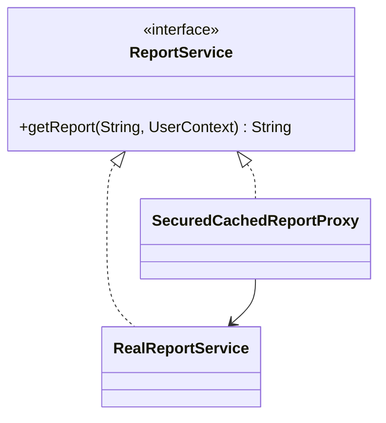

Proxy controls access to another object.
That access control might mean security checks, caching, lazy initialization, rate limiting, or remote communication.

---

## Example Problem

Generating a report is expensive.
Only admin users may access it, and repeated requests for the same report should be cached.

---

## UML



---

## Implementation Walkthrough

```java
import java.util.HashMap;
import java.util.Map;

public interface ReportService {
    String getReport(String reportId, UserContext userContext);
}

public final class RealReportService implements ReportService {
    @Override
    public String getReport(String reportId, UserContext userContext) {
        return "Expensive report payload for " + reportId;
    }
}

public final class SecuredCachedReportProxy implements ReportService {
    private final ReportService delegate;
    private final Map<String, String> cache = new HashMap<>();

    public SecuredCachedReportProxy(ReportService delegate) {
        this.delegate = delegate;
    }

    @Override
    public String getReport(String reportId, UserContext userContext) {
        if (!userContext.isAdmin()) {
            throw new SecurityException("Admin role required");
        }
        return cache.computeIfAbsent(reportId, id -> delegate.getReport(id, userContext));
    }
}
```

Usage:

```java
ReportService reportService = new SecuredCachedReportProxy(new RealReportService());
String report = reportService.getReport("sales-monthly", new UserContext("sandeep", true));
```

The proxy performs two distinct control tasks before the expensive service does any work:

1. it rejects unauthorized callers
2. it avoids repeated work through caching

That is why Proxy fits better than a plain helper method here. The caller still sees the same `ReportService` contract, but access to the real object is now governed by policy.

---

## Why Proxy Fits Better Than Decorator Here

Decorator and Proxy look structurally similar.
The difference is intent.

- Decorator adds behavior as part of business composition
- Proxy controls access to the real object

This example is fundamentally about gatekeeping access and shielding an expensive service.

As the policy grows, the proxy can evolve to support TTL, tenant-aware cache keys, or remote call protection without changing client code.

---

## Production Notes

Real proxies often add:

- TTL-based caches
- permission scopes
- remote client retries
- circuit breaking

At that point the proxy becomes operationally important, so its behavior must be documented and tested.
