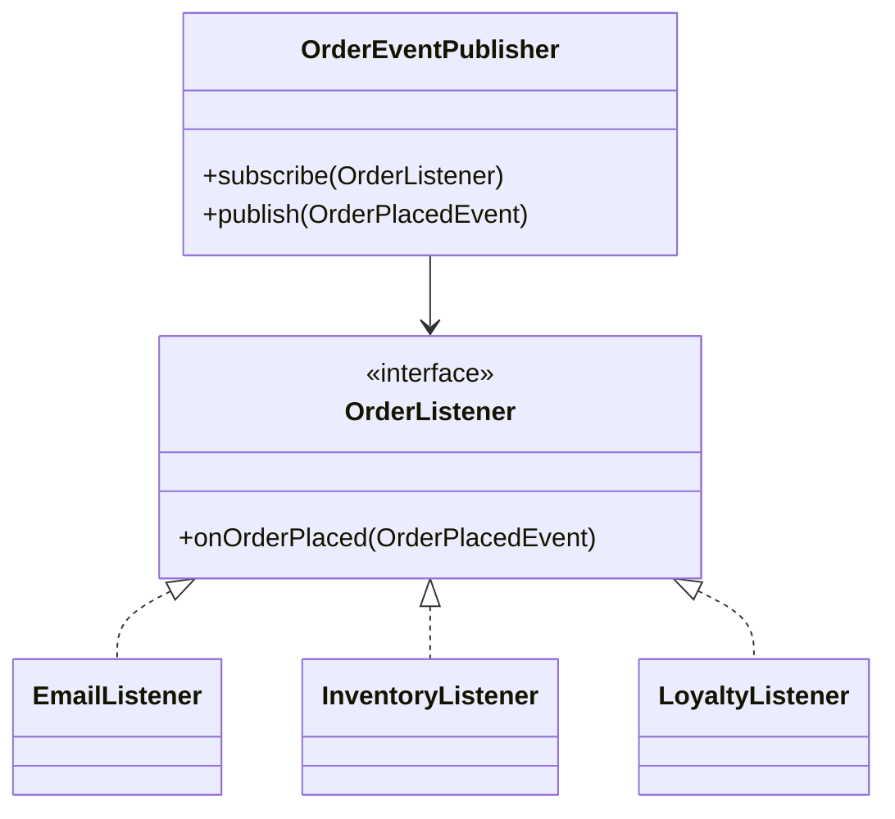
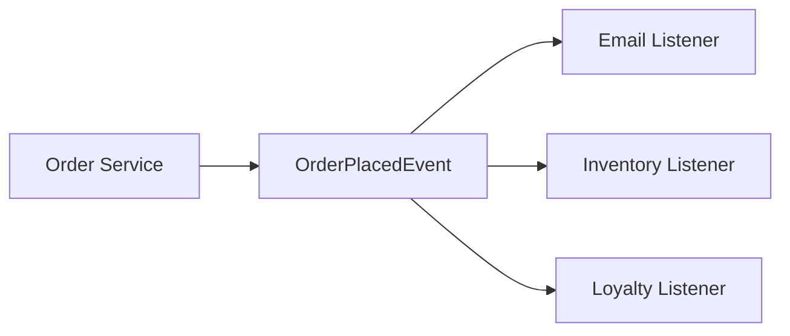

Observer is about decoupling publishers from subscribers.
It works well when one state change must trigger multiple downstream reactions that should not be hardcoded into the same class.

---

## Problem 1: Order Events with Multiple Subscribers

Problem description:
When an order is placed, we want to:

- send confirmation
- update inventory
- award loyalty points

The order service should not know the internal details of each downstream reaction.

What we are solving actually:
We are solving for one-to-many reactions without tight coupling.
The order service knows an important event happened, but it should not be responsible for all side effects that other parts of the system care about.
If we hardcode every reaction inside the order service, it quickly becomes a hub for unrelated responsibilities.

What we are doing actually:

1. Represent the event explicitly.
2. Define a listener contract for subscribers.
3. Let a publisher hold a list of subscribers.
4. Publish the event once and let every subscriber react independently.

---

## UML



---

## Implementation Walkthrough

```java
import java.util.ArrayList;
import java.util.List;

public final class OrderPlacedEvent {
    private final String orderId;
    private final String customerId;

    public OrderPlacedEvent(String orderId, String customerId) {
        this.orderId = orderId;
        this.customerId = customerId;
    }

    public String getOrderId() { return orderId; }
    public String getCustomerId() { return customerId; }
}

public interface OrderListener {
    void onOrderPlaced(OrderPlacedEvent event);
}

public final class OrderEventPublisher {
    private final List<OrderListener> listeners = new ArrayList<>();

    public void subscribe(OrderListener listener) {
        listeners.add(listener);
    }

    public void publish(OrderPlacedEvent event) {
        for (OrderListener listener : listeners) {
            listener.onOrderPlaced(event); // Fan out the same event to each subscriber.
        }
    }
}

public final class EmailListener implements OrderListener {
    @Override
    public void onOrderPlaced(OrderPlacedEvent event) {
        System.out.println("Email sent for " + event.getOrderId());
    }
}
```

Application assembly:

```java
OrderEventPublisher publisher = new OrderEventPublisher();
publisher.subscribe(new EmailListener());
publisher.subscribe(event -> System.out.println("Inventory updated for " + event.getOrderId()));
publisher.subscribe(event -> System.out.println("Loyalty credited for " + event.getCustomerId()));

publisher.publish(new OrderPlacedEvent("ORD-99", "CUS-10"));
```

The core improvement is that `OrderEventPublisher` now knows only that an order was placed.
It does not need to know how email formatting works, how inventory is updated, or how loyalty points are computed. That is the kind of decoupling that keeps an order service from turning into a hub for every downstream responsibility.

---

## Event Fan-Out Flow



The key idea is that the publisher emits one fact and many listeners react.
The publisher should not need to coordinate each downstream implementation detail.

---

## Why Observer Fits

Observer is a strong fit when:

- one change should notify many dependents
- the publisher should stay unaware of subscriber internals
- subscribers may change over time

This keeps the publisher stable while allowing downstream behavior to grow or shrink with low coupling.

---

## Practical Caveats

Observer can become dangerous if:

- listener order starts to matter
- failure handling is undefined
- synchronous fan-out increases request latency

In production, those concerns often push the design toward asynchronous eventing infrastructure.

Even when that shift happens, the object-level Observer pattern still teaches the right architectural instinct: publish a fact and let subscribers react independently.

Still, the object-level Observer pattern is a good foundation for understanding decoupled reactions.

---

## Observer vs Pub/Sub Infrastructure

The in-memory Observer pattern is not the same thing as Kafka, RabbitMQ, or a full event bus.
But it teaches the same decoupling instinct at object level.

- Observer is in-process and usually synchronous
- message brokers are cross-process and often asynchronous

That distinction matters because delivery guarantees, retries, ordering, and failure isolation change dramatically once you cross process boundaries.

---

## Common Mistakes

1. Letting listener order become an undocumented business dependency
2. Running expensive or failure-prone work synchronously inside request handling
3. Allowing one failing listener to break every other reaction without a clear policy
4. Publishing vague events that force subscribers to guess what happened

---

## Debug Steps

Debug steps:

- log the event id or order id at publish time and in each listener
- test listener failure behavior explicitly
- measure request latency if fan-out is synchronous
- verify new subscribers can be added without editing publisher logic

---

## Key Takeaways

- Observer decouples one publisher from many downstream reactions
- the publisher should emit facts, not orchestrate subscriber internals
- once failure, latency, or delivery guarantees become important, move toward stronger event infrastructure
