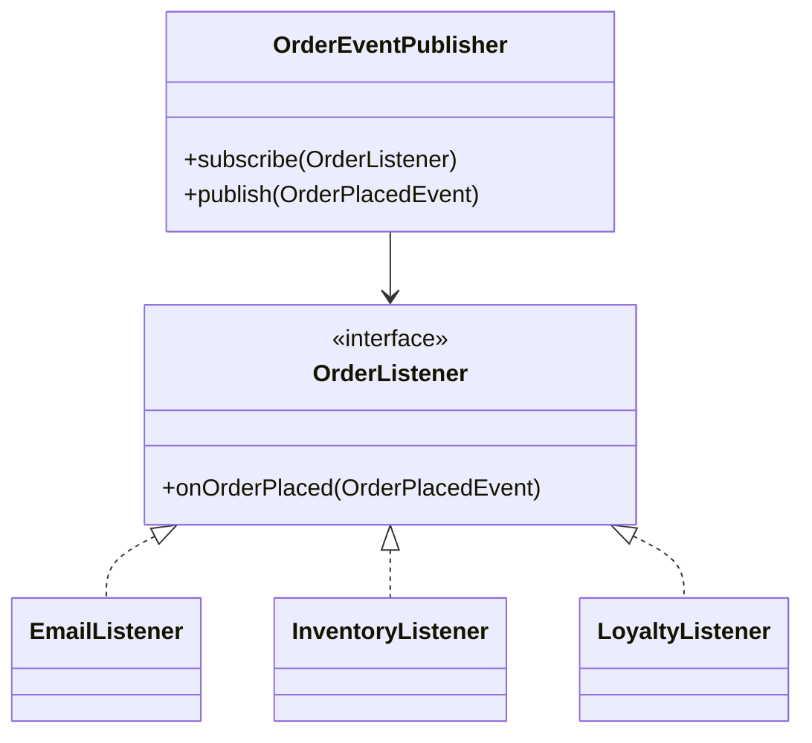

Observer is about decoupling publishers from subscribers.
It works well when one state change must trigger multiple downstream reactions that should not be hardcoded into the same class.

---

## Example Problem

When an order is placed, we want to:

- send confirmation
- update inventory
- award loyalty points

The order service should not know the internal details of each downstream reaction.

---

## UML



---

## Implementation Walkthrough

```java
import java.util.ArrayList;
import java.util.List;

public final class OrderPlacedEvent {
    private final String orderId;
    private final String customerId;

    public OrderPlacedEvent(String orderId, String customerId) {
        this.orderId = orderId;
        this.customerId = customerId;
    }

    public String getOrderId() { return orderId; }
    public String getCustomerId() { return customerId; }
}

public interface OrderListener {
    void onOrderPlaced(OrderPlacedEvent event);
}

public final class OrderEventPublisher {
    private final List<OrderListener> listeners = new ArrayList<>();

    public void subscribe(OrderListener listener) {
        listeners.add(listener);
    }

    public void publish(OrderPlacedEvent event) {
        for (OrderListener listener : listeners) {
            listener.onOrderPlaced(event);
        }
    }
}

public final class EmailListener implements OrderListener {
    public void onOrderPlaced(OrderPlacedEvent event) {
        System.out.println("Email sent for " + event.getOrderId());
    }
}
```

Application assembly:

```java
OrderEventPublisher publisher = new OrderEventPublisher();
publisher.subscribe(new EmailListener());
publisher.subscribe(event -> System.out.println("Inventory updated for " + event.getOrderId()));
publisher.subscribe(event -> System.out.println("Loyalty credited for " + event.getCustomerId()));

publisher.publish(new OrderPlacedEvent("ORD-99", "CUS-10"));
```

The core improvement is that `OrderEventPublisher` now knows only that an order was placed.
It does not need to know how email formatting works, how inventory is updated, or how loyalty points are computed. That is the kind of decoupling that keeps an order service from turning into a hub for every downstream responsibility.

---

## Practical Caveats

Observer can become dangerous if:

- listener order starts to matter
- failure handling is undefined
- synchronous fan-out increases request latency

In production, those concerns often push the design toward asynchronous eventing infrastructure.

Even when that shift happens, the object-level Observer pattern still teaches the right architectural instinct: publish a fact and let subscribers react independently.

Still, the object-level Observer pattern is a good foundation for understanding decoupled reactions.
