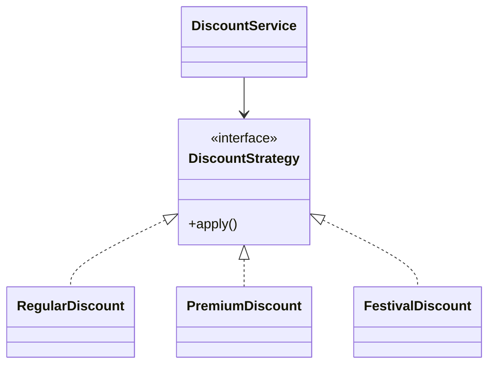

Strategy is one of the most practical patterns in Java because many business rules are really "pick one algorithm for this request."
The pattern matters less for toy examples and more for codebases where pricing, eligibility, routing, or validation rules change over time.

---

## Problem 1: Discount Engine with Swappable Pricing Policies

Problem description:
An order total may be calculated under different discount rules:

- regular customer
- premium customer
- festival campaign

The checkout service should not contain a large branching block for every pricing policy.

What we are solving actually:
We are solving change isolation.
Pricing rules change frequently, and if we keep every rule inside one giant `if/else` block, the checkout flow becomes hard to test, hard to review, and easy to break when a new campaign is introduced.

What we are doing actually:

1. Define a common contract for all discount algorithms.
2. Implement each pricing rule as its own class.
3. Keep runtime selection outside the execution logic.
4. Let the checkout flow apply the selected strategy without knowing the rule details.

---

## UML



---

## Implementation Walkthrough

```java
public interface DiscountStrategy {
    double apply(double subtotal);
}

public final class RegularDiscount implements DiscountStrategy {
    @Override
    public double apply(double subtotal) {
        return subtotal; // No discount for regular customers.
    }
}

public final class PremiumDiscount implements DiscountStrategy {
    @Override
    public double apply(double subtotal) {
        return subtotal * 0.85; // 15% off for premium customers.
    }
}

public final class FestivalDiscount implements DiscountStrategy {
    @Override
    public double apply(double subtotal) {
        return subtotal - 500; // Flat campaign discount.
    }
}

public final class DiscountService {
    private final DiscountStrategy discountStrategy;

    public DiscountService(DiscountStrategy discountStrategy) {
        this.discountStrategy = discountStrategy;
    }

    public double finalAmount(double subtotal) {
        double discounted = discountStrategy.apply(subtotal);
        return Math.max(0, discounted); // Guard against negative totals.
    }
}

public final class DiscountStrategyResolver {
    public DiscountStrategy resolve(Customer customer, boolean festivalActive) {
        if (festivalActive) {
            return new FestivalDiscount(); // Selection stays outside execution.
        }
        if (customer.isPremium()) {
            return new PremiumDiscount();
        }
        return new RegularDiscount();
    }
}
```

Runtime selection:

```java
DiscountStrategyResolver resolver = new DiscountStrategyResolver();
DiscountStrategy strategy = resolver.resolve(customer, festivalActive);
DiscountService discountService = new DiscountService(strategy);
double payable = discountService.finalAmount(5000);
```

The separation is deliberate.
`DiscountService` applies a chosen policy.
`DiscountStrategyResolver` decides which policy is active.
That keeps one class focused on execution and another focused on selection.

---

## Why Strategy Is Better Than Flag Arguments

This is bad:

```java
calculateDiscount(total, isPremium, isFestival, isEmployee, isFirstOrder)
```

Flags multiply conditional complexity.
Strategy isolates each algorithm behind one contract and keeps the caller focused on selection, not implementation details.

That is why Strategy tends to age well in codebases with evolving business rules.
New algorithms add new types instead of making one old method longer and harder to verify.

---

## What This Buys You Operationally

In production systems, pricing logic is rarely static.
Marketing adds campaigns.
Premium plans evolve.
Country-specific rules appear.

Strategy helps because:

- each rule can be unit tested independently
- rollout logic can choose a strategy without rewriting checkout code
- deleting an old campaign is often just removing one strategy and its resolver branch

This is a much safer maintenance story than a 150-line pricing method with intertwined conditions.

---

## Trade-Offs

Strategy does introduce more classes.
That is a good trade when the algorithms are meaningfully different.

It is a bad trade when:

- there are only two trivial branches
- rules are not expected to grow
- the classes become tiny wrappers with no real behavioral value

If all you have is one `if (premium)` check and it is not growing, the simplest code may still be the right code.

---

## Common Mistakes

1. Mixing strategy selection logic back into the execution class
2. Creating too many microscopic strategies for rules that are not independently meaningful
3. Forgetting shared guardrails such as `Math.max(0, ...)`
4. Treating Strategy as a full rules engine when the domain needs priority, composition, or chaining

---

## Debug Steps

Debug steps:

- log which strategy was selected for a request
- add table-driven tests for each strategy with boundary subtotals
- verify the resolver chooses the intended strategy when multiple conditions overlap
- test negative or tiny subtotals to ensure guardrails still hold

---

## Natural Combination

Strategy often pairs with Factory or Resolver-style composition.
Strategy answers: "how should behavior vary?"
Factory or resolver answers: "which strategy should be active in this context?"

---

## Key Takeaways

- Strategy isolates interchangeable algorithms behind one contract
- the real payoff is maintainability under changing business rules
- keep selection separate from execution so each part stays easy to evolve

---

## Natural Combination

Strategy often pairs with Factory.
Strategy answers: “how should behavior vary?”
Factory answers: “which strategy should be created for this context?”
