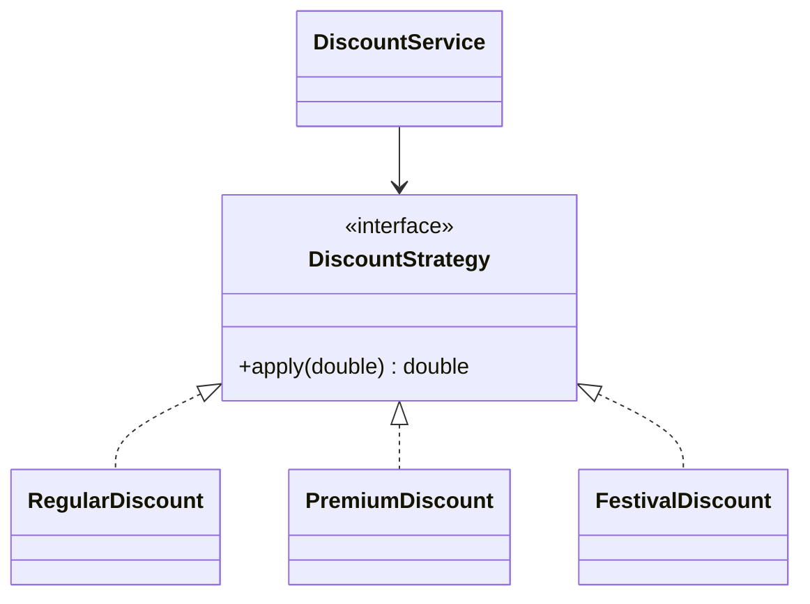

Strategy is one of the most useful patterns in Java because many business rules are really just interchangeable algorithms selected at runtime.

---

## Problem

Discount calculation varies by customer type:

- regular customer
- premium customer
- festival campaign

The checkout service should not contain a large branching block for every pricing policy.

---

## UML



---

## Implementation Walkthrough

```java
public interface DiscountStrategy {
    double apply(double subtotal);
}

public final class RegularDiscount implements DiscountStrategy {
    public double apply(double subtotal) {
        return subtotal;
    }
}

public final class PremiumDiscount implements DiscountStrategy {
    public double apply(double subtotal) {
        return subtotal * 0.85;
    }
}

public final class FestivalDiscount implements DiscountStrategy {
    public double apply(double subtotal) {
        return subtotal - 500;
    }
}

public final class DiscountService {
    private final DiscountStrategy discountStrategy;

    public DiscountService(DiscountStrategy discountStrategy) {
        this.discountStrategy = discountStrategy;
    }

    public double finalAmount(double subtotal) {
        return Math.max(0, discountStrategy.apply(subtotal));
    }
}
```

Runtime selection:

```java
DiscountStrategy strategy = customer.isPremium()
        ? new PremiumDiscount()
        : new RegularDiscount();

DiscountService discountService = new DiscountService(strategy);
double payable = discountService.finalAmount(5000);
```

The example keeps selection and execution separate on purpose.
`DiscountService` is responsible for applying a chosen policy correctly. Another part of the application can decide which policy is active for the current customer or campaign. That separation prevents the service from growing into a branching rules engine.

---

## Why Strategy Is Better Than Flag Arguments

This is bad:

```java
calculateDiscount(total, isPremium, isFestival, isEmployee, isFirstOrder)
```

Flags multiply conditional complexity.
Strategy isolates each algorithm behind one contract and keeps the caller focused on selection, not implementation details.

That is why Strategy tends to age well in codebases with evolving business rules. New algorithms add new types instead of making one old method longer and harder to verify.

---

## Natural Combination

Strategy often pairs with Factory.
Strategy answers: “how should behavior vary?”
Factory answers: “which strategy should be created for this context?”
