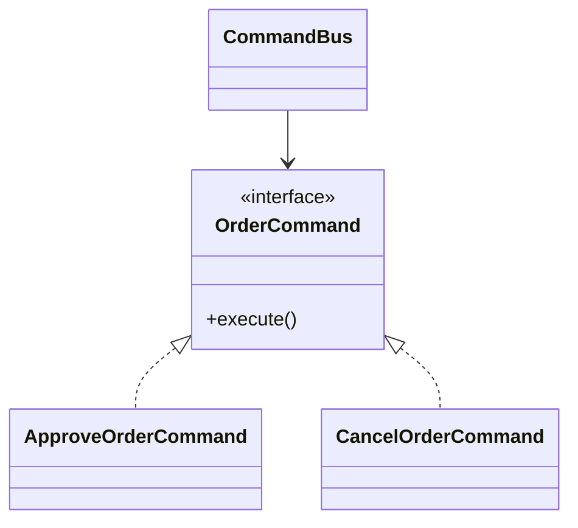

Command turns an action into an object.
That sounds simple, but it enables powerful capabilities:

- queueing
- retries
- auditing
- delayed execution
- undo in some domains

---

## Example Problem

An admin console can trigger order operations:

- approve order
- cancel order
- resend invoice

These actions should be executable now or later through the same abstraction.

---

## UML



---

## Implementation Walkthrough

```java
public interface OrderCommand {
    void execute();
}

public final class OrderOperations {
    public void approve(String orderId) {
        System.out.println("Approved " + orderId);
    }

    public void cancel(String orderId) {
        System.out.println("Cancelled " + orderId);
    }
}

public final class ApproveOrderCommand implements OrderCommand {
    private final OrderOperations operations;
    private final String orderId;

    public ApproveOrderCommand(OrderOperations operations, String orderId) {
        this.operations = operations;
        this.orderId = orderId;
    }

    public void execute() {
        operations.approve(orderId);
    }
}

public final class CancelOrderCommand implements OrderCommand {
    private final OrderOperations operations;
    private final String orderId;

    public CancelOrderCommand(OrderOperations operations, String orderId) {
        this.operations = operations;
        this.orderId = orderId;
    }

    public void execute() {
        operations.cancel(orderId);
    }
}

public final class CommandBus {
    public void submit(OrderCommand command) {
        command.execute();
    }
}
```

Usage:

```java
OrderOperations operations = new OrderOperations();
CommandBus commandBus = new CommandBus();
commandBus.submit(new ApproveOrderCommand(operations, "ORD-200"));
```

This version executes immediately, but the abstraction is already carrying the right shape for more advanced behavior.
Once the action is a first-class object, the system can attach metadata such as requester identity, retry count, scheduled execution time, or audit correlation without redesigning every call site.

---

## Why This Pattern Matters

If actions are plain method calls, delayed execution and audit trails require ad hoc work.
With Command, the action itself is a first-class unit.

That makes it easier to store metadata such as:

- who requested it
- when it should run
- how many retries are allowed

This is why Command appears frequently in job systems and workflow engines.

That is the practical lens for the pattern: use it when the action needs to outlive the current method stack frame.
