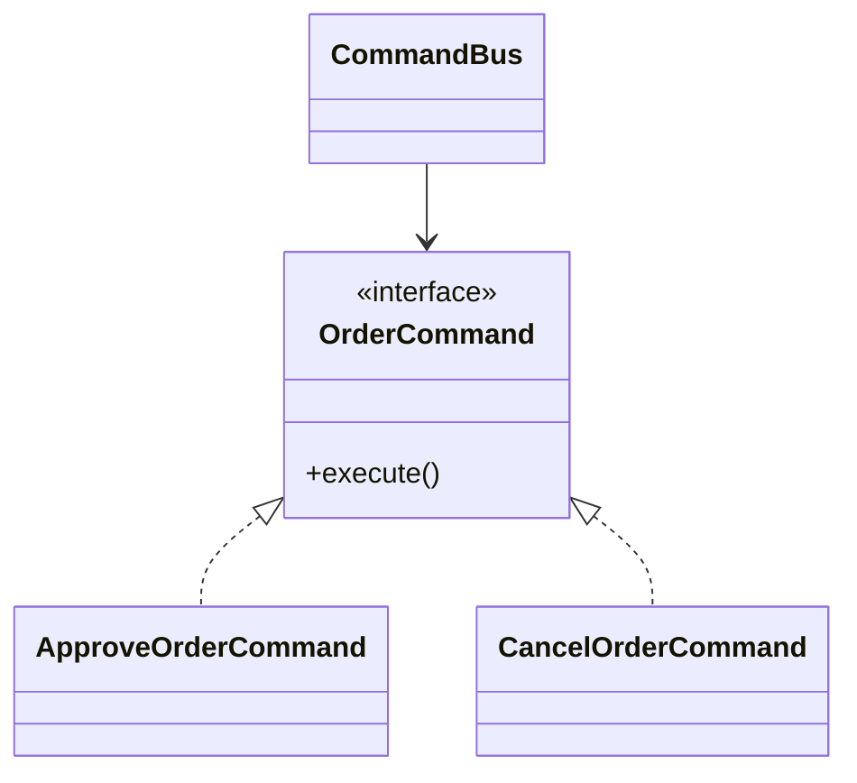

Command turns an action into an object.
That sounds small, but it unlocks capabilities that plain method calls struggle with:

- queueing
- retries
- auditing
- delayed execution
- undo in some domains

---

## Problem 1: Queueable Order Actions

Problem description:
An admin console can trigger order operations such as:

- approve order
- cancel order
- resend invoice

These actions should be executable now or later through the same abstraction.

What we are solving actually:
We are solving for actions that need to outlive the current method call.
Once an action may be queued, retried, audited, or executed on another thread, "just call the method" stops being enough.
We need a first-class object that represents both the intent and the data required to execute that intent.

What we are doing actually:

1. Define a command interface for executable actions.
2. Wrap each order operation in its own command object.
3. Pass those command objects to a bus or queue instead of calling operations directly.
4. Let the bus decide whether to run now, later, or after additional metadata checks.

---

## UML



---

## Implementation Walkthrough

```java
public interface OrderCommand {
    void execute();
    String type();
}

public final class OrderOperations {
    public void approve(String orderId) {
        System.out.println("Approved " + orderId);
    }

    public void cancel(String orderId) {
        System.out.println("Cancelled " + orderId);
    }
}

public final class ApproveOrderCommand implements OrderCommand {
    private final OrderOperations operations;
    private final String orderId;

    public ApproveOrderCommand(OrderOperations operations, String orderId) {
        this.operations = operations;
        this.orderId = orderId;
    }

    @Override
    public void execute() {
        operations.approve(orderId); // Command delegates to the real receiver.
    }

    @Override
    public String type() {
        return "APPROVE_ORDER";
    }
}

public final class CancelOrderCommand implements OrderCommand {
    private final OrderOperations operations;
    private final String orderId;

    public CancelOrderCommand(OrderOperations operations, String orderId) {
        this.operations = operations;
        this.orderId = orderId;
    }

    @Override
    public void execute() {
        operations.cancel(orderId);
    }

    @Override
    public String type() {
        return "CANCEL_ORDER";
    }
}

public final class CommandBus {
    private final Queue<OrderCommand> queue = new ArrayDeque<>();

    public void submit(OrderCommand command) {
        queue.offer(command); // Store now, execute later.
    }

    public void processNext() {
        OrderCommand command = queue.poll();
        if (command == null) {
            return;
        }

        System.out.println("Executing command type=" + command.type());
        command.execute();
    }
}
```

Usage:

```java
OrderOperations operations = new OrderOperations();
CommandBus commandBus = new CommandBus();
commandBus.submit(new ApproveOrderCommand(operations, "ORD-200"));
commandBus.processNext();
```

This example uses an in-memory queue to keep the idea simple.
In a real system, the queue might be a durable table, broker, or workflow engine.
The important part is that the action is now an object with identity and data, not just a call on the current stack frame.

---

## Why This Pattern Matters

If actions are plain method calls, delayed execution and audit trails require ad hoc work around every call site.
With Command, the action itself becomes the first-class unit.

That makes it easier to store metadata such as:

- who requested it
- when it should run
- how many retries are allowed

This is why Command appears frequently in job systems and workflow engines.

That is the practical lens for the pattern: use it when the action needs to outlive the current method stack frame.

---

## What Separates Command from a Simple Callback

In many codebases, people first reach for `Runnable` or a lambda.
That is fine for tiny local behavior.
Command becomes more valuable when the action needs:

- a clear domain-specific type
- execution metadata
- serialization or persistence
- auditability
- targeted retry policies

At that point, a named command object communicates intent much better than an anonymous callback.

---

## Trade-Offs

The pattern adds more classes and a small amount of ceremony.
That trade is worth it when execution control matters.

It is usually not worth it when:

- the action is always immediate
- there is no queue, retry, or audit requirement
- the wrapper object adds no new information or behavior

Command should buy operational flexibility, not just extra indirection.

---

## Common Mistakes

1. Putting business logic in both the receiver and the command wrapper
2. Using commands without stable identifiers or metadata in systems that need traceability
3. Pretending an in-memory queue is durable when the use case actually needs persistence
4. Treating all commands the same when retry and failure semantics differ by action type

---

## Debug Steps

Debug steps:

- log command type, order id, and submission time when enqueuing
- log execution start and completion separately from submission
- test duplicate processing behavior if retries are possible
- verify commands can fail without corrupting surrounding queue state

---

## Key Takeaways

- Command turns an operation plus its context into a first-class object
- the real payoff is queueing, auditing, retries, and delayed execution
- use it when actions need to survive beyond the current call path
