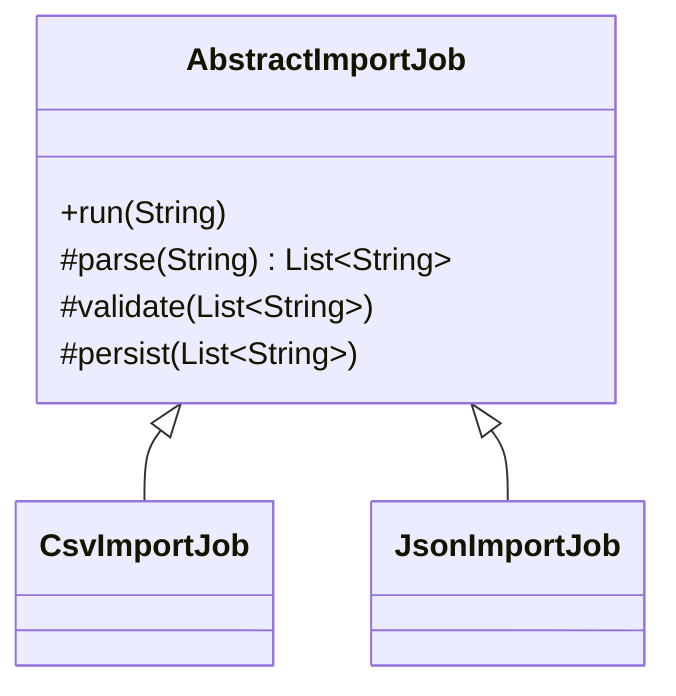
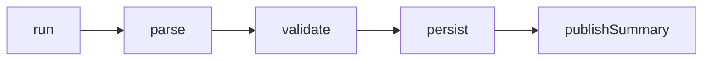

Template Method is a good fit when the overall algorithm is stable, but one or more steps vary by subtype.
It is especially common in parsing and import workflows.

---

## Problem 1: File Import Pipeline with Format-Specific Parsing

Problem description:
Every import job follows the same high-level flow:

1. read file
2. parse records
3. validate
4. persist
5. publish summary

The parsing step varies by file format.

What we are solving actually:
We are solving for algorithm stability with controlled extension points.
The business wants every import to follow the same lifecycle, but different formats need different parsing logic.
If every import type implements the whole workflow independently, the shared steps drift apart and duplication creeps in.

What we are doing actually:

1. Put the stable workflow in one final template method.
2. Mark variable steps, such as parsing, as overridable hooks.
3. Keep shared validation, persistence, and summary logic in the base class.
4. Let subclasses customize only the intended extension points.

---

## UML



---

## Implementation Walkthrough

```java
import java.util.Arrays;
import java.util.List;

public abstract class AbstractImportJob {

    public final void run(String rawContent) {
        List<String> records = parse(rawContent); // Variant step decided by subclass.
        validate(records); // Shared workflow rule.
        persist(records); // Shared persistence behavior.
        publishSummary(records.size()); // Shared final reporting step.
    }

    protected abstract List<String> parse(String rawContent);

    protected void validate(List<String> records) {
        if (records.isEmpty()) {
            throw new IllegalArgumentException("No records found");
        }
    }

    protected void persist(List<String> records) {
        System.out.println("Persisted " + records.size() + " records");
    }

    protected void publishSummary(int count) {
        System.out.println("Import summary count=" + count);
    }
}

public final class CsvImportJob extends AbstractImportJob {
    @Override
    protected List<String> parse(String rawContent) {
        return Arrays.asList(rawContent.split("\n"));
    }
}

public final class JsonImportJob extends AbstractImportJob {
    @Override
    protected List<String> parse(String rawContent) {
        return Arrays.asList(rawContent.replace("[", "").replace("]", "").split(","));
    }
}
```

Usage:

```java
new CsvImportJob().run("a,b,c\nd,e,f");
new JsonImportJob().run("[a,b,c]");
```

The `run` method is the heart of the pattern because it makes the workflow order explicit and stable.
Subclasses can vary parsing, but they cannot silently reorder validation and persistence without changing the base algorithm itself. That is what gives Template Method its value.

---

## Workflow Skeleton



This is the mental model for Template Method:
the skeleton stays fixed while a few marked steps are customizable.

---

## Why It Works

The algorithm skeleton is protected from duplication.
Subclasses customize only the parts that are expected to vary.

This is the central value of Template Method: stable workflow, controlled customization points.

If the system eventually needs runtime-selected parsing instead of subclass-based variation, that is usually the moment to move from Template Method toward Strategy or composition.

---

## Template Method vs Strategy

These patterns often solve similar-looking problems, but the variation point is different.

- Template Method uses inheritance and decides variation by subtype
- Strategy uses composition and decides variation at runtime

If import type is known by class design and the workflow is fixed, Template Method is a good fit.
If the parser needs to be selected dynamically from configuration or request metadata, Strategy is often cleaner.

---

## Common Mistakes

1. Letting subclasses override too many steps, making the template unstable
2. Pushing business decisions into inheritance when runtime composition would be cleaner
3. Forgetting to make the template method `final`
4. Creating deep inheritance trees for what is really just one interchangeable algorithm

---

## Debug Steps

Debug steps:

- log each step in the template flow to confirm execution order
- test that empty input fails validation consistently across subclasses
- verify a subclass can change parsing without changing validation or persistence behavior
- check whether new format support truly needs inheritance or would be cleaner with composition

---

## Key Takeaways

- Template Method protects a stable workflow while exposing controlled hook points
- it is strongest when the algorithm order should never vary
- switch to Strategy or composition when runtime selection becomes the real requirement

---

## When to Avoid It

If behavior variation needs runtime selection instead of inheritance-time selection, Strategy may be a better fit.
That is one of the most important distinctions between the two patterns.
