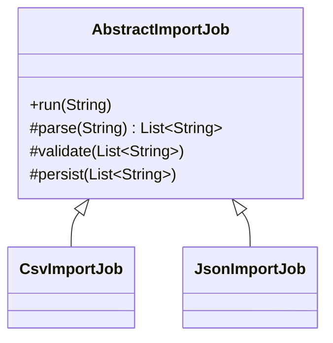

Template Method is a good fit when the overall algorithm is stable, but one or more steps vary by subtype.
It is especially common in parsing and import workflows.

---

## Problem

Every import job follows the same high-level flow:

1. read file
2. parse records
3. validate
4. persist
5. publish summary

The parsing step varies by file format.

---

## UML



---

## Implementation Walkthrough

```java
import java.util.Arrays;
import java.util.List;

public abstract class AbstractImportJob {

    public final void run(String rawContent) {
        List<String> records = parse(rawContent);
        validate(records);
        persist(records);
        publishSummary(records.size());
    }

    protected abstract List<String> parse(String rawContent);

    protected void validate(List<String> records) {
        if (records.isEmpty()) {
            throw new IllegalArgumentException("No records found");
        }
    }

    protected void persist(List<String> records) {
        System.out.println("Persisted " + records.size() + " records");
    }

    protected void publishSummary(int count) {
        System.out.println("Import summary count=" + count);
    }
}

public final class CsvImportJob extends AbstractImportJob {
    @Override
    protected List<String> parse(String rawContent) {
        return Arrays.asList(rawContent.split("\n"));
    }
}

public final class JsonImportJob extends AbstractImportJob {
    @Override
    protected List<String> parse(String rawContent) {
        return Arrays.asList(rawContent.replace("[", "").replace("]", "").split(","));
    }
}
```

Usage:

```java
new CsvImportJob().run("a,b,c\nd,e,f");
new JsonImportJob().run("[a,b,c]");
```

The `run` method is the heart of the pattern because it makes the workflow order explicit and stable.
Subclasses can vary parsing, but they cannot silently reorder validation and persistence without changing the base algorithm itself. That is what gives Template Method its value.

---

## Why It Works

The algorithm skeleton is protected from duplication.
Subclasses customize only the parts that are expected to vary.

This is the central value of Template Method: stable workflow, controlled customization points.

If the system eventually needs runtime-selected parsing instead of subclass-based variation, that is usually the moment to move from Template Method toward Strategy or composition.

---

## When to Avoid It

If behavior variation needs runtime selection instead of inheritance-time selection, Strategy may be a better fit.
That is one of the most important distinctions between the two patterns.
