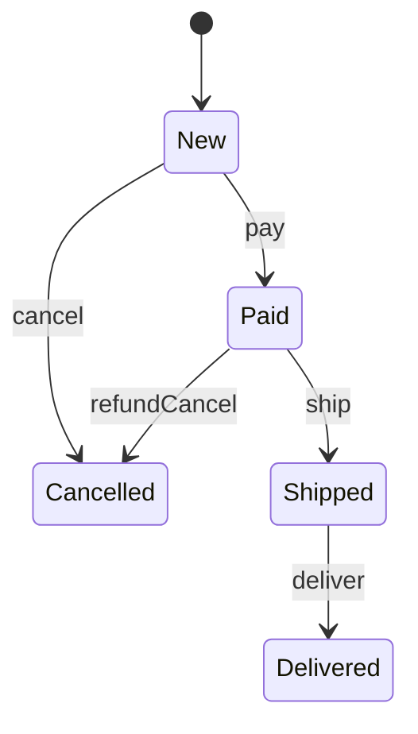

State becomes useful when an object’s behavior changes meaningfully based on its current lifecycle stage.
Without it, classes often fill up with conditionals like `if (status == PAID && action == SHIP)`.

---

## Example Problem

Orders move through states:

- new
- paid
- shipped
- delivered
- cancelled

Valid actions depend on the current state.

---

## UML



---

## Implementation Walkthrough

```java
public interface OrderState {
    void pay(OrderContext context);
    void ship(OrderContext context);
    void deliver(OrderContext context);
    void cancel(OrderContext context);
}

public final class OrderContext {
    private OrderState state = new NewState();

    void transitionTo(OrderState state) {
        this.state = state;
    }

    public void pay() { state.pay(this); }
    public void ship() { state.ship(this); }
    public void deliver() { state.deliver(this); }
    public void cancel() { state.cancel(this); }
}

public final class NewState implements OrderState {
    public void pay(OrderContext context) { context.transitionTo(new PaidState()); }
    public void ship(OrderContext context) { throw new IllegalStateException("Pay before ship"); }
    public void deliver(OrderContext context) { throw new IllegalStateException("Ship before deliver"); }
    public void cancel(OrderContext context) { context.transitionTo(new CancelledState()); }
}

public final class PaidState implements OrderState {
    public void pay(OrderContext context) { throw new IllegalStateException("Already paid"); }
    public void ship(OrderContext context) { context.transitionTo(new ShippedState()); }
    public void deliver(OrderContext context) { throw new IllegalStateException("Ship before deliver"); }
    public void cancel(OrderContext context) { context.transitionTo(new CancelledState()); }
}
```

Usage:

```java
OrderContext order = new OrderContext();
order.pay();
order.ship();
order.deliver();
```

The main advantage here is that each state owns the rules for what is legal next.
That makes invalid transitions hard to ignore and keeps lifecycle logic close to the state that understands it best.

---

## Why State Improves the Model

Each state owns the rules that apply in that state.
That is easier to reason about than one giant `switch` inside `Order`.

It also makes transitions explicit, which is valuable in workflow-heavy systems.

That explicitness becomes even more useful once you add auditing, notifications, or compensation around state changes, because the transition points are already modeled clearly.

---

## Practical Guidance

State is worth introducing when:

- lifecycle rules are non-trivial
- invalid transitions matter
- behavior differs across stages

If state is little more than display text, an enum is enough.
