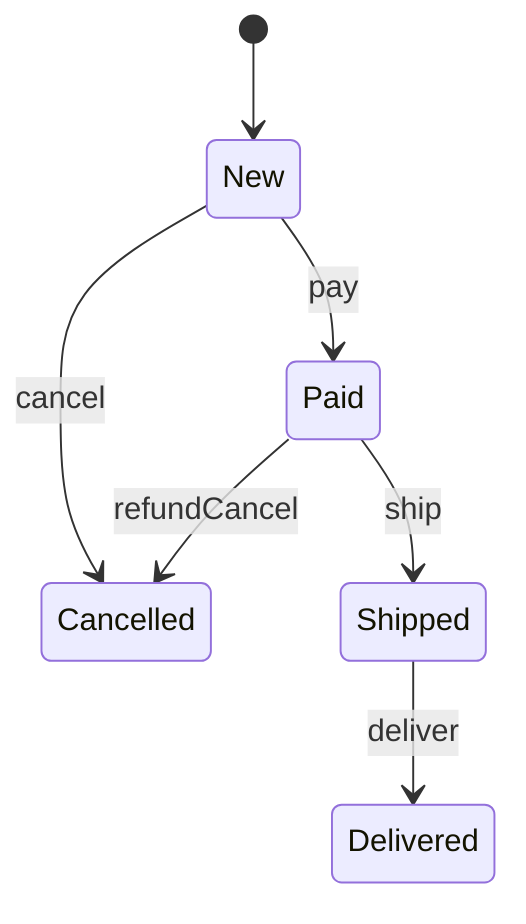

State becomes useful when an object's behavior changes meaningfully based on its lifecycle stage.
Without it, classes often fill up with conditionals like `if (status == PAID && action == SHIP)`, and that logic only gets messier as transitions grow.

---

## Problem 1: Order Lifecycle with Valid Transitions

Problem description:
Orders move through these stages:

- new
- paid
- shipped
- delivered
- cancelled

Valid actions depend on the current state.

What we are solving actually:
We are solving for behavior that depends on lifecycle, not just stored data.
An order should not merely carry a status enum.
It should enforce different rules depending on where it is in the workflow.
That means "pay", "ship", "deliver", and "cancel" are not universally valid operations.

What we are doing actually:

1. Model each lifecycle stage as a state object.
2. Route order actions through the current state.
3. Let each state decide which actions are legal and which next state to transition to.
4. Keep transition rules close to the state that owns them instead of spreading them across a giant `switch`.

---

## UML



---

## Implementation Walkthrough

```java
public interface OrderState {
    void pay(OrderContext context);
    void ship(OrderContext context);
    void deliver(OrderContext context);
    void cancel(OrderContext context);
    String name();
}

public final class OrderContext {
    private OrderState state = new NewState();

    void transitionTo(OrderState state) {
        this.state = state; // Single place where lifecycle movement happens.
    }

    public void pay() { state.pay(this); }
    public void ship() { state.ship(this); }
    public void deliver() { state.deliver(this); }
    public void cancel() { state.cancel(this); }
    public String currentState() { return state.name(); }
}

public final class NewState implements OrderState {
    public void pay(OrderContext context) { context.transitionTo(new PaidState()); }
    public void ship(OrderContext context) { throw new IllegalStateException("Pay before ship"); }
    public void deliver(OrderContext context) { throw new IllegalStateException("Ship before deliver"); }
    public void cancel(OrderContext context) { context.transitionTo(new CancelledState()); }
    public String name() { return "NEW"; }
}

public final class PaidState implements OrderState {
    public void pay(OrderContext context) { throw new IllegalStateException("Already paid"); }
    public void ship(OrderContext context) { context.transitionTo(new ShippedState()); }
    public void deliver(OrderContext context) { throw new IllegalStateException("Ship before deliver"); }
    public void cancel(OrderContext context) { context.transitionTo(new CancelledState()); }
    public String name() { return "PAID"; }
}

public final class ShippedState implements OrderState {
    public void pay(OrderContext context) { throw new IllegalStateException("Already paid"); }
    public void ship(OrderContext context) { throw new IllegalStateException("Already shipped"); }
    public void deliver(OrderContext context) { context.transitionTo(new DeliveredState()); }
    public void cancel(OrderContext context) { throw new IllegalStateException("Cannot cancel after shipping"); }
    public String name() { return "SHIPPED"; }
}

public final class DeliveredState implements OrderState {
    public void pay(OrderContext context) { throw new IllegalStateException("Already completed"); }
    public void ship(OrderContext context) { throw new IllegalStateException("Already completed"); }
    public void deliver(OrderContext context) { throw new IllegalStateException("Already delivered"); }
    public void cancel(OrderContext context) { throw new IllegalStateException("Cannot cancel delivered order"); }
    public String name() { return "DELIVERED"; }
}

public final class CancelledState implements OrderState {
    public void pay(OrderContext context) { throw new IllegalStateException("Order cancelled"); }
    public void ship(OrderContext context) { throw new IllegalStateException("Order cancelled"); }
    public void deliver(OrderContext context) { throw new IllegalStateException("Order cancelled"); }
    public void cancel(OrderContext context) { throw new IllegalStateException("Already cancelled"); }
    public String name() { return "CANCELLED"; }
}
```

Usage:

```java
OrderContext order = new OrderContext();
order.pay();
order.ship();
order.deliver();
```

The main advantage is that each state owns the rules for what is legal next.
That makes invalid transitions explicit and keeps lifecycle logic close to the state that understands it best.

---

## Why State Improves the Model

Each state owns the rules that apply in that state.
That is easier to reason about than one giant `switch` inside `Order`, especially when transitions have side effects such as:

- notifications
- audit records
- inventory release
- refund initiation

State also makes transitions explicit, which is valuable in workflow-heavy systems.
Once transitions are explicit, adding hooks around them becomes much easier.

---

## State vs Enum Plus Switch

An enum is enough when state is mostly descriptive.
For example, reporting screens may only need to show status labels.

State pattern becomes worth it when:

- legal actions differ by state
- invalid transitions matter
- transition side effects are meaningful
- workflow rules keep changing

That is the point where an enum plus scattered `switch` blocks starts to decay.

---

## Trade-Offs

The pattern creates more classes and more explicit wiring.
That is a good trade when lifecycle rules are important.

It is a bad trade when the state model is tiny and mostly static.
If all you need is a display status and one or two simple checks, an enum is usually simpler and clearer.

---

## Common Mistakes

1. Keeping a large `switch` in `OrderContext` even after introducing state classes
2. Allowing state classes to mutate unrelated business data with no clear boundary
3. Creating transitions that are not symmetric with real business rules
4. Using the pattern when an enum would be enough

---

## Debug Steps

Debug steps:

- log every transition as `from -> action -> to`
- test invalid transitions explicitly, not just the happy path
- assert that terminal states like `DELIVERED` and `CANCELLED` reject further actions
- verify any side effects happen at the transition point, not in scattered callers

---

## Practical Guidance

State is worth introducing when:

- lifecycle rules are non-trivial
- invalid transitions matter
- behavior differs across stages

If state is little more than display text, an enum is enough.

---

## Key Takeaways

- State models lifecycle-dependent behavior, not just lifecycle labels
- each state object owns the rules for what can happen next
- use it when workflow correctness matters more than keeping class count low
