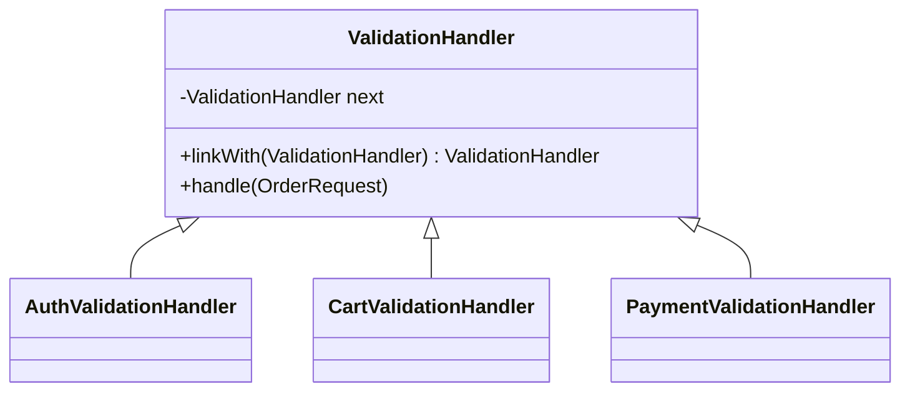

Chain of Responsibility is attractive whenever one big validator starts turning into a wall of conditionals.
The promise is simple: separate each rule, keep the flow modular, and stop letting every validation concern compete inside one method.

---

## Where The Monolith Starts Cracking

Before creating an order, we want to verify:

- request is authenticated
- cart is not empty
- payment method is allowed
- shipping address is serviceable

Each rule should stay modular.

---

## Why A Chain Helps

The point is not just splitting code into smaller classes.

The real gain is that validation becomes:

- isolated
- reorderable
- insertable

That matters the moment a new fraud check, country restriction, or compliance rule appears.
You add another handler instead of editing a single validator that already knows too much.

---

## Structure



---

## A Minimal Implementation

```java
public abstract class ValidationHandler {
    private ValidationHandler next;

    public ValidationHandler linkWith(ValidationHandler next) {
        this.next = next;
        return next;
    }

    public final void handle(OrderRequest request) {
        check(request);
        if (next != null) {
            next.handle(request);
        }
    }

    protected abstract void check(OrderRequest request);
}

public final class AuthValidationHandler extends ValidationHandler {
    protected void check(OrderRequest request) {
        if (!request.isAuthenticated()) {
            throw new IllegalStateException("Authentication required");
        }
    }
}

public final class CartValidationHandler extends ValidationHandler {
    protected void check(OrderRequest request) {
        if (request.getItemCount() == 0) {
            throw new IllegalStateException("Cart is empty");
        }
    }
}

public final class PaymentValidationHandler extends ValidationHandler {
    protected void check(OrderRequest request) {
        if (!"CARD".equals(request.getPaymentMethod())) {
            throw new IllegalStateException("Unsupported payment method");
        }
    }
}
```

Usage:

```java
ValidationHandler chain = new AuthValidationHandler();
chain.linkWith(new CartValidationHandler())
     .linkWith(new PaymentValidationHandler());

chain.handle(new OrderRequest(true, 3, "CARD"));
```

The structural value is straightforward:

- each rule owns one responsibility
- the pipeline order is explicit
- new checks can be inserted without rewriting a giant method

---

## Where Teams Break This Pattern

Chain of Responsibility becomes fragile when handlers stop behaving like handlers.

Common problems:

- handlers mutate shared request state in hidden ways
- later handlers depend on side effects from earlier ones
- some checks throw immediately while others silently continue
- the team can no longer explain whether the chain is fail-fast or error-collecting

Once that happens, the pipeline shape survives but the clarity disappears.

---

## What I Would Decide Up Front

Before using this pattern in production, lock down three things:

1. does the chain fail fast or collect all violations
2. are handlers pure checks or allowed to enrich context
3. who owns the assembly order

If those rules are explicit, Chain of Responsibility stays readable.
If they are implicit, it turns into middleware folklore very quickly.
