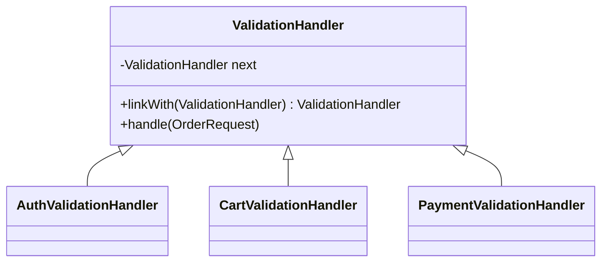

Chain of Responsibility is useful when a request should pass through multiple handlers, each deciding whether to process, reject, or forward it.
This pattern appears naturally in validation pipelines and middleware.

---

## Example Problem

Before creating an order, we want to verify:

- request is authenticated
- cart is not empty
- payment method is allowed
- shipping address is serviceable

Each rule should stay modular.

---

## UML



---

## Implementation Walkthrough

```java
public abstract class ValidationHandler {
    private ValidationHandler next;

    public ValidationHandler linkWith(ValidationHandler next) {
        this.next = next;
        return next;
    }

    public final void handle(OrderRequest request) {
        check(request);
        if (next != null) {
            next.handle(request);
        }
    }

    protected abstract void check(OrderRequest request);
}

public final class AuthValidationHandler extends ValidationHandler {
    protected void check(OrderRequest request) {
        if (!request.isAuthenticated()) {
            throw new IllegalStateException("Authentication required");
        }
    }
}

public final class CartValidationHandler extends ValidationHandler {
    protected void check(OrderRequest request) {
        if (request.getItemCount() == 0) {
            throw new IllegalStateException("Cart is empty");
        }
    }
}

public final class PaymentValidationHandler extends ValidationHandler {
    protected void check(OrderRequest request) {
        if (!"CARD".equals(request.getPaymentMethod())) {
            throw new IllegalStateException("Unsupported payment method");
        }
    }
}
```

Usage:

```java
ValidationHandler chain = new AuthValidationHandler();
chain.linkWith(new CartValidationHandler())
     .linkWith(new PaymentValidationHandler());

chain.handle(new OrderRequest(true, 3, "CARD"));
```

The pattern improves maintainability because each rule is isolated and reorderable.
If a new fraud check or regional compliance check appears, it can be inserted into the chain without inflating one giant validation method.

---

## Why This Helps

Each validation rule is isolated and reorderable.
That makes the pipeline easier to extend and test.

It also avoids one huge validator class where every rule competes for attention.

If the domain prefers collecting multiple validation errors instead of failing fast, the same chain shape still works. The handler contract just changes from “throw immediately” to “append violations and continue.”

---

## Common Risk

If handlers silently mutate the request or depend on hidden side effects from earlier handlers, the chain becomes fragile.
Keep handlers explicit and focused.
