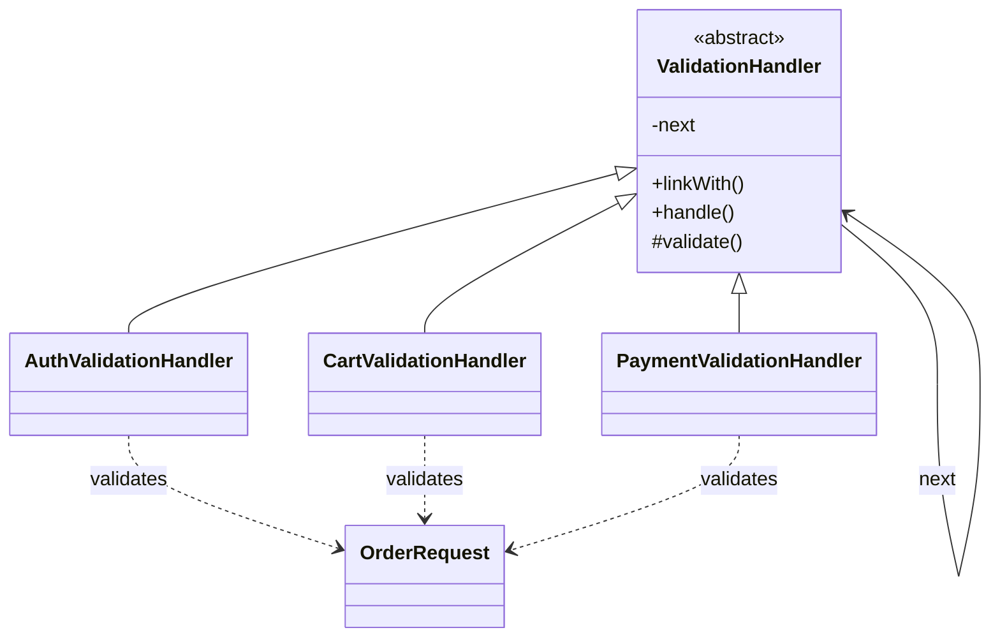

Chain of Responsibility becomes valuable when validation or processing logic needs a stable sequence of independently understandable steps.

It is not automatically better than one method.
It is better when the sequence itself is part of the design.

## Quick Summary

| Question | Strong fit | Weak fit |
| --- | --- | --- |
| Do steps need a clear order? | yes | no |
| Do new checks get inserted often? | yes | rarely |
| Can each handler own one narrow responsibility? | yes | no |
| Do handlers secretly depend on one another's side effects? | no | yes |

The pattern works when the chain is explicit and each step behaves like a good pipeline stage.

## A Good Example: Order Request Validation

Suppose an order request must pass these checks:

- caller is authenticated
- cart is not empty
- payment method is supported
- shipping destination is serviceable

Those rules are easier to evolve when they are modular and ordered.
The chain makes that order visible.

## A Clean Java Shape

```java
public abstract class ValidationHandler {
    private ValidationHandler next;

    public ValidationHandler linkWith(ValidationHandler next) {
        this.next = next;
        return next;
    }

    public final void handle(OrderRequest request) {
        validate(request);
        if (next != null) {
            next.handle(request);
        }
    }

    protected abstract void validate(OrderRequest request);
}

public final class AuthValidationHandler extends ValidationHandler {
    @Override
    protected void validate(OrderRequest request) {
        if (!request.isAuthenticated()) {
            throw new IllegalStateException("Authentication required");
        }
    }
}

public final class CartValidationHandler extends ValidationHandler {
    @Override
    protected void validate(OrderRequest request) {
        if (request.getItemCount() == 0) {
            throw new IllegalStateException("Cart is empty");
        }
    }
}

public final class PaymentValidationHandler extends ValidationHandler {
    @Override
    protected void validate(OrderRequest request) {
        if (!"CARD".equals(request.getPaymentMethod())) {
            throw new IllegalStateException("Unsupported payment method");
        }
    }
}
```

Assembly stays explicit:

```java
ValidationHandler chain = new AuthValidationHandler();
chain.linkWith(new CartValidationHandler())
     .linkWith(new PaymentValidationHandler());

chain.handle(new OrderRequest(true, 3, "CARD"));
```

The UML view is useful here because it shows two things at once:
shared handler structure and the explicit `next` link that creates the pipeline.



That gives the team one visible flow and one clear insertion point for new rules.

## Why Teams Like This Pattern

The gains are practical:

- each rule stays small
- ordering is visible
- new handlers are easy to add
- tests can focus on one step at a time

This is especially helpful when the rule set changes often because of compliance, fraud checks, or market-specific policies.

## The Decision You Must Make Up Front

Before implementing the chain, decide whether it is:

### Fail-fast

The first violation stops processing.
This is simpler and often better for command workflows.

### Error-collecting

Every handler contributes violations, and the caller receives a full list.
This is often better for request validation APIs or form-style feedback.

Do not mix those styles accidentally.
That is one of the fastest ways to make the chain confusing.

## Where This Pattern Goes Wrong

### Handlers mutate hidden shared state

If one handler enriches the request in a way later handlers secretly depend on, the pipeline becomes fragile.

### Ordering rules are implicit

If nobody knows where the chain is assembled, debugging becomes guesswork.

### Some handlers throw while others silently record errors

That creates inconsistent contract behavior.

### One handler owns too much

A handler named `FraudAndPolicyAndInventoryValidationHandler` is a clue that the responsibilities were not actually separated.

## Alternatives Worth Considering

### One plain validator method

Best when the logic is short and unlikely to grow.

### Specification pattern

Better when the real problem is composable rule logic rather than ordered processing.

### Middleware or interceptor pipeline

Better when the steps are framework-level request processing concerns, not domain validation.

Chain of Responsibility is strongest when step ordering matters and the pipeline itself is a first-class design choice.

## A Better Production Rule

Keep handlers either:

- pure validators, or
- clearly documented enrichers

Do not blur the two casually.
That one boundary often determines whether the pattern stays readable.

## Testing Strategy

Useful tests include:

- each handler rejects invalid input independently
- valid input flows through the whole chain
- inserting a new handler does not require rewriting existing ones
- chain order is correct for business semantics
- fail-fast or collect-all behavior is enforced consistently

If changing one rule forces you to rewrite three handlers, the chain is probably not decoupled enough.

## Key Takeaways

- Chain of Responsibility is for ordered, modular processing steps.
- It helps when the flow needs extension without rewriting a large validator.
- It fails when handlers depend on hidden side effects or inconsistent contracts.
- The most important design choice is not the class hierarchy; it is whether the chain behavior and assembly order are explicit.
