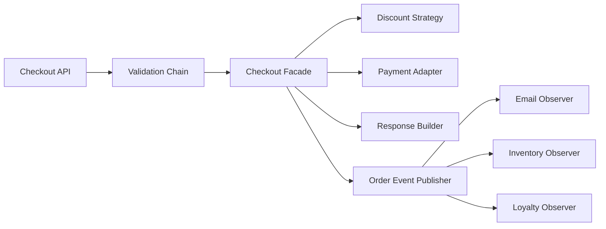

The hardest part of design patterns is not implementation.
It is choosing the right pattern and stopping before abstraction becomes ceremony.

This final post ties the series together around one practical question:

**How do patterns combine inside a real Java application?**

---

## Checkout System Example

A practical checkout flow might use:

- `Facade` for the application entry point
- `Strategy` for discount calculation
- `Adapter` for payment providers
- `Observer` for post-order notifications
- `Chain of Responsibility` for request validation
- `Builder` for assembling the final response object

---

## Combination Diagram



---

## Implementation Walkthrough

```java
public final class CheckoutApplicationService {
    private final ValidationHandler validationHandler;
    private final CheckoutFacade checkoutFacade;

    public CheckoutApplicationService(ValidationHandler validationHandler,
                                      CheckoutFacade checkoutFacade) {
        this.validationHandler = validationHandler;
        this.checkoutFacade = checkoutFacade;
    }

    public CheckoutResult submit(OrderRequest request) {
        validationHandler.handle(request);
        return checkoutFacade.checkout(request.toCommand());
    }
}
```

Notice what each pattern is doing:

- the chain rejects invalid requests early
- the facade simplifies subsystem coordination
- strategies and adapters hide policy and integration variation
- observers decouple side effects

This is the correct way to think about patterns: as focused tools that solve different design pressures in one coherent flow.

The most important discipline is keeping those pattern roles separate.
If the facade starts implementing discount policy, or the adapter starts making validation decisions, the patterns stop clarifying the design and start competing with each other.

---

## Selection Heuristic

Use this matrix:

1. if creation varies, look at creational patterns
2. if integration or wrapping varies, look at structural patterns
3. if runtime algorithm choice or lifecycle behavior varies, look at behavioral patterns
4. if a plain refactor solves the problem, skip the pattern

---

## Final Rule

Do not ask, “Which pattern can I apply here?”
Ask, “What kind of change is making this code difficult to evolve?”

Once that is clear, the right pattern is usually obvious.
