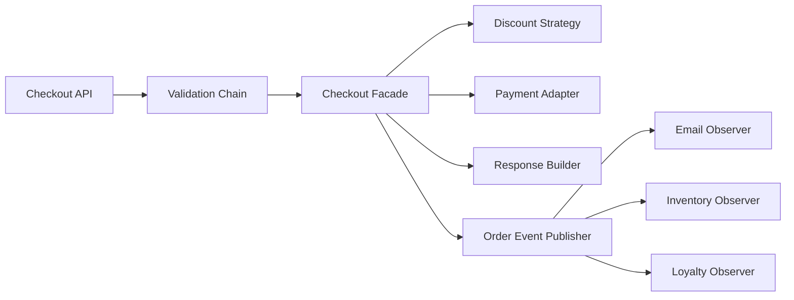
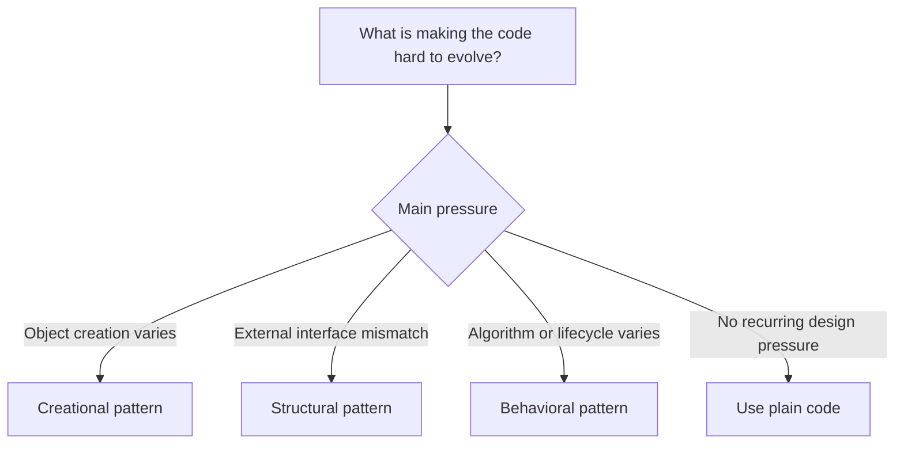

The hardest part of design patterns is not implementation.
It is choosing the right pattern and stopping before abstraction becomes ceremony.

This final post ties the series together around one practical question:

**How do patterns combine inside a real Java application?**

---

## Problem 1: Choosing the Right Pattern Combination

Problem description:
Suppose we are building a checkout system.
Different design pressures appear at different points in the flow:

- request validation
- policy variation
- third-party payment integration
- side-effect fan-out
- response construction

How do we choose the right pattern for each pressure without overcomplicating the system?

What we are solving actually:
We are solving pattern selection, not just pattern implementation.
Most design problems get worse when one pattern is used everywhere.
The goal is to match each abstraction to a specific kind of change or instability.

What we are doing actually:

1. Map each design pressure to the smallest pattern that addresses it well.
2. Let each pattern own one role in the system.
3. Keep boundaries clear so patterns do not overlap or fight each other.
4. Use plain code when no pattern adds enough value.

---

## Checkout System Example

A practical checkout flow might use:

- `Facade` for the application entry point
- `Strategy` for discount calculation
- `Adapter` for payment providers
- `Observer` for post-order notifications
- `Chain of Responsibility` for request validation
- `Builder` for assembling the final response object

---

## Combination Diagram



---

## Implementation Walkthrough

```java
public final class CheckoutApplicationService {
    private final ValidationHandler validationHandler;
    private final CheckoutFacade checkoutFacade;

    public CheckoutApplicationService(ValidationHandler validationHandler,
                                      CheckoutFacade checkoutFacade) {
        this.validationHandler = validationHandler;
        this.checkoutFacade = checkoutFacade;
    }

    public CheckoutResult submit(OrderRequest request) {
        validationHandler.handle(request);
        return checkoutFacade.checkout(request.toCommand());
    }
}
```

Notice what each pattern is doing:

- the chain rejects invalid requests early
- the facade simplifies subsystem coordination
- strategies and adapters hide policy and integration variation
- observers decouple side effects

This is the correct way to think about patterns: as focused tools that solve different design pressures in one coherent flow.

The most important discipline is keeping those pattern roles separate.
If the facade starts implementing discount policy, or the adapter starts making validation decisions, the patterns stop clarifying the design and start competing with each other.

---

## Pattern Selection Matrix



This is the mental model I find most practical.
Start from the change pressure, not from the pattern catalog.

---

## Selection Heuristic

Use this matrix:

1. if creation varies, look at creational patterns
2. if integration or wrapping varies, look at structural patterns
3. if runtime algorithm choice or lifecycle behavior varies, look at behavioral patterns
4. if a plain refactor solves the problem, skip the pattern

---

## Common Combination Examples

- `Facade + Strategy + Adapter`
  Useful when one service coordinates a checkout flow, chooses pricing logic, and integrates with multiple providers.
- `Chain of Responsibility + Facade`
  Useful when validation should happen before orchestration starts.
- `Observer + Command`
  Useful when side effects need to be decoupled and optionally queued or retried.
- `Builder + Facade`
  Useful when orchestration produces a complex response object.

The important point is that combinations should be complementary.
Each pattern should reduce one kind of complexity.

---

## Common Mistakes

1. Using a pattern because it sounds advanced rather than because a concrete change pressure exists
2. Letting one class play too many pattern roles at once
3. Stacking abstractions until the flow becomes harder to follow than the original code
4. Forgetting that a straightforward refactor may beat a formal pattern

---

## Debug Steps

Debug steps:

- trace one real request through the flow and label which pattern is helping at each step
- remove one abstraction mentally and ask what concrete problem it was solving
- check whether two patterns are solving the same problem redundantly
- look for places where plain code would be clearer than one more layer

---

## Final Rule

Do not ask, “Which pattern can I apply here?”
Ask, “What kind of change is making this code difficult to evolve?”

Once that is clear, the right pattern is usually obvious.

---

## Key Takeaways

- patterns combine well when each one addresses a different design pressure
- start with the source of change, not the pattern name
- the best design-pattern decision is often choosing not to add one
