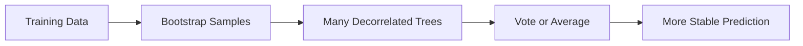

Random forest is still one of the most useful models in practical machine learning because it solves a very common problem well:
you need a strong tabular baseline quickly, the feature space is messy, and you do not want your first model to be fragile.

It is rarely the final answer for every system.
It is often the fastest path to a trustworthy answer.

## Quick Decision Guide

| Situation | Random forest fit | Why |
| --- | --- | --- |
| Mixed-quality tabular data | Strong | Handles nonlinear interactions and weak feature engineering better than many simple baselines |
| Need a credible benchmark fast | Strong | Usually trains reliably and gives a good first ceiling |
| Very large low-latency serving path | Mixed | Accuracy may be fine, but memory and inference cost can become painful |
| Need clean extrapolation beyond observed ranges | Weak | Tree ensembles do not extrapolate gracefully |
| Need simple coefficients for policy explanation | Weak | Feature effects are harder to summarize cleanly |

## The Mental Model

A single decision tree is easy to understand, but it is unstable.
Small changes in the training data can create a very different tree and a very different prediction boundary.

Random forest improves that by combining many intentionally different trees:

- each tree sees a bootstrap sample of the data
- each split sees only a random subset of features
- the final prediction aggregates across the tree set

The point is not that every tree is excellent.
The point is that the ensemble is less sensitive to noise than any one tree.

## Why It Works Well on Real Tabular Data

Many business datasets are not clean enough for elegant textbook assumptions.
They contain weak nonlinearities, threshold effects, missing-value workarounds, imperfect scaling choices, and interactions no one fully specified up front.

Random forest often handles this environment well because:

- it captures nonlinear interactions without feature crosses
- it does not require heavy scaling discipline
- it is less brittle than one deep tree
- it is usually competitive before serious feature engineering begins

That makes it a strong first model for:

- churn prediction
- fraud triage
- lead scoring
- credit risk ranking
- internal operational classifiers on medium-sized tabular data

## When Random Forest Is the Right Baseline

Use it early when:

1. the data is tabular
2. the target relationship is probably nonlinear
3. you need a robust baseline before deciding whether boosting or neural approaches are worth the complexity

Do not confuse "baseline" with "temporary toy."
A good baseline is what tells you whether a more complex model is actually earning its operational cost.

## Hyperparameters That Actually Matter

Most random forest tuning mistakes come from changing too many knobs at once or optimizing only for offline score.

### `n_estimators`

More trees usually improve stability, but gains taper off.
Once the ensemble variance is already low, adding more trees mostly buys marginal accuracy at the cost of memory and latency.

Good habit:
increase trees until validation performance stabilizes, then stop.

### `max_depth`

This controls how aggressively each tree memorizes local structure.
Very deep trees can fit noise and make the ensemble larger than necessary.

Shallow-to-moderate depth often gives a better tradeoff between signal capture and serving efficiency.

### `min_samples_leaf`

This is one of the best regularization controls in practice.
Larger leaves force smoother decision regions and reduce overreaction to tiny slices of data.

If a forest is producing jittery probabilities or unstable segment behavior, `min_samples_leaf` is often the first knob worth revisiting.

### `max_features`

This controls tree diversity.
Smaller feature subsets make trees less correlated, which can improve ensemble stability.
Too small, and each tree becomes weak.
Too large, and trees become too similar.

### `class_weight`

For imbalanced classification, this matters more than teams often expect.
If the rare class drives the real business value, you usually need weighting, threshold tuning, or both.

## A Practical Tuning Order

When teams struggle with random forest, they often start by pushing `n_estimators` upward.
That is usually not where the real gains are.

A better tuning order is:

1. choose the right evaluation metric for the business problem
2. set class weighting if imbalance matters
3. tune `max_depth` and `min_samples_leaf`
4. adjust `max_features`
5. increase `n_estimators` until performance plateaus
6. benchmark latency before declaring victory

This order keeps the model grounded in operating behavior rather than leaderboard instinct.

## Out-of-Bag Error Is Useful, but Not Final Truth

Out-of-bag (OOB) evaluation gives a convenient internal estimate because each tree leaves out part of the training data.
That makes OOB error a good speed tool for iteration.

It is useful for:

- rough hyperparameter comparison
- spotting obvious overfitting
- getting quick signal without a full validation loop every time

It is not a replacement for:

- a proper holdout or cross-validation strategy
- time-aware evaluation when the data drifts
- segment-level analysis
- calibration checks

If production data has temporal movement, policy thresholds, or strong subgroup differences, OOB alone is not enough.

## Feature Importance Is Easy to Misread

Random forest often creates false confidence because it can produce a ranked feature list.
That list is useful, but it is not a causal explanation and it is not always stable.

Be especially careful with impurity-based importance:

- it can overvalue high-cardinality features
- it can distribute importance strangely across correlated variables
- it can make a noisy proxy look more important than a true driver

Permutation importance is usually safer for interpretation.
Even then, inspect stability across resamples or folds.

If the ranking changes dramatically between runs, the right conclusion is not "the model found a secret truth."
The right conclusion is "the explanatory story is unstable."

## Probability Outputs Need Respect

Random forest scores are often good for ranking, but not automatically reliable for probability-based decisions.
If a model drives:

- offer eligibility
- fraud review thresholds
- pricing tiers
- intervention priority

then calibration matters.

Check whether a predicted `0.80` actually behaves like an 80 percent event rate.
If it does not, calibration or threshold redesign may be needed.

## When Not to Use Random Forest

Random forest is not the best default in every setting.

Be cautious when:

- the serving path has strict latency or memory budgets
- the dataset is huge and linear or gradient-boosted methods scale better
- extrapolation outside observed ranges matters
- interpretability must be extremely simple and policy-facing

For example, if leadership needs a stable coefficient-level explanation for a pricing policy, a simpler generalized linear model may be more defensible.

## A Better Production Workflow

For a churn or risk model, a solid workflow looks like this:

1. build a simple baseline such as logistic regression
2. train random forest as the nonlinear benchmark
3. compare ranking quality, calibration, and subgroup behavior
4. tune depth, leaf size, and feature subsampling
5. evaluate latency and memory at the target serving shape
6. choose thresholds based on business costs, not raw accuracy

That process makes the model useful even if random forest does not become the final choice.

## Common Failure Modes

### Bigger forest, same real problem

Teams keep adding trees when the actual issue is poor labeling, leakage, weak features, or threshold mismatch.

### Accuracy obsession under class imbalance

A model can look "good" offline and still miss the rare class that actually matters.

### Overconfident interpretation

Feature importance is not the same as mechanism.
Use it as model insight, not business truth.

### No segment-level evaluation

A forest can perform well overall and still fail badly in important customer slices, traffic sources, or geographies.

## What to Check Before Shipping

- compare training, OOB, validation, and test behavior
- inspect subgroup metrics, not just one global score
- measure inference cost on realistic batch or request shapes
- review calibration if the output drives policy thresholds
- test whether feature-importance stories stay stable across resamples

## Key Takeaways

- Random forest is one of the best first serious models for messy tabular problems.
- The real value is not magic accuracy. It is stable, nonlinear baseline performance with relatively low setup pain.
- Depth, leaf size, weighting, and evaluation discipline matter more than blindly adding trees.
- Use it to establish a trustworthy benchmark, then decide whether a more complex model truly earns its cost.
