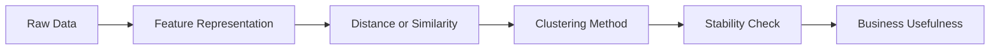

---
categories:
- AI
- ML
date: 2026-01-13
seo_title: 'Clustering: K-Means, DBSCAN, and Hierarchical Methods'
seo_description: A practical guide to clustering methods, distance choices, validation,
  and production use in segmentation and anomaly discovery.
tags:
- ai
- ml
- clustering
- kmeans
- dbscan
- unsupervised-learning
title: 'Clustering: K-Means, DBSCAN, and Hierarchical Methods'
toc: true
toc_icon: cog
toc_label: In This Article
header:
  overlay_image: "/assets/images/ai-ml-series-banner.svg"
  overlay_filter: 0.35
  show_overlay_excerpt: false
  caption: Find Structure Without Labels
---
Clustering is useful when you need structure in unlabeled data, but it is one of the easiest ML areas to misuse.
Teams often act as though the algorithm is discovering "true groups" hidden in the data.
In practice, clustering mostly reveals structure induced by your feature representation, distance definition, and evaluation choices.

That is why a clustering project should start with a business question, not with "which algorithm should we try first?"

## Quick Comparison

| Method | Best for | Strengths | Main failure mode |
| --- | --- | --- | --- |
| K-means | compact numeric clusters | simple, scalable, easy to operationalize | forces centroid-shaped clusters and requires `k` |
| DBSCAN | density structure and noise discovery | no fixed `k`, arbitrary shapes, natural outlier handling | brittle when densities vary a lot |
| Hierarchical clustering | multi-resolution exploration | dendrogram gives useful structure across cuts | can become expensive and sensitive to linkage choice |

## The Right Mental Model

Clustering is not classification without labels.
It is representation-driven grouping.

That distinction matters because success depends on three earlier choices:

1. what features you include
2. what similarity notion you encode
3. what downstream action the grouping is supposed to support

If the features are poor or the distance is semantically wrong, no clustering algorithm can rescue the project.

## Start With the Action, Not the Plot

Before choosing an algorithm, answer this:
what will the team do differently if the clusters are credible?

Good answers:

- different onboarding journeys for customer segments
- prioritized manual review for unusual behavior groups
- candidate labels for annotation workflows
- exploration of product usage archetypes

Weak answers:

- "we want to see what the data says"
- "we want five segments because the presentation wants five slides"

Without a downstream action, clustering becomes decorative analysis.

## Representation and Distance Matter More Than Algorithm Brand

Two clustering projects with the same algorithm can produce very different results because the real model is often the feature space.

Examples:

- Euclidean distance can make sense for standardized continuous features
- cosine distance is often better for text or embeddings where direction matters more than magnitude
- Manhattan distance can be more robust for some sparse count-like settings

If the notion of similarity is wrong, a nice-looking cluster map is still wrong.

## K-means: Fast, Useful, and Easy to Overtrust

K-means partitions data around centroids and tries to minimize within-cluster squared distance.
It is a strong default when you expect reasonably compact numeric groups and want something operationally simple.

### Where K-means works well

- customer segmentation on standardized numeric features
- coarse grouping for downstream routing
- large datasets where speed matters

### Where K-means struggles

- elongated or curved cluster shapes
- clusters with very different sizes or variances
- unscaled features
- strong outlier contamination

Use k-means++ initialization and multiple seeds.
If the solution moves a lot across runs, that is a warning sign about the data or the assumed geometry.

## DBSCAN: Good for Density, Good for Noise, Easy to Mis-tune

DBSCAN groups dense regions and labels sparse regions as noise.
That makes it attractive when you care about arbitrary shapes or anomaly-oriented workflows.

### Where DBSCAN works well

- spatial or geometric patterns with non-spherical shape
- exploratory outlier surfacing
- datasets where a fixed cluster count is unnatural

### Where DBSCAN struggles

- very high-dimensional spaces where density becomes less meaningful
- settings with strongly varying cluster densities
- cases where parameter sensitivity is not understood

The algorithm can be excellent, but only when `eps` and `min_samples` reflect the actual scale of the feature space.

## Hierarchical Clustering: Useful When One Cut Is Not Enough

Hierarchical clustering is strong when the real question is not "what are the clusters?" but "how does the grouping behave at different resolutions?"

That is valuable for:

- exploratory segmentation
- taxonomy design
- relationship discovery between groups

The linkage choice matters a lot:

- single linkage can chain points together too easily
- complete linkage favors tighter clusters
- average linkage gives a middle ground
- Ward linkage often works well for Euclidean compact-cluster structure

If the team ignores linkage choice, they are often ignoring the actual clustering behavior.

## Choosing the Number of Clusters

For methods that require `k`, teams often over-rely on one diagnostic plot.
That is rarely enough.

Useful signals include:

- elbow heuristic
- silhouette score
- Davies-Bouldin index
- cluster size balance
- interpretability of segment descriptions
- business actionability

A mathematically neat `k` that produces segments no one can use is not a good clustering solution.

## Stability Is a First-Class Quality Check

A segmentation is weak if it disappears when you change the random seed, shift the date window, or nudge one parameter.

Test stability across:

- random seeds
- nearby hyperparameter settings
- adjacent time windows
- bootstrap or resampled subsets

If the cluster assignments swing wildly, do not build hard business policies on top of them.

## Validation Needs More Than Internal Metrics

Internal metrics are useful, but they are not enough.
Silhouette score can tell you something about cohesion and separation.
It cannot tell you whether the clusters support a real product or business decision.

Better validation asks:

- do the segments differ in downstream behavior?
- do they remain interpretable over time?
- can an operator or stakeholder describe what makes each group distinct?
- do they support a real workflow, policy, or experiment?

This is where many clustering projects fail.
They optimize the picture and neglect the decision.

## A Practical Segmentation Workflow

1. define the business action or hypothesis
2. build a leakage-safe feature representation
3. choose a distance that matches domain meaning
4. test multiple clustering families, not just one favorite
5. compare internal metrics, stability, and actionability
6. assign plain-language descriptions to the final groups
7. monitor migration and drift after deployment

If you cannot describe what makes one cluster meaningfully different from another, the segmentation is probably not ready.

## Common Failure Modes

### Clustering raw mixed-scale features

The algorithm is then mostly reflecting measurement scale, not meaningful similarity.

### Treating a 2D plot as ground truth

Visualization is helpful for inspection.
It is not proof that operationally real groups exist.

### Choosing `k` because a dashboard wanted a neat number

This creates presentation-friendly segments that may not reflect the data or the use case.

### No temporal validation

A segment that only exists in one snapshot is often not strong enough for durable business action.

## What to Check Before Shipping a Segmentation

- verify the feature set does not leak downstream outcomes
- test stability across seeds and nearby hyperparameters
- inspect cluster size distribution for pathological imbalance
- compare segment behavior on real business or product outcomes
- write plain-language descriptions for each cluster and see if they remain consistent over time

## Key Takeaways

- Clustering is not about discovering universal truth. It is about finding useful structure under a chosen representation.
- Feature design and distance choice usually matter more than the algorithm name.
- K-means, DBSCAN, and hierarchical clustering each solve different geometric problems.
- A clustering result is only good if it is stable enough to trust and useful enough to act on.
