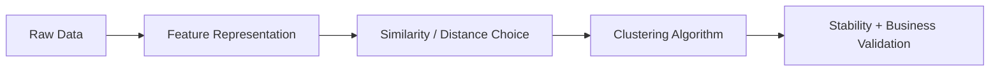

---
categories:
- AI
- ML
date: 2026-01-13
seo_title: 'Clustering: K-Means, DBSCAN, and Hierarchical Methods'
seo_description: A practical guide to clustering methods, distance choices, validation,
  and production use in segmentation and anomaly discovery.
tags:
- ai
- ml
- clustering
- kmeans
- dbscan
- unsupervised-learning
title: 'Clustering: K-Means, DBSCAN, and Hierarchical Methods'
toc: true
toc_icon: cog
toc_label: In This Article
header:
  overlay_image: "/assets/images/ai-ml-series-banner.svg"
  overlay_filter: 0.35
  show_overlay_excerpt: false
  caption: Find Structure Without Labels
---
Clustering finds structure in unlabeled data.
It is widely used for customer segmentation, pattern discovery, exploratory analysis, and anomaly surfacing.

---

## Problem 1: Group Similar Data Without Labels

Problem description:
We want to discover meaningful structure in data even when no class labels are available.

What we are solving actually:
We are solving for representation-driven grouping, not “finding true classes.”
Clustering quality depends on features, distance choice, and what the business plans to do with the resulting groups.

What we are doing actually:

1. Choose a representation and similarity notion.
2. Pick a clustering family that matches expected structure.
3. Validate the result for both stability and business usefulness.

## What Clustering Can and Cannot Do

Clustering can:

- group similar items by chosen feature space
- expose latent structure for downstream decisions
- provide useful priors for labeling and strategy

Clustering cannot automatically produce “true classes.”
Cluster quality always depends on feature definition, distance metric, and use-case validation.

---

## K-Means

K-means minimizes within-cluster squared distance around centroids.

Strengths:

- scalable and simple
- easy to implement and operationalize

Limitations:

- requires `k`
- sensitive to scaling and initialization
- assumes roughly spherical/equal-variance clusters

Use k-means++ initialization and run multiple seeds.

---

## DBSCAN

DBSCAN groups dense regions and marks sparse points as noise.

Strengths:

- no explicit `k` needed
- handles arbitrary cluster shapes
- naturally surfaces noise points

Limitations:

- sensitive to `eps` and `min_samples`
- struggles when clusters have very different densities

DBSCAN is strong for anomaly-oriented exploratory workflows.

---

## Hierarchical Clustering

Produces nested cluster tree (dendrogram).

Variants:

- agglomerative (bottom-up)
- divisive (top-down)

Key choice is linkage (single, complete, average, Ward).
This affects cluster geometry and interpretability.

Useful when you need multi-resolution segmentation.

---

## Distance Metric Choice

Distance defines similarity.
Wrong distance invalidates results.

Examples:

- Euclidean for standardized numeric attributes
- cosine for text/embedding directions
- Manhattan for sparse count-like spaces

Always justify metric based on domain semantics.

---

## Choosing Number of Clusters

For algorithms requiring `k`, combine:

- elbow heuristic
- silhouette score
- Davies-Bouldin index
- domain-driven interpretability check

Metric-only selection often yields segments that are statistically neat but operationally useless.

---

## Stability Testing

A practical segmentation should be stable across:

- random seeds
- nearby parameter values
- adjacent time windows

If clusters are unstable, avoid hard business policies based on them.

---

## Production Segmentation Workflow

1. define business action per segment
2. build leakage-safe feature set
3. standardize and test multiple algorithms
4. evaluate compactness/separation and business meaning
5. assign interpretable labels to clusters
6. monitor drift and segment migration over time

Clustering is useful only when it drives action.

---

## Common Mistakes

1. clustering raw unscaled mixed features
2. overinterpreting visualization artifacts
3. selecting `k` only from elbow plot
4. no temporal stability analysis
5. no downstream validation with business outcomes

---

## Debug Steps

Debug steps:

- rerun clustering across seeds and nearby hyperparameters to test stability
- inspect cluster size distribution so one giant cluster or many tiny clusters do not go unnoticed
- validate clusters against downstream actions, not just silhouette or elbow scores
- revisit feature engineering first if every algorithm yields unstable or uninterpretable groups

## Key Takeaways

- clustering is representation plus algorithm plus interpretation
- distance metric and feature design matter more than algorithm brand name
- stable, actionable segments are the real success criteria
