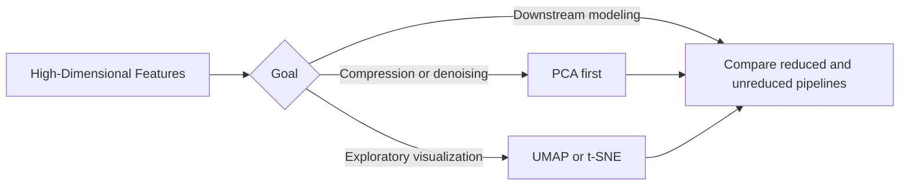

---
categories:
- AI
- ML
date: 2026-01-14
seo_title: Dimensionality Reduction with PCA, UMAP, and t-SNE
seo_description: A practical deep dive into dimensionality reduction methods, when
  to use them, and pitfalls in interpretation.
tags:
- ai
- ml
- pca
- umap
- tsne
- unsupervised-learning
title: Dimensionality Reduction with PCA, UMAP, and t-SNE
toc: true
toc_icon: cog
toc_label: In This Article
header:
  overlay_image: "/assets/images/ai-ml-series-banner.svg"
  overlay_filter: 0.35
  show_overlay_excerpt: false
  caption: Compress Information, Keep Signal
---
Dimensionality reduction is valuable when it makes a model or analysis *more useful*, not when it merely makes a chart look interesting.
That distinction matters because many teams use PCA, UMAP, or t-SNE for the wrong reason:
they want visual reassurance rather than a better representation.

The right question is not "which reduction method is best?"
It is "what do we need the reduced space to preserve, and how will we validate that it helped?"

## Quick Guide

| Method | Best use | Strengths | Main risk |
| --- | --- | --- | --- |
| PCA | linear compression and denoising | fast, stable, interpretable variance structure | may miss nonlinear task-relevant structure |
| t-SNE | exploratory 2D or 3D visualization | strong local neighborhood visualization | easy to overinterpret global layout |
| UMAP | scalable nonlinear embedding and exploration | often faster than t-SNE, flexible local-global tradeoff | still sensitive to parameter and interpretation choices |

## Start With the Goal

Dimensionality reduction usually serves one of four goals:

1. compress features before downstream modeling
2. remove noise or redundancy
3. make exploratory visualization possible
4. improve retrieval or distance behavior in a more compact space

If you cannot name the goal, you probably do not need dimensionality reduction yet.

## Why High Dimension Becomes a Problem

High-dimensional spaces often create:

- noisy or weak features
- redundant correlated dimensions
- higher computational cost
- unstable distance behavior
- visual opacity for human inspection

Dimensionality reduction can help, but only if the reduction preserves what matters for the actual task.

## PCA: The First Serious Baseline

PCA should often be the first dimensionality reduction method you try because it is simple, stable, and honest.
It finds orthogonal directions that explain the most variance in the data.

### Where PCA shines

- correlated numeric features
- preprocessing for linear models
- compression before distance-based methods
- quick denoising baselines

### Where PCA is limited

- nonlinear structure matters
- top-variance directions are not the most task-relevant directions
- interpretability requires domain semantics beyond variance

PCA is not glamorous, but it is dependable.
That already makes it better than many visually exciting but poorly validated alternatives.

## Choosing How Many Components

There is no sacred number of components.
Choose based on the real objective.

Useful signals:

- explained variance curves
- downstream model quality
- latency or memory reduction targets
- interpretability tradeoffs

If 10 components preserve almost all useful signal and cut substantial compute cost, that is better than keeping 100 because it "feels safer."

## t-SNE: Excellent for Local Structure, Dangerous for Storytelling

t-SNE is powerful for visualization because it often shows local neighborhoods and cluster-like patterns in a way humans can inspect.
That makes it genuinely useful for exploratory analysis.

It also invites overconfidence.

Important cautions:

- far-apart cluster distances in a t-SNE plot may not mean much
- cluster size on the map is not a trustworthy measure of real density
- different seeds or perplexity settings can change the picture meaningfully
- t-SNE is generally poor as a production feature transform

Use it to ask questions, not to declare answers.

## UMAP: Flexible, Useful, Still Not a Truth Machine

UMAP is often a strong modern choice for nonlinear embedding because it scales well and can produce visually and operationally useful low-dimensional representations.

Two parameters matter a lot:

- `n_neighbors`: how local versus global the embedding should be
- `min_dist`: how tightly points are allowed to pack together

UMAP can be useful for:

- exploratory structure analysis
- visualization of embeddings
- some downstream workflows that benefit from compact nonlinear representation

But the same warning still applies:
if the embedding changes meaningfully with reasonable parameter shifts, your interpretation should remain cautious.

## Visualization Is Not Validation

This is the core failure mode in dimensionality reduction work.
Teams see a clean-looking 2D projection and treat it as proof that meaningful clusters, segments, or classes exist.

That is not enough.

Better validation asks:

- did downstream model quality improve?
- did retrieval quality improve?
- did training or serving cost improve enough to matter?
- does the structure remain stable across seeds and nearby parameters?
- do the conclusions hold across adjacent data slices?

If the answer is no, the pretty embedding may still be analytically weak.

## Leakage Is an Easy Way to Fool Yourself

Reducers must be fit inside the training pipeline, not on the full dataset before splitting.
This is especially important when the reduced representation feeds a supervised model.

Bad pattern:

- fit PCA or UMAP on all data
- split later
- report optimistic downstream metrics

Correct pattern:

- split first
- fit reducer on training data only
- apply the fitted reducer to validation and test

This matters just as much as proper scaling and model validation.

## Supervised Reduction Can Help, but Raises the Stakes

Some reduction approaches can use labels to preserve discriminative structure.
That can improve task performance, but it also increases the risk of leakage or brittle overfitting if evaluation is weak.

Use supervised variants only when:

- the task is clearly predictive, not just exploratory
- the evaluation pipeline is clean
- you compare against unreduced and unsupervised baselines

Otherwise, you may be optimizing a shortcut rather than a representation.

## A Practical Workflow

1. define whether the goal is compression, visualization, denoising, or downstream performance
2. standardize numeric features when appropriate
3. try PCA first as the honest baseline
4. compare downstream quality with and without reduction
5. use UMAP or t-SNE for exploratory inspection, not as automatic truth
6. test seed and parameter stability before drawing strong conclusions

If dimensionality reduction does not improve usefulness, skip it.
Not using a reducer is often the correct decision.

## Common Failure Modes

### Choosing by aesthetics

The embedding that looks nicest is not necessarily the embedding that preserves useful information.

### Treating t-SNE or UMAP separation as proof of operational segments

Visual separation can be suggestive, but it is not enough on its own.

### Keeping too many PCA components by habit

That preserves cost without preserving much additional value.

### Ignoring reproducibility

If the plot or representation changes heavily with seed or parameter shifts, the narrative should stay modest.

## What to Check Before Shipping

- verify reducers are fit only inside training folds or pipelines
- compare downstream metrics with and without reduction
- test stability across seeds and nearby parameter values
- be explicit about whether the reduced space is for modeling or only for exploration
- avoid making business claims from visualization alone

## Key Takeaways

- PCA is usually the right first reduction baseline because it is simple, stable, and easy to validate.
- t-SNE and UMAP are useful exploratory tools, but they are easy to overinterpret.
- Dimensionality reduction is only successful when it improves the real task, not when it merely produces a cleaner-looking map.
- Always validate the reduced space by downstream performance, stability, and leakage-safe evaluation.
