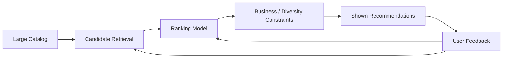

---
categories:
- AI
- ML
date: 2026-01-17
seo_title: 'Recommender Systems: Retrieval, Ranking, and Feedback Loops'
seo_description: A practical architecture guide to modern recommender systems including
  candidate retrieval, ranking, and online feedback.
tags:
- ai
- ml
- recommender-systems
- ranking
- retrieval
title: 'Recommender Systems: Retrieval, Ranking, and Feedback Loops'
toc: true
toc_icon: cog
toc_label: In This Article
header:
  overlay_image: "/assets/images/ai-ml-series-banner.svg"
  overlay_filter: 0.35
  show_overlay_excerpt: false
  caption: Find the Right Item in Milliseconds
---
Recommendation systems are not one model.
They are multi-stage decision pipelines balancing relevance, diversity, freshness, fairness, and latency.

The engineering challenge is not simply "predict what the user clicks."
It is "build a fast decision pipeline that can retrieve, rank, and serve items without collapsing into popularity bias or starving the catalog."

## Standard Two-Stage Architecture

Most production recommenders use:

1. retrieval: quickly fetch a few hundred relevant candidates from large catalog
2. ranking: score these candidates with richer user-item-context features

Why this matters:

- retrieval optimizes recall and speed
- ranking optimizes precision and business objectives

Trying to do everything in one stage does not scale well.

This separation is one of the most important architecture decisions in recommender systems.
If retrieval is weak, the ranker never sees the right items.
If ranking is weak, good candidates still turn into poor recommendations.

---

## Retrieval Methods

Common approaches:

- collaborative filtering and matrix factorization
- embedding similarity with approximate nearest neighbor search
- co-occurrence/co-visitation graphs
- popularity and recency priors

Retrieval should maximize candidate coverage under strict latency budgets.

In practice, retrieval is often a recall problem under extreme scale.
The system does not need the perfect item at this stage. It needs a strong candidate pool fast enough that the user never feels the pipeline.

---

## Ranking Layer Design

Rankers use richer features:

- user profile and history
- item metadata and quality
- context (time, device, session intent)
- cross features (user-item affinities)

Objectives can include click-through, watch time, conversion, retention, or long-term value.
Pick objective aligned with product strategy.

That objective choice matters more than many teams expect.
Optimizing short-term click-through alone can easily make the product feel addictive, repetitive, or low-trust over time.

---

## Feedback Loops and Popularity Bias

Recommenders influence future training data.
If system only promotes already-popular items, discovery collapses.

Countermeasures:

- exploration policies
- diversity constraints
- novelty-aware reranking
- exposure fairness monitoring

Healthy ecosystems require deliberate exploration-exploitation balance.

This is where recommender systems stop being pure ranking systems and become product-governance systems.
What gets shown changes future data, and future data shapes what gets shown next.

> [!important]
> A recommender trained only on prior exposure data will often learn to reward what was already visible, not what was actually best for the user or the catalog.

---

## Exploration Strategies

Common patterns:

- epsilon-greedy
- Thompson sampling
- contextual bandits

Use guardrails to avoid user experience degradation while collecting learning signal.

Exploration should be designed, measured, and bounded.
If it is ignored, the system becomes stagnant.
If it is careless, the system degrades user trust.

---

## Cold Start Handling

For new users:

- onboarding preferences
- contextual/popularity priors
- short-session intent features

For new items:

- content embeddings
- metadata similarity
- controlled exposure for feedback collection

Cold start should be first-class design, not an afterthought.

Many recommendation systems look strong in mature-user simulations and then fail on exactly the traffic that matters most for growth: new users, new items, and sparse sessions.

---

## Metrics: Offline and Online

Offline:

- recall@k
- NDCG@k
- MAP

Online:

- CTR
- conversion rate
- session depth
- retention and satisfaction signals

Optimize both short-term and long-term outcomes.

Offline ranking metrics are useful, but they are not enough.
The real production question is whether the system improves the product experience over time without creating unhealthy exposure dynamics.

---

## Operational Constraints

- candidate generation latency
- feature freshness
- cache invalidation
- safe fallbacks when model unavailable
- real-time monitoring of recommendation quality

Recommendation engines are high-throughput critical systems.

This is why a recommender should always have a degraded-but-safe mode.
A fast fallback based on recency, popularity, or editorial rules is often better than returning nothing or serving unstable results during an incident.

---

## Common Mistakes

1. optimizing CTR only and harming long-term trust
2. no diversity or freshness constraints
3. weak experimentation and rollback discipline
4. no fairness checks for catalog exposure
5. blaming ranking when the real issue is weak retrieval coverage

---

## Debug Steps

Debug steps:

- measure retrieval recall separately from ranking quality so pipeline failures are not conflated
- inspect recommendation exposure skew to detect popularity collapse early
- compare short-term engagement gains with longer-term retention or satisfaction trends
- test cold-start fallbacks explicitly because production traffic always contains new users and new items

## Key Takeaways

- recommender systems are full pipelines, not single predictors
- retrieval quality and ranking quality must be measured separately
- feedback loops require active controls for fairness and discovery
- online experimentation is required before broad rollout
