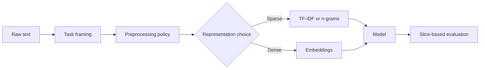

---
categories:
- AI
- ML
date: 2026-01-18
seo_title: 'NLP Fundamentals: From Raw Text to Useful Features'
seo_description: A practical deep dive into core NLP pipeline design, text preprocessing,
  feature extraction, and evaluation.
tags:
- ai
- ml
- nlp
- text-processing
- feature-extraction
title: 'NLP Fundamentals: From Raw Text to Useful Features'
toc: true
toc_icon: cog
toc_label: In This Article
header:
  overlay_image: "/assets/images/ai-ml-series-banner.svg"
  overlay_filter: 0.35
  show_overlay_excerpt: false
  caption: Language Data Needs Careful Representation
---
The hard part of NLP is usually not turning text into vectors.
The hard part is deciding what information the system must preserve, what kind of errors the task can tolerate, and how to tell whether the pipeline is helping or quietly destroying signal.

In practice, weak task framing and weak data discipline cause more damage than picking the wrong model family.

## Start With the Task, Not the Model

The same text can support very different tasks:

- classification: spam detection, sentiment, intent routing
- extraction: named entities, product attributes, policy violations
- retrieval: semantic search, document recall, FAQ matching
- generation: summarization, question answering, drafting

Each one needs a different success definition.

That means the first question should be:
"What output must this system produce, and which mistakes matter most?"

If that question is fuzzy, the rest of the pipeline becomes guesswork.

## A Concrete Example: Support Ticket Routing

Imagine we need to route customer support tickets into the right queue.

Some signals matter a lot:

- product names
- error codes
- refund or cancellation intent
- sentiment only when it changes escalation policy

Some preprocessing choices help:

- unicode normalization
- whitespace cleanup
- consistent handling of copied stack traces

Some can hurt if applied blindly:

- lowercasing product SKUs that are case-sensitive
- stripping punctuation when `ERR-1042` is an important token
- over-aggressive stopword removal that destroys short intent phrases

That is why NLP preprocessing should be task-aware, not copied from a default notebook.

## Preprocessing Is a Policy Decision

Good preprocessing often includes:

- unicode normalization
- casing policy
- tokenization
- language or locale detection
- HTML or markup cleanup
- spam/noise filtering

But the right pipeline depends on what must survive.

For example, in legal or medical text, punctuation and capitalization may carry useful structure.
In query logs, misspellings may be part of the real user behavior you need to support.

> [!important]
> Preprocessing should remove accidental noise, not meaningful signal. If a cleanup step changes the business meaning of text, it is not a harmless cleanup step.

## Classical Sparse Features Still Matter

For many real classification problems, TF-IDF plus a linear model is still an excellent baseline.

Why it remains useful:

- fast to train and serve
- interpretable feature weights
- strong with limited labeled data
- easy to debug when the system misfires

A baseline like this is not old-fashioned.
It is one of the fastest ways to find out whether the problem is actually representation-limited.

## Dense Representations Help When Semantics Matter

Embeddings are most useful when simple token overlap is not enough.

Common cases:

- semantic retrieval
- clustering similar intents
- reranking documents by meaning rather than literal term match
- cross-lingual or paraphrase-heavy matching

But generic embeddings are not automatically good in specialized domains.
A support model trained on consumer FAQs may perform badly on cloud infrastructure tickets full of internal acronyms.

That is why evaluation needs in-domain text, not only benchmark confidence.

## Label Quality Often Dominates Model Quality

Many NLP projects plateau because the labels are inconsistent, not because the architecture is weak.

Good labeling discipline includes:

- clear guidelines with examples
- a stable label taxonomy
- inter-annotator agreement checks
- adjudication for ambiguous cases
- versioning when label definitions change

If the team cannot explain why two similar examples received different labels, the model is learning confusion instead of policy.

## Evaluation Has To Match the Task

Different tasks need different scorecards:

- classification: precision, recall, F1, per-class performance
- sequence labeling: entity-level precision and recall
- retrieval: recall@k, MRR, NDCG
- generation: automatic metrics plus human review against real business expectations

Aggregate scores can hide serious operational risk.
An intent router with good overall F1 may still be terrible on high-value cancellation requests or on the one language variant your key customer segment uses.

## Slice Analysis Is Where Real Improvement Happens

When the model underperforms, do not start by adding complexity.
Start by slicing the failures.

Useful slices:

- language or locale
- text length
- rare domain terms
- noisy spelling or OCR artifacts
- ambiguous user phrasing
- newly introduced vocabulary after a product launch

This is usually where the fastest quality gains come from, because the slices reveal whether the problem is labeling, preprocessing, representation, or model capacity.

## Production NLP Needs More Than Accuracy

Once the system goes live, the concerns widen:

- vocabulary drift
- policy and safety filtering
- privacy and PII handling in logs
- latency budgets
- prompt or input abuse for LLM-backed flows
- offline versus online feature mismatch

A model with good offline metrics can still be operationally weak if it is too slow, too leaky with sensitive text, or too brittle to new vocabulary.

## A Practical Development Strategy

For many teams, the strongest sequence is:

1. define the task and business failure modes clearly
2. build a careful preprocessing policy
3. create a strong sparse baseline
4. test whether dense features or embeddings add real value
5. use slice analysis to decide what to improve next

That order keeps the team honest.
It prevents "modern model first" decisions from masking problems that were really about labels, boundaries, or evaluation.

## Common Mistakes

1. choosing a model before defining the task failure mode
2. over-cleaning text and erasing useful signal
3. skipping sparse baselines entirely
4. trusting one overall score instead of slice analysis
5. deploying on a domain that looks different from the training data

## Debug Checklist

- verify that preprocessing preserved the tokens that actually matter
- compare dense methods against a simple sparse baseline
- inspect mislabeled or ambiguous training examples first
- slice errors by domain vocabulary, input length, and noise level
- validate latency and safety behavior, not only offline accuracy

## Key Takeaways

- Strong NLP systems start with correct task framing.
- Preprocessing is a modeling decision, not a hygiene ritual.
- Sparse baselines still earn their place in real production pipelines.
- Label quality and slice analysis often matter more than model novelty.
