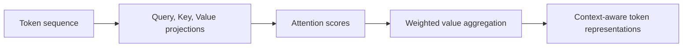

Transformers are the architecture behind modern LLMs, code models, rerankers, and many multimodal systems.
They replaced recurrent-heavy NLP because they model context more directly and scale better with compute.

This article focuses on practical understanding: architecture intuition, operational trade-offs, and where teams usually fail.

---

## Why Transformers Won

Earlier sequence models had two major bottlenecks:

- sequential processing, which limited training parallelism
- weak long-range dependency capture

Transformers solve both with self-attention.
Each token representation can directly use information from other tokens in the same layer.

Result:

- better scalability
- stronger contextual representation
- faster iteration for large-scale training

---

## Self-Attention Mechanics

Each token is projected to three vectors:

- query
- key
- value

Query-key similarity decides attention weights.
Those weights are applied to value vectors to produce contextualized output.

This lets model focus dynamically on relevant parts of sequence for each token.

A simple way to think about it:

- the query asks "what am I looking for"
- the key says "what information do I contain"
- the value carries the information that gets aggregated

In the sentence "The server restarted because it ran out of memory," the token `it` should attend more strongly to `server` than to `memory`.
That is the kind of contextual routing self-attention is designed to learn.

---

## Multi-Head Attention

One attention map is insufficient for complex language structure.
Multi-head attention enables parallel subspaces to capture different relations:

- local syntax
- long-distance dependencies
- semantic grouping
- entity and reference behavior

Combined heads create richer representations than single-head attention.

---

## Transformer Block Components

A standard block includes:

1. multi-head attention
2. feed-forward network
3. residual connections
4. normalization

Residual paths preserve gradient flow in deep stacks.
Normalization stabilizes optimization and convergence.

---

## Positional Information

Attention alone has no sense of order.
Position encoding injects sequence order:

- sinusoidal
- learned positional embeddings
- relative position variants

Position strategy matters for long-context and extrapolation behavior.

This matters more than it first appears.
Without a notion of order, "dog bites man" and "man bites dog" would look uncomfortably similar to the model.

---

## Training and Scaling Trade-Offs

Larger models and datasets often improve capability, but scaling introduces:

- high training cost
- larger inference latency
- memory pressure
- serving complexity

Model selection should be driven by task quality per unit cost, not absolute benchmark score.

That is especially important in enterprise systems, where the best model is often not the most capable one in the abstract.
It is the one that satisfies latency, cost, and safety constraints while staying predictable enough to operate.

---

## Adaptation Options

After pretraining, teams typically use:

- prompt engineering
- supervised fine-tuning
- parameter-efficient tuning (LoRA/adapters)
- retrieval augmentation

For fast-changing knowledge domains, retrieval + prompt control often has better ROI than frequent fine-tuning.

That choice is often misunderstood.
Fine-tuning changes model behavior.
Retrieval changes the information available to the model at runtime.
Those solve different problems.

---

## Inference Engineering Constraints

Serving quality is shaped by:

- context length
- output length
- batch size strategy
- KV-cache memory policy
- quantization/compilation choices

Key production task is balancing latency, cost, and quality.

For example, a longer context window is not automatically a win.
It may increase latency and memory usage enough that overall system throughput drops, while the model still pays attention poorly to the least relevant parts of the prompt.

---

## Failure Modes in Real Systems

Common issues:

- hallucination on factual tasks
- prompt sensitivity
- instruction drift in long context
- policy violations on edge inputs

Mitigation stack:

- grounded retrieval
- schema-constrained outputs
- policy filters
- fallback and escalation logic

Architecture alone does not guarantee reliability.

The operational lesson is straightforward: a transformer is a component, not a whole product.
Production reliability comes from the surrounding system design.

---

## Evaluation Framework

Evaluate across dimensions:

- task success
- factual grounding
- robustness under adversarial inputs
- policy/safety compliance
- latency and cost

One metric cannot represent full system quality.

For a support assistant, "good evaluation" may mean:

- answers are grounded in retrieved documents
- escalation happens when confidence is low
- output stays within schema
- P95 latency remains inside the product budget

That is a much more useful bar than only reporting benchmark-style accuracy.

---

## Architecture Selection Checklist

Before locking model architecture, confirm:

1. expected context length distribution
2. latency targets at P95/P99
3. request cost budget
4. grounding/citation requirement
5. required fallback behavior

Teams that skip this checklist usually over-spend and under-deliver.

---

## Practical Optimization Sequence

A high-ROI sequence for transformer systems:

1. improve retrieval/context quality
2. tighten prompts and output schemas
3. add runtime validation and fallback
4. optimize latency via batching/quantization
5. scale model size only if needed

This sequence often outperforms model-size-first strategy.

---

## Key Takeaways

- Transformers enable scalable, context-rich sequence modeling.
- Production success depends on full-system design, not architecture choice alone.
- Grounding, validation, and serving optimization are core reliability levers.
- Model scaling should follow product constraints and economics.

---

## Further Reading

- [Vector Databases for RAG in Production](/ai/ml/vector-databases-for-rag-in-production/)
- [Embeddings in Practice: Model Choice, Evaluation, and Lifecycle](/ai/ml/mlops/embeddings-in-practice-model-choice-evaluation-and-lifecycle/)
- [Agentic AI Fundamentals: Planning, Tools, Memory, and Control Loops](/ai/ml/agentic-ai-fundamentals-planning-tools-memory-control-loops/)
- [Building Production AI Agents: Architecture, Guardrails, and Evaluation](/ai/ml/mlops/building-production-ai-agents-architecture-guardrails-evaluation/)

---

## Production Case Pattern

Consider an enterprise knowledge assistant with strict latency and citation requirements.

Typical architecture:

- medium-size transformer for response generation
- retrieval layer with top-k context
- citation-mandated prompt format
- schema validation and fallback response path

Why this works:

- grounding improves factual reliability
- medium model keeps cost manageable
- validation ensures output compatibility with UI and logs

This often outperforms a larger model without retrieval in factual workflows.

The deeper lesson is that architecture should reflect the product promise.
If the promise is "fast, grounded, cited answers," then retrieval, validation, and fallback deserve as much attention as the model itself.

---

## Model Upgrade Readiness Checklist

Before upgrading transformer model version:

1. compare latency and cost under production traffic replay
2. run regression tests on safety and factual tasks
3. verify output format stability
4. check retrieval compatibility and context behavior
5. run canary with rollback threshold definitions

Model upgrades should be treated like infrastructure releases, not simple dependency bumps.
