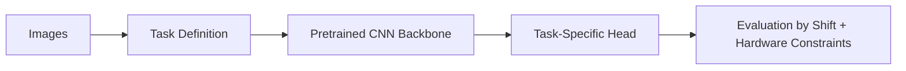

Computer vision systems convert pixels into structured outputs such as labels, boxes, masks, or embeddings.
CNNs remain foundational in many practical vision pipelines due to efficiency and strong transfer learning ecosystems.

The important production question is not "what CNN block is fashionable right now?"
It is "will this model still behave when the lighting changes, the camera changes, the objects are partly occluded, or the inference budget shrinks on the real target hardware?"

## CNN Intuition

Convolution applies learned filters across spatial neighborhoods.
Early layers capture edges/textures; deeper layers capture parts and object-level patterns.

Key properties:

- local connectivity
- parameter sharing
- translation robustness

These make CNNs data-efficient relative to dense networks on images.

That is why CNNs still matter even in a world with strong transformer-based vision models.
They are often easier to deploy, easier to fine-tune on modest datasets, and easier to operate under strict latency or device constraints.

---

## Common Vision Tasks

- classification: assign image label
- detection: locate and classify objects
- segmentation: pixel-level masks
- embedding/search: visual similarity retrieval

Task definition affects labeling cost, model choice, and evaluation protocol.

An image classifier for product categories is not the same problem as a defect detector on a factory line.
The output shape, error cost, and labeling strategy change the whole pipeline.

---

## Training Strategy

High-impact practices:

- transfer learning from pretrained backbones
- task-appropriate augmentation
- class imbalance mitigation
- resolution tuning for quality/latency balance

For small datasets, transfer learning usually dominates architecture novelty.

In many production teams, the highest-ROI decision is simply choosing the right pretrained backbone and spending more effort on labeling and data curation.

---

## Augmentation as Robustness Tool

Useful augmentations:

- random crop/resize
- horizontal flip
- brightness/contrast jitter
- blur/noise simulation

Augmentation should match real deployment distortions.
Over-aggressive augmentation can hurt task fidelity.

For example, if a warehouse scanner produces motion blur and uneven lighting, those are useful augmentations.
If the task depends on fine-grained texture, heavy blur may teach the model to ignore the very signal you need.

> [!important]
> Augmentation is a hypothesis about real deployment conditions. If the hypothesis is wrong, the model may become more robust to fake distortions while becoming worse on the distortions users actually generate.

---

## Metrics by Task Type

- classification: top-1/top-k, per-class recall
- detection: mAP at multiple IoU thresholds
- segmentation: IoU, Dice

Always include per-class metrics and confusion slices.
Average accuracy can hide severe minority-class failures.

In a safety or inspection workflow, one rare but critical miss may matter far more than the mean metric suggests.

---

## Error Slicing for Vision

Slice performance by:

- lighting conditions
- camera type
- occlusion level
- object size
- background complexity

Vision models often fail under distribution shifts not represented in benchmark datasets.

This is one of the most important differences between a lab-ready model and a production-ready one.
If a defect detector only saw clear daytime images in training, it may collapse on low-light, reflective, or cluttered scenes even though the benchmark score looked excellent.

---

## Deployment Trade-Offs

Production concerns:

- device constraints (edge vs server)
- latency and throughput targets
- quantization and pruning impact
- monitoring false positives/negatives in field data

Model that wins offline may fail on edge hardware constraints.

A larger backbone may gain a few points of offline quality while exceeding the device memory budget or forcing latency above the product threshold.
That trade-off should be evaluated early, not after the model is already socially "chosen."

---

## Reliability and Safety

For high-stakes uses (inspection, medical triage, safety):

- human review thresholds
- confidence-aware escalation
- model/version traceability
- periodic dataset refresh

Vision deployments need explicit fail-safe behavior.

If the model supports a high-stakes process, the surrounding workflow should know what happens when confidence is low, when the image is out of distribution, or when the hardware path degrades.

---

## Common Mistakes

1. training on clean curated images only
2. no per-environment evaluation
3. skipping calibration for confidence-driven decisions
4. focusing on model architecture before dataset quality
5. assuming a validation set from one camera source represents the full fleet

---

## Debug Steps

Debug steps:

- inspect failures by lighting, background, occlusion, and device source
- compare validation data conditions with real capture conditions before trusting metrics
- benchmark accuracy together with latency and memory on target hardware
- validate augmentation choices against actual field distortions instead of synthetic guesses

## Key Takeaways

- CNNs remain practical and strong for many real-world vision problems
- data quality and augmentation strategy are major quality levers
- deployment success requires hardware-aware optimization and shift monitoring
