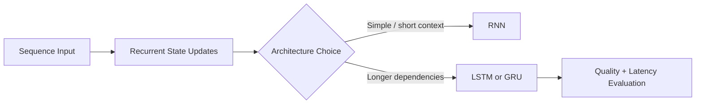

---
categories:
- AI
- ML
date: 2026-01-21
seo_title: Sequence Modeling with RNN, LSTM, and GRU
seo_description: A practical guide to recurrent sequence models, where they still
  fit, and how they compare with transformer approaches.
tags:
- ai
- ml
- rnn
- lstm
- gru
- sequence-modeling
title: Sequence Modeling with RNN, LSTM, and GRU
toc: true
toc_icon: cog
toc_label: In This Article
header:
  overlay_image: "/assets/images/ai-ml-series-banner.svg"
  overlay_filter: 0.35
  show_overlay_excerpt: false
  caption: Recurrent Models Still Have Practical Niches
---
Transformers dominate many NLP benchmarks, but recurrent models still matter in latency-sensitive and resource-constrained sequential tasks.
Understanding RNN/LSTM/GRU remains useful for strong engineering decisions.

The real question is not whether RNNs beat transformers in general.
It is whether a recurrent model gives you enough quality for the task while fitting the latency, memory, and streaming constraints of the system you actually need to operate.

## Recurrent Modeling Basics

RNNs process sequence elements step-by-step:

`h_t = f(x_t, h_{t-1})`

This recurrent state captures temporal context.
Unlike feed-forward models, recurrence naturally models order.

Main limitation is gradient propagation through long sequences.

That sequential structure is both the strength and the weakness of recurrent models.
It gives them a natural fit for streaming inputs, but it also limits the training parallelism that made transformers so attractive at scale.

---

## Why Vanilla RNNs Struggle

Backpropagation through many time steps can cause:

- vanishing gradients (forget long-term dependencies)
- exploding gradients (unstable training)

As a result, vanilla RNNs often underperform on long-context tasks.

This is why plain RNNs rarely survive as the default in modern sequence work unless the problem is very short-range or the model budget is extremely constrained.

---

## LSTM: Gated Memory Control

LSTM introduces gated updates:

- forget gate
- input gate
- output gate

These gates regulate information retention and flow, improving long-range modeling.
LSTM is heavier than vanilla RNN but usually far more stable.

The useful mental model is simple:

- the forget gate controls what old information can be dropped
- the input gate controls what new information is worth writing
- the output gate controls what part of memory is exposed at the current step

That gating logic is what makes LSTMs much more robust on sequences where important context must survive for many steps.

---

## GRU: Lightweight Alternative

GRU simplifies gating structure while retaining much of LSTM capability.
It often trains faster with similar performance on moderate sequence lengths.

Use GRU when you need reduced complexity and comparable quality.

In practice, GRU often wins when the team wants most of the benefit of gated recurrence without the extra complexity of a full LSTM cell.

---

## Where Recurrent Models Still Fit

- streaming sensor analytics
- low-latency edge inference
- compact on-device models
- moderate-length time series

For very long contexts and large-scale text generation, transformers usually win.

Recurrent models are especially attractive when:

- inputs arrive incrementally
- the model can reuse hidden state cheaply
- memory budget matters more than benchmark prestige
- the sequence length is moderate enough that recurrence remains practical

That is why they still show up in embedded forecasting, streaming telemetry, and smaller on-device language tasks.

---

## Training Practices

Core techniques:

- sequence padding and masking
- truncated backprop through time
- gradient clipping
- learning-rate schedules
- recurrent dropout

Batch construction by similar sequence lengths can improve efficiency.

For recurrent models, stability techniques are not optional extras.
Gradient clipping in particular is often part of the baseline recipe, not a rescue trick.

---

## Inference and Serving Advantages

Recurrent models can be efficient for token-by-token streaming where state reuse is natural.
In some constrained systems they provide lower memory footprint than transformer alternatives.

This makes them relevant in embedded and real-time contexts.

That advantage matters most when the system consumes events continuously rather than reasoning over a very large context window all at once.

---

## Evaluation for Sequential Tasks

Choose metrics based on objective:

- sequence classification: F1/AUC
- forecasting: MAE/RMSE/WAPE
- token labeling: token/entity F1

Also evaluate latency and memory, not only predictive score.

If the deployment target is an edge device or a real-time pipeline, those operational metrics may matter as much as model quality.

---

## Common Mistakes

1. using vanilla RNN for long contexts without gating
2. no gradient clipping in unstable training
3. ignoring sequence length distribution in batching
4. benchmarking only accuracy, not latency/memory
5. assuming transformers are automatically the best fit for every sequential workload

---

## Debug Steps

Debug steps:

- inspect gradient behavior and add clipping before unstable training spirals
- compare LSTM and GRU on the same latency budget instead of picking by habit
- evaluate batching strategy against real sequence-length distribution
- include serving memory and token-by-token latency in the final architecture decision

## Key Takeaways

- recurrent architectures are not obsolete; they are context-dependent tools
- LSTM/GRU solve major RNN training limitations through gating
- choose architecture using quality, latency, and deployment constraints together
