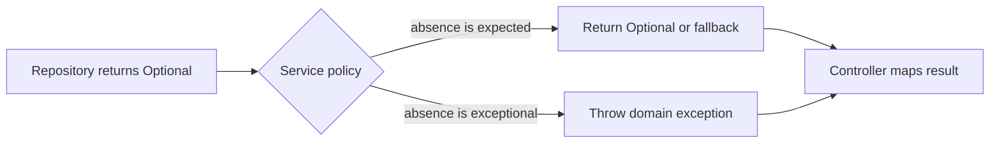

`Optional<T>` is most useful when absence is part of the contract.
It is much less useful when teams treat it as a general-purpose replacement for `null`.

In production systems, the real question is not "should we use Optional?" It is "where does absence belong in this API, and who is responsible for turning that absence into a business decision?"

## Quick Summary

| Question | Good use of `Optional` | Poor use of `Optional` |
| --- | --- | --- |
| Return type | Repository lookups, parsing helpers, maybe-present derived values | Methods that should always return a value |
| Parameters | Rarely needed | Most application methods |
| Fields | Usually avoid | Entities, DTOs, request/response models |
| Controllers | Fine at mapping edge | Poor if leaked through the whole stack |

## Where Optional Actually Helps

`Optional` works best when a caller needs to decide what to do with absence.

Typical examples:

- repository methods like `findById`
- cache lookups where missing data is normal
- parsing or lookup helpers
- transformation pipelines where values may disappear after filtering

```java
public interface UserRepository {
    Optional<User> findById(Long id);
}
```

That contract is clear: the repository might not find a row, and the caller must decide how to handle it.

## Where Optional Usually Makes Code Worse

The most common misuses come from pushing `Optional` into places where it does not improve the contract.

Avoid it in:

- JPA entity fields
- DTO fields
- JSON request and response models
- method parameters

```java
class UserDto {
    private Optional<String> email; // avoid
}
```

That does not make the payload clearer. It makes serialization, validation, and general team understanding worse.

> [!warning]
> `Optional` is a good return-type tool. It is usually a poor domain-model field type and an awkward method-parameter type.

## Think in Terms of Policy

The real value of `Optional` appears when the repository layer returns "maybe," and the service layer turns that into policy.



### Policy 1: Absence Is an Error

```java
public User getUserOrThrow(Long id) {
    return userRepository.findById(id)
            .orElseThrow(() -> new UserNotFoundException(id));
}
```

This is often the right choice for command flows and request paths where the caller expects a real aggregate.

### Policy 2: Absence Is Valid

```java
public Optional<UserProfile> findProfile(Long userId) {
    return userRepository.findById(userId)
            .filter(User::isActive)
            .map(profileMapper::toProfile);
}
```

This is a good fit when the business rule really allows "not found" or "not applicable" as a normal outcome.

## Use `map`, `flatMap`, and `filter` for Simple Decisions

The nicest `Optional` code tends to be short and local.

```java
Optional<String> email = userRepository.findById(id)
        .map(User::getEmail);
```

```java
Optional<Address> primaryAddress = userRepository.findById(id)
        .flatMap(User::getPrimaryAddress);
```

```java
Optional<User> activeUser = userRepository.findById(id)
        .filter(User::isActive);
```

These operations are expressive when the business rule is still easy to read in one pass.

## Do Not Build Giant Optional Pipelines

This starts out elegant and often ends up opaque:

```java
userRepository.findById(id)
        .filter(User::isActive)
        .map(User::getAccount)
        .flatMap(Account::getPrimaryPlan)
        .filter(Plan::isBillable)
        .map(planMapper::toResponse);
```

There is nothing technically wrong with this style, but once real logging, metrics, validation, and branching enter the picture, debugging gets harder.

A better production version is often:

```java
public Optional<PlanResponse> findBillablePlan(Long userId) {
    return userRepository.findById(userId)
            .filter(User::isActive)
            .flatMap(this::extractBillablePlan)
            .map(planMapper::toResponse);
}

private Optional<Plan> extractBillablePlan(User user) {
    return user.getAccount()
            .flatMap(Account::getPrimaryPlan)
            .filter(Plan::isBillable);
}
```

The code still uses `Optional`, but the business steps now have names.

## `orElse` vs `orElseGet` Is Not a Small Detail

This is one of the most important `Optional` footguns in production code.

`orElse` eagerly evaluates the fallback expression:

```java
User user = userRepository.findById(id)
        .orElse(createDefaultUser());
```

Even when the user exists, `createDefaultUser()` still runs.

`orElseGet` is lazy:

```java
User user = userRepository.findById(id)
        .orElseGet(this::createDefaultUser);
```

That difference matters when the fallback allocates objects, calls another service, or produces side effects.

> [!important]
> Use `orElseGet` when the fallback is expensive, effectful, or non-trivial. Reserve `orElse` for cheap constant defaults.

## Controller Boundaries Should Be Explicit

Controllers should not be full of `isPresent()` and `get()` calls. The cleaner pattern is to keep business policy in the service and map the final outcome at the HTTP edge.

```java
@GetMapping("/users/{id}")
public ResponseEntity<UserProfile> getUser(@PathVariable Long id) {
    return userService.findProfile(id)
            .map(ResponseEntity::ok)
            .orElseGet(() -> ResponseEntity.notFound().build());
}
```

This is a good use of `Optional`: absence is turned into a clear HTTP decision at the boundary.

## Common Mistakes That Keep Showing Up

### Blind `get()`

```java
User user = userRepository.findById(id).get(); // avoid
```

If absence is impossible, encode that with `orElseThrow`. If absence is expected, keep it as `Optional`.

### Optional Parameters

```java
public void updateEmail(Optional<String> email) // avoid
```

This forces every caller to wrap values before calling the method, and it rarely improves readability.

A better API is usually one of these:

```java
public void updateEmail(String email)
public void clearEmail()
```

or:

```java
public void updateEmail(@Nullable String email)
```

if your team has a clear nullable contract.

### Optional Fields in Entities or DTOs

This creates more friction than clarity. Domain fields can still be nullable internally as long as the service and API contracts are explicit.

## Testing Optional Contracts

If a method returns `Optional<T>`, test both branches.

```java
@Test
void returnsEmptyWhenUserIsInactive() {
    when(userRepository.findById(42L))
            .thenReturn(Optional.of(inactiveUser()));

    Optional<UserProfile> result = userService.findProfile(42L);

    assertThat(result).isEmpty();
}
```

```java
@Test
void mapsActiveUserToProfile() {
    when(userRepository.findById(42L))
            .thenReturn(Optional.of(activeUser()));

    Optional<UserProfile> result = userService.findProfile(42L);

    assertThat(result).isPresent();
}
```

For methods using `orElseGet`, it is also worth testing that the fallback is not evaluated when the value is present.

## A Practical Decision Rule

Use `Optional` when all three of these are true:

1. absence is part of the method contract
2. the caller must decide what absence means
3. the code becomes clearer, not just more fashionable

If those are not true, a normal return type plus a well-defined exception or a nullable field at the right boundary is often the better design.

## Best Practices Checklist

- use `Optional` mainly for return types
- keep repository contracts explicit
- convert absence into policy in the service layer
- prefer `orElseThrow` over blind `get()`
- prefer `orElseGet` over `orElse` for expensive fallbacks
- keep chains short enough to debug
- avoid `Optional` in entities, DTOs, and most method parameters

## Related Posts

- [Collectors Deep Dive](/java/java-8-collectors-deep-dive/)
- [Functional Interfaces Advanced](/java/java-8-functional-interfaces-advanced/)
- [CompletableFuture Deep Dive](/java/completablefuture/java-8-completablefuture-deep-dive/)
