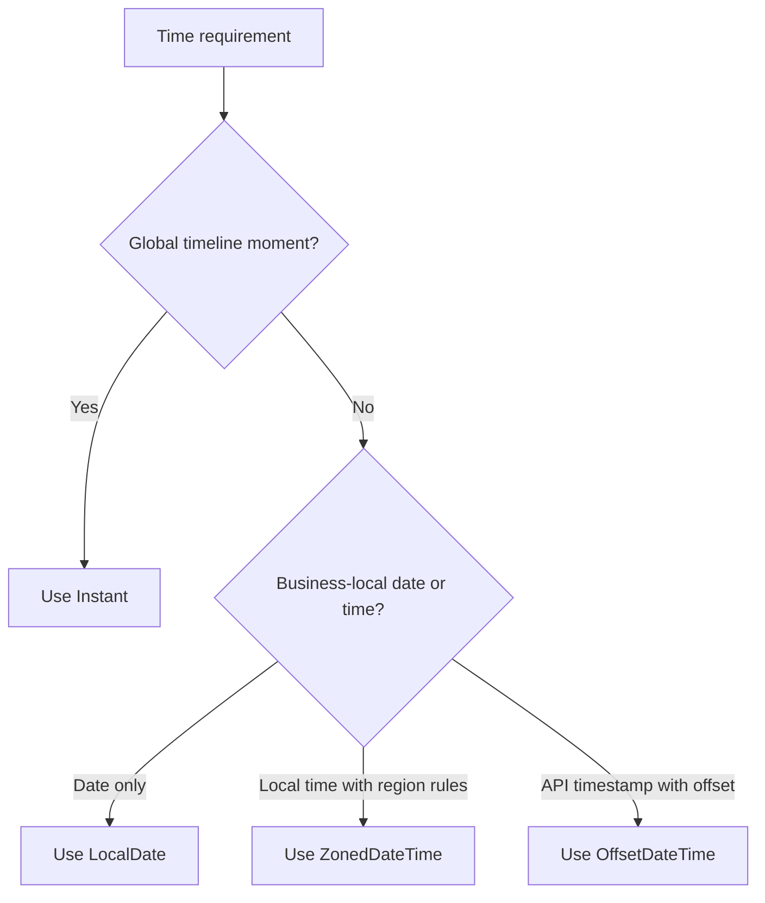

Time bugs in backend systems rarely come from missing APIs.
They come from using the wrong time model for the problem.

The Java 8 `java.time` API gives you the tools to model time correctly, but only if you make one decision early: are you dealing with a global point on the timeline, or with a local business concept such as "the store opens at 9:00 AM in New York"?

## Quick Summary

| Use case | Preferred type | Why |
| --- | --- | --- |
| Event creation time, audit time, message timestamp | `Instant` | Global and unambiguous |
| Business date like billing day or birth date | `LocalDate` | No timezone needed |
| API timestamp with explicit offset | `OffsetDateTime` | Good wire contract |
| User-facing scheduled time in a named region | `ZonedDateTime` | Handles real timezone rules |
| Simple elapsed timeout or TTL | `Duration` | Better than manual millis arithmetic |

The safest default in distributed systems is simple: store machine time as `Instant`, convert to local zone only where business or presentation requires it.

## The First Modeling Question

Before choosing a type, ask:

1. is this value a real timeline moment
2. is it a local business calendar concept
3. does the timezone need to survive the boundary

Those questions are more important than memorizing every class in `java.time`.



## The Core Types That Matter Most

### `Instant`

Use `Instant` for facts that happened on the global timeline:

- order creation
- audit records
- token issuance
- event publication

```java
Instant createdAt = Instant.now();
```

This value means the same thing everywhere.

### `LocalDate`

Use `LocalDate` when the date matters but the timezone does not:

- birthday
- settlement date
- business holiday

### `OffsetDateTime`

Use `OffsetDateTime` when an external contract needs to preserve the sent offset.
It is often a good wire type, but many systems still normalize to `Instant` internally.

### `ZonedDateTime`

Use `ZonedDateTime` when timezone rules themselves matter, such as scheduling a local appointment or a business cut-off in a named region.

### `LocalDateTime`

This is the type most teams overuse.
It has a date and time but no zone or offset, which means it is not a safe choice for global event timestamps.

> [!warning]
> `LocalDateTime` is not "almost an Instant." It is a local wall-clock value without enough information to place it correctly on the global timeline.

## The Most Important Production Rule

Persist timeline events in UTC.

```java
Instant createdAt = Instant.now();
```

Convert for users at the edge:

```java
ZoneId userZone = ZoneId.of("America/Los_Angeles");
String display = ZonedDateTime.ofInstant(createdAt, userZone)
        .format(DateTimeFormatter.ofPattern("yyyy-MM-dd HH:mm z"));
```

This keeps storage, messaging, analytics, and cross-region services aligned on one truth.

## Why `LocalDateTime` Is a Common Trap

This code looks innocent:

```java
LocalDateTime createdAt = LocalDateTime.now();
```

But the stored value depends on whichever timezone context surrounded that machine when the value was created.
That makes it dangerous for:

- audit trails
- event ordering
- expiry calculations shared across regions
- APIs consumed by services in other zones

If the value needs to survive a service boundary, `Instant` is usually the safer model.

## API Contracts Should Prefer ISO-8601

For external APIs, pick one standard format and hold the line.

UTC with ISO-8601 is the easiest contract for distributed systems:

```json
{
  "createdAt": "2026-03-07T10:15:30Z"
}
```

Parsing is straightforward:

```java
Instant timestamp = Instant.parse("2026-03-07T10:15:30Z");
```

If a partner sends an offset timestamp, normalize it internally:

```java
OffsetDateTime received = OffsetDateTime.parse("2026-03-07T15:45:00+05:30");
Instant normalized = received.toInstant();
```

Custom date formats are rarely worth the long-term pain unless an existing contract forces them.

## DST Is Where Weak Time Models Break

This is where time handling stops being a formatting problem and becomes a correctness problem.

```java
ZoneId zone = ZoneId.of("America/New_York");
LocalDateTime local = LocalDateTime.of(2026, 3, 8, 2, 30);
ZonedDateTime scheduled = local.atZone(zone);
```

On a DST transition day, some local times do not exist and some occur twice.
That means business scheduling needs explicit rules:

- skip invalid times
- shift to the next valid time
- pick the earlier or later offset for ambiguous times

If those rules are not written down, the bug will show up later as a mystery scheduling defect.

> [!important]
> DST bugs are business-rule bugs as much as time-library bugs. The API can represent the edge case, but your product still has to decide what should happen.

## Expiry and TTL Logic Should Use `Duration`

Do not scatter manual epoch arithmetic through the codebase.

```java
Instant issuedAt = Instant.now();
Instant expiresAt = issuedAt.plus(Duration.ofMinutes(15));
boolean expired = Instant.now().isAfter(expiresAt);
```

For business calendar arithmetic, prefer `Period` or date-based operations instead of raw seconds.

## JPA and Database Mapping Need One Clear Policy

The database layer is where otherwise good time code often becomes inconsistent.

Good rules:

- persist event timestamps as UTC
- do not rely on database session timezone for correctness
- keep application, database, and analytics pipelines aligned on one timestamp meaning

A practical entity shape looks like this:

```java
@Entity
class AccessToken {

    @Column(nullable = false)
    private Instant issuedAt;

    @Column(nullable = false)
    private Instant expiresAt;
}
```

That is much safer than hiding global event time inside `LocalDateTime`.

## Inject `Clock` So Time-Dependent Code Is Testable

Time is an input.
Treat it like one.

```java
public class TokenService {
    private final Clock clock;

    public TokenService(Clock clock) {
        this.clock = clock;
    }

    public Instant issuedAt() {
        return Instant.now(clock);
    }
}
```

Then tests become deterministic:

```java
Clock fixed = Clock.fixed(
        Instant.parse("2026-03-07T00:00:00Z"),
        ZoneOffset.UTC
);
```

This is one of the cleanest quality improvements you can make in time-heavy services.

## A Practical Architecture Policy

For most backend systems, this policy works well:

- use `Instant` for stored and exchanged event time
- use `LocalDate` for business dates
- convert to user or business zones only at the right boundary
- centralize parsing and formatting rules
- ban new use of legacy `Date` and `Calendar` in application code

That is not the only possible policy, but it is one of the safest and easiest to explain across teams.

## Debug Checklist for Time Bugs

- verify whether the value is timeline time or business-local time
- inspect the timezone and offset at each service boundary
- check DST transition dates before assuming parsing is wrong
- confirm database and application timezone assumptions match
- reproduce tests with a fixed `Clock`

## Related Posts

- [CompletableFuture Error Handling](/java/completablefuture/java-8-completablefuture-error-handling/)
- [Parallel Streams Performance](/java/java-8-parallel-streams-performance/)
- [Stream API Deep Dive](/java/java-8-stream-api-deep-dive/)
